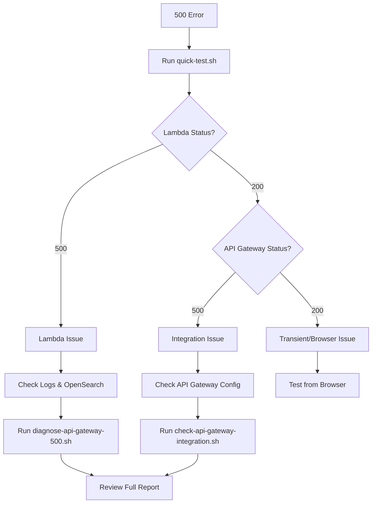

# API Gateway 500 Error Diagnostic Guide

## Overview

This guide provides comprehensive testing and diagnostic procedures for resolving 500 errors in the CIS File Search Application's API Gateway integration with Lambda.

## Current Error

```
GET /api/search/?q=%E5%AE%87%E9%83%BD%E5%AE%AE&searchMode=or&page=1&limit=20&sortBy=relevance&sortOrder=desc 500
Search API error: Error: API Gateway error: 500
```

## Quick Start

### 1. Run Quick Test (Fastest)

```bash
cd /Users/tatsuya/focus_project/cis_filesearch_app/backend/lambda-search-api
./scripts/quick-test.sh
```

This performs:
- Direct Lambda function test
- API Gateway endpoint test
- Recent log check
- Immediate diagnosis

**Expected Output:**
- Green checkmarks = Components working
- Red X = Component failing
- Diagnosis of where the issue lies

### 2. Run Specific Query Test (Detailed)

```bash
./scripts/test-specific-query.sh
```

This tests:
- Exact failing query (宇都宮)
- Multiple query variations
- GET and POST methods
- searchType parameter handling
- CloudWatch logs analysis

**Expected Output:**
- Status codes for each test
- Response bodies
- Log entries
- Error messages (if any)

### 3. Run Full Diagnostic (Comprehensive)

```bash
./scripts/diagnose-api-gateway-500.sh
```

This performs:
- All Lambda function tests
- API Gateway configuration check
- Integration settings verification
- OpenSearch connectivity test
- Permission validation
- Log analysis

**Expected Output:**
- Complete diagnostic report
- Configuration details
- Summary with recommended actions

### 4. Check API Gateway Integration (Configuration)

```bash
./scripts/check-api-gateway-integration.sh
```

This inspects:
- API Gateway type (HTTP API v2 or REST API v1)
- Route/resource configuration
- Integration settings
- Lambda permissions
- Deployment status
- Stage configuration

## Test Scripts Overview

| Script | Purpose | Duration | Use When |
|--------|---------|----------|----------|
| `quick-test.sh` | Fast diagnosis | ~10 sec | First check |
| `test-specific-query.sh` | Query testing | ~30 sec | Lambda works, API fails |
| `diagnose-api-gateway-500.sh` | Full diagnostic | ~60 sec | Comprehensive analysis |
| `check-api-gateway-integration.sh` | Config check | ~30 sec | Integration issues |

## Manual Testing Commands

### Test Lambda Directly

```bash
# Create test event
cat > /tmp/test-event.json <<EOF
{
  "httpMethod": "GET",
  "queryStringParameters": {
    "q": "宇都宮",
    "searchMode": "or",
    "page": "1",
    "limit": "20",
    "sortBy": "relevance",
    "sortOrder": "desc"
  }
}
EOF

# Invoke Lambda
aws lambda invoke \
  --function-name cis-search-api-prod \
  --region ap-northeast-1 \
  --payload file:///tmp/test-event.json \
  --cli-binary-format raw-in-base64-out \
  --log-type Tail \
  /tmp/response.json

# View response
cat /tmp/response.json | jq '.'
```

### Test API Gateway Endpoint

```bash
# Test with curl
curl -v "https://5xbn3ng31f.execute-api.ap-northeast-1.amazonaws.com/default/search?q=%E5%AE%87%E9%83%BD%E5%AE%AE&searchMode=or&page=1&limit=20"

# Test with different parameters
curl -v "https://5xbn3ng31f.execute-api.ap-northeast-1.amazonaws.com/default/search?q=test&page=1&limit=5"
```

### Check Lambda Logs

```bash
# Get latest log stream
LOG_STREAM=$(aws logs describe-log-streams \
  --log-group-name /aws/lambda/cis-search-api-prod \
  --region ap-northeast-1 \
  --order-by LastEventTime \
  --descending \
  --max-items 1 \
  --query 'logStreams[0].logStreamName' \
  --output text)

# Get log events
aws logs get-log-events \
  --log-group-name /aws/lambda/cis-search-api-prod \
  --log-stream-name "$LOG_STREAM" \
  --region ap-northeast-1 \
  --limit 50 \
  --query 'events[*].message' \
  --output text
```

## Common Issues and Solutions

### Issue 1: Lambda Works, API Gateway Returns 500

**Symptoms:**
- Direct Lambda invocation returns 200
- API Gateway returns 500

**Diagnosis:**
```bash
./scripts/check-api-gateway-integration.sh
```

**Possible Causes:**
1. Integration response mapping incorrect
2. Lambda proxy integration not enabled
3. Missing Lambda permissions

**Solutions:**

**Check Lambda Permissions:**
```bash
aws lambda get-policy \
  --function-name cis-search-api-prod \
  --region ap-northeast-1 | jq '.'
```

**Add Permission (if missing):**
```bash
aws lambda add-permission \
  --function-name cis-search-api-prod \
  --statement-id apigateway-invoke \
  --action lambda:InvokeFunction \
  --principal apigateway.amazonaws.com \
  --source-arn "arn:aws:execute-api:ap-northeast-1:*:5xbn3ng31f/*" \
  --region ap-northeast-1
```

**Verify Integration Type:**
```bash
# For HTTP API
aws apigatewayv2 get-integration \
  --api-id 5xbn3ng31f \
  --integration-id <integration-id> \
  --region ap-northeast-1

# Should show:
# "IntegrationType": "AWS_PROXY"
# "PayloadFormatVersion": "2.0"
```

### Issue 2: Lambda Returns 500

**Symptoms:**
- Direct Lambda invocation returns 500
- Error in response body

**Diagnosis:**
```bash
./scripts/test-specific-query.sh
```

**Possible Causes:**
1. OpenSearch connection failure
2. IAM authentication issues
3. Missing environment variables
4. Index not found

**Solutions:**

**Check Environment Variables:**
```bash
aws lambda get-function-configuration \
  --function-name cis-search-api-prod \
  --region ap-northeast-1 \
  --query 'Environment.Variables'
```

**Required Variables:**
- `OPENSEARCH_ENDPOINT`: OpenSearch domain endpoint
- `AWS_REGION`: ap-northeast-1

**Test OpenSearch Connectivity:**
```bash
# Create simple test
cat > /tmp/os-test.json <<EOF
{
  "httpMethod": "GET",
  "queryStringParameters": {
    "q": "test",
    "page": "1",
    "limit": "1"
  }
}
EOF

aws lambda invoke \
  --function-name cis-search-api-prod \
  --region ap-northeast-1 \
  --payload file:///tmp/os-test.json \
  --cli-binary-format raw-in-base64-out \
  --log-type Tail \
  /tmp/os-response.json

# Check logs
cat /tmp/os-response.json | jq -r '.body' | jq '.'
```

**Check IAM Role:**
```bash
# Get Lambda execution role
ROLE_NAME=$(aws lambda get-function-configuration \
  --function-name cis-search-api-prod \
  --region ap-northeast-1 \
  --query 'Role' \
  --output text | sed 's|.*/||')

# Get role policies
aws iam list-attached-role-policies \
  --role-name "$ROLE_NAME"
```

**Required Permissions:**
- `es:ESHttpGet`
- `es:ESHttpPost`
- `es:ESHttpPut`

### Issue 3: CORS Issues

**Symptoms:**
- Browser console shows CORS error
- API works in curl but not browser

**Solutions:**

**Check CORS Headers in Response:**
```bash
curl -v "https://5xbn3ng31f.execute-api.ap-northeast-1.amazonaws.com/default/search?q=test"
```

**Look for:**
```
Access-Control-Allow-Origin: *
Access-Control-Allow-Headers: Content-Type
Access-Control-Allow-Methods: GET, POST, OPTIONS
```

**Configure CORS in API Gateway:**
```bash
# For HTTP API
aws apigatewayv2 update-api \
  --api-id 5xbn3ng31f \
  --cors-configuration AllowOrigins="*",AllowMethods="GET,POST,OPTIONS",AllowHeaders="Content-Type" \
  --region ap-northeast-1
```

### Issue 4: Timeout Errors

**Symptoms:**
- Requests take >30 seconds
- Gateway timeout errors

**Solutions:**

**Check Lambda Timeout:**
```bash
aws lambda get-function-configuration \
  --function-name cis-search-api-prod \
  --region ap-northeast-1 \
  --query 'Timeout'
```

**Increase Timeout (if needed):**
```bash
aws lambda update-function-configuration \
  --function-name cis-search-api-prod \
  --timeout 30 \
  --region ap-northeast-1
```

**Check API Gateway Timeout:**
```bash
# For HTTP API
aws apigatewayv2 get-integration \
  --api-id 5xbn3ng31f \
  --integration-id <integration-id> \
  --region ap-northeast-1 \
  --query 'TimeoutInMillis'
```

## Diagnostic Workflow



## Monitoring and Logging

### Enable API Gateway Logging

**For HTTP API:**
```bash
# Create log group
aws logs create-log-group \
  --log-group-name /aws/apigateway/cis-search-api \
  --region ap-northeast-1

# Update stage with logging
aws apigatewayv2 update-stage \
  --api-id 5xbn3ng31f \
  --stage-name '$default' \
  --access-log-settings DestinationArn=arn:aws:logs:ap-northeast-1:<account-id>:log-group:/aws/apigateway/cis-search-api \
  --region ap-northeast-1
```

### View API Gateway Logs

```bash
aws logs tail /aws/apigateway/cis-search-api --follow
```

### Lambda Metrics

```bash
# Get Lambda metrics
aws cloudwatch get-metric-statistics \
  --namespace AWS/Lambda \
  --metric-name Errors \
  --dimensions Name=FunctionName,Value=cis-search-api-prod \
  --start-time $(date -u -d '1 hour ago' +%Y-%m-%dT%H:%M:%S) \
  --end-time $(date -u +%Y-%m-%dT%H:%M:%S) \
  --period 300 \
  --statistics Sum \
  --region ap-northeast-1
```

## Testing Checklist

Before deploying fixes, verify:

- [ ] Lambda function returns 200 with valid response
- [ ] API Gateway endpoint returns 200
- [ ] Both text and image search work
- [ ] Japanese characters handled correctly
- [ ] searchMode parameter (and/or) works
- [ ] Pagination works (page, limit)
- [ ] Sorting works (sortBy, sortOrder)
- [ ] Empty queries return match_all results
- [ ] Error responses have proper format
- [ ] CORS headers present
- [ ] Logs show expected flow

## Test Data

### Test Queries

| Query | Purpose | Expected Results |
|-------|---------|-----------------|
| 宇都宮 | Japanese text | Multiple file matches |
| test | ASCII text | Basic search works |
| (empty) | Match all | Returns all documents |
| 東京 | Different Japanese | Different results |
| 道路 (road) | Common term | Many results |

### Test Parameters

```json
{
  "q": "宇都宮",
  "searchMode": "or",
  "page": 1,
  "limit": 20,
  "sortBy": "relevance",
  "sortOrder": "desc"
}
```

### Expected Response Format

```json
{
  "statusCode": 200,
  "headers": {
    "Content-Type": "application/json",
    "Access-Control-Allow-Origin": "*"
  },
  "body": "{\"success\":true,\"data\":{\"results\":[...],\"total\":10000,\"page\":1,\"limit\":20,\"searchType\":\"text\",\"index\":\"cis-files\"}}"
}
```

## Additional Resources

- [AWS Lambda Troubleshooting](https://docs.aws.amazon.com/lambda/latest/dg/lambda-troubleshooting.html)
- [API Gateway Troubleshooting](https://docs.aws.amazon.com/apigateway/latest/developerguide/api-gateway-troubleshooting.html)
- [OpenSearch IAM Authentication](https://docs.aws.amazon.com/opensearch-service/latest/developerguide/fgac.html)

## Contact and Support

If issues persist after running all diagnostics:

1. Collect full diagnostic output:
   ```bash
   ./scripts/diagnose-api-gateway-500.sh > diagnostic-report.txt 2>&1
   ```

2. Gather Lambda logs:
   ```bash
   aws logs filter-log-events \
     --log-group-name /aws/lambda/cis-search-api-prod \
     --start-time $(date -u -d '1 hour ago' +%s)000 \
     --region ap-northeast-1 \
     > lambda-logs.txt
   ```

3. Export API Gateway configuration:
   ```bash
   ./scripts/check-api-gateway-integration.sh > api-gateway-config.txt 2>&1
   ```

Include these files when requesting support.
