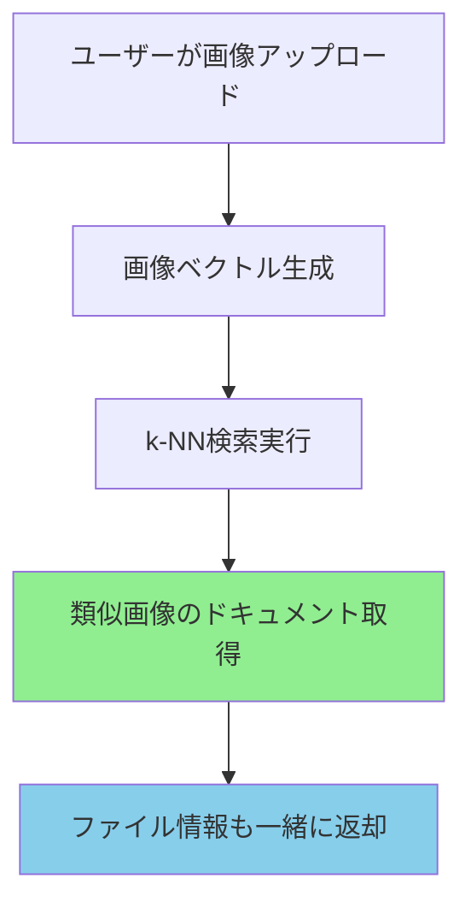

# 🔗 画像ベクトルとファイルの紐付け仕組み

## 📋 データ構造の詳細

### 1. テキスト検索インデックス（cis-files）
```json
{
  "_id": "doc_001",
  "file_name": "宇都宮市道路計画.pdf",
  "file_path": "s3://cis-filesearch-s3-landing/documents/road/ts-server3/...",
  "file_size": 2048000,
  "content": "宇都宮市における道路整備計画について...",  // テキスト内容
  "created_date": "2024-01-15",
  "modified_date": "2024-12-01"
}
```

### 2. 画像検索インデックス（file-index-v2-knn）
```json
{
  "_id": "img_001",
  "fileName": "設計図_001.jpg",
  "filePath": "s3://cis-filesearch-s3-landing/documents/road/images/設計図_001.jpg",
  "fileSize": 1024000,
  "fileType": "jpg",
  "image_vector": [0.123, 0.456, 0.789, ...],  // 1024次元
  "department": "道路設計部",
  "tags": ["設計図", "道路", "宇都宮"],
  "modifiedDate": "2024-12-01"
}
```

## 🔄 検索フローと紐付け

### 画像検索時の処理フロー



### 実際の検索レスポンス
```javascript
// 画像検索APIのレスポンス
{
  "success": true,
  "data": {
    "results": [
      {
        "id": "img_001",
        "fileName": "設計図_001.jpg",        // ← ファイル名
        "filePath": "s3://...",              // ← ファイルパス
        "fileSize": 1024000,                 // ← ファイルサイズ
        "relevanceScore": 0.95,              // ← 類似度スコア
        "department": "道路設計部",          // ← 部署情報
        "tags": ["設計図", "道路"]           // ← タグ情報
      }
    ]
  }
}
```

## ✅ 紐付けが保証される理由

### 1. ドキュメント単位での管理
```python
# バッチ処理での実装イメージ
def index_image(image_file):
    # ステップ1: ファイル情報を取得
    file_info = {
        "fileName": image_file.name,
        "filePath": image_file.s3_path,
        "fileSize": image_file.size,
        "modifiedDate": image_file.modified
    }

    # ステップ2: 画像ベクトルを生成
    vector = generate_embedding(image_file.s3_url)

    # ステップ3: 両方を含むドキュメントを作成
    document = {
        **file_info,                    # ファイル情報
        "image_vector": vector          # ベクトル
    }

    # ステップ4: OpenSearchに保存（紐付け完了）
    opensearch.index(
        index="file-index-v2-knn",
        body=document,
        id=generate_unique_id(image_file)
    )
```

### 2. IDによる一意性
- 各画像には一意のIDが付与
- 同じファイルは同じIDを使用（重複防止）
- S3パスのハッシュ値をIDとして使用可能

### 3. 検索時の完全性
```python
# 検索実行時
def search_similar_images(query_vector):
    result = opensearch.search(
        index="file-index-v2-knn",
        body={
            "query": {
                "knn": {
                    "image_vector": {
                        "vector": query_vector,
                        "k": 10
                    }
                }
            },
            "_source": [
                "fileName",      # ファイル名も取得
                "filePath",      # パスも取得
                "department",    # 部署も取得
                "tags"          # タグも取得
            ]
        }
    )

    # 返却されるデータには必ずファイル情報が含まれる
    return result.hits
```

## 📝 実装上の重要ポイント

### 既存ファイルのインデックス化
```python
# cis-filesインデックスから画像ファイルを取得
existing_images = opensearch.search(
    index="cis-files",
    body={
        "query": {
            "terms": {
                "file_type": ["jpg", "jpeg", "png", "gif"]
            }
        }
    }
)

# 各画像に対してベクトル生成とインデックス化
for img in existing_images:
    # ファイル情報はそのまま保持
    doc = {
        "fileName": img["file_name"],
        "filePath": img["file_path"],
        "fileSize": img["file_size"],
        "modifiedDate": img["modified_date"],
        # ベクトルを追加
        "image_vector": generate_embedding(img["file_path"])
    }

    # file-index-v2-knnに保存（紐付け維持）
    opensearch.index("file-index-v2-knn", doc)
```

## 🎯 紐付けの確認方法

### 1. 検索テスト
```bash
# 画像検索を実行
curl -X POST http://localhost:3000/api/search \
  -F "image=@test.jpg"

# レスポンスにファイル情報が含まれることを確認
{
  "results": [{
    "fileName": "設計図_001.jpg",  ← ちゃんとファイル名が返る
    "filePath": "s3://...",        ← パスも返る
    "relevanceScore": 0.95
  }]
}
```

### 2. データ整合性チェック
```python
# インデックス内のドキュメントを確認
doc = opensearch.get(
    index="file-index-v2-knn",
    id="img_001"
)

# ベクトルとファイル情報が両方存在することを確認
assert "image_vector" in doc["_source"]
assert "fileName" in doc["_source"]
assert "filePath" in doc["_source"]
```

## ✅ まとめ

**紐付けは自動的に保証されます！**

理由：
1. **同一ドキュメント内**に画像ベクトルとファイル情報を保存
2. **OpenSearchが紐付けを管理**（IDで一意に識別）
3. **検索時に両方の情報を返却**（ベクトル検索してもファイル情報が返る）

心配な点：
- ❌ 紐付けが失われる → **起きません**（同一ドキュメント内）
- ❌ どのファイルか分からなくなる → **起きません**（必ずファイル情報付き）
- ❌ 間違った紐付け → **起きません**（IDで厳密管理）