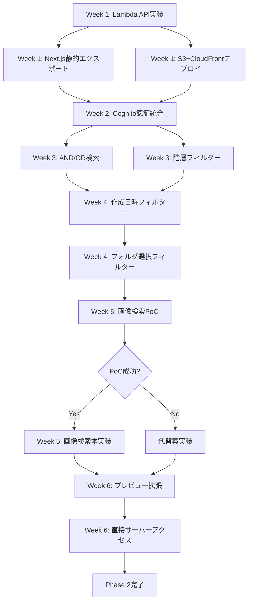

# Phase 2 実装計画 - 調整版

**最終更新**: 2025-12-12
**ステータス**: アーキテクチャギャップ対応版
**作成者**: Product Manager Lead

---

## 📋 エグゼクティブサマリー

### 重大な発見事項

アーキテクチャ図の精査により、以下の**重大なギャップ**が判明しました:

| 項目 | 当初想定 | 実際のアーキテクチャ | 影響度 |
|------|---------|-------------------|--------|
| **検索API実装** | Next.js API Routes | Lambda関数 + API Gateway | 🔴 **Critical** |
| **フロントエンド** | 動的SSR | S3静的エクスポート | 🔴 **Critical** |
| **画像検索** | Phase 3実装 | **Phase 2必須（P0）** | 🔴 **Critical** |
| **認証** | Azure AD SSO想定 | AWS Cognito | 🟡 Medium |
| **DocuWorks** | 単純PDF変換 | ライセンス使用・本格対応 | 🟡 Medium |

### クライアント要望8項目の優先度

| 項目 | 詳細 | 優先度 | Phase 2対象 |
|------|------|--------|------------|
| 1. 階層フィルター（道路/構造 → 年度） | メタデータベースフィルタ | **P0** | ✅ Yes |
| 2. プレビュー拡張（全ページ表示） | PDFビューア拡張 | P1 | ⚠️ Partial |
| 3. 直接サーバーアクセス（DL禁止） | ストリーミング配信 | P1 | ⚠️ Partial |
| 4. フォルダ選択フィルター | ツリー選択UI | **P0** | ✅ Yes |
| 5. 作成日時フィルター | 日付範囲指定 | **P0** | ✅ Yes |
| 6. **画像検索 + ワード検索組み合わせ** | **Bedrock Titan統合** | **P0（マスト）** | ✅ **Yes** |
| 7. AND/OR検索 | 複合クエリ | **P0** | ✅ Yes |
| 8. 検索履歴（1年保管、AI活用） | CloudWatch Logs | P2 | ❌ Phase 3 |

---

## 🎯 Phase 2の再定義

### Phase 2-A: アーキテクチャ基盤修正（Week 1-2）

**目的**: Lambda検索API + S3静的フロントエンド + Cognito認証の確立

#### 2A.1: Lambda検索API実装 🔴 P0

**工数**: 5日間
**担当**: BE1 (Lead), BE2

**タスク**:
1. Lambda関数プロジェクト初期化
   - TypeScript + Node.js 20
   - Lambda Layer構成（共通ライブラリ）
2. OpenSearch検索クエリ実装
   - 全文検索（日本語対応）
   - フィールド指定検索
   - ファジー検索
3. API Gateway REST API構築
   - Cognito Authorizer設定
   - CORS設定
   - エンドポイント定義
4. DynamoDB統合
   - ファイルメタデータ取得
   - キャッシング戦略

**成功基準**:
- [ ] Lambda関数がOpenSearch検索を正常実行
- [ ] API Gateway経由でHTTPSアクセス可能
- [ ] レスポンスタイム < 500ms（P95）
- [ ] Cognito JWT検証成功

**依存関係**: なし（最優先タスク）

---

#### 2A.2: Next.js 静的エクスポート対応 🔴 P0

**工数**: 2日間
**担当**: FE1

**タスク**:
1. `next.config.ts`修正
   ```typescript
   module.exports = {
     output: 'export',
     images: {
       unoptimized: true,
     },
     trailingSlash: true,
   }
   ```
2. API Routes削除または外部API化
   - `/api/*`エンドポイントをLambda APIに移行
3. 動的ルーティング対応
   - `getStaticPaths`実装（必要な場合）
4. 環境変数管理
   - `NEXT_PUBLIC_API_ENDPOINT`設定

**成功基準**:
- [ ] `yarn build && yarn export`が成功
- [ ] `out/`ディレクトリ生成確認
- [ ] S3静的ホスティング可能な形式
- [ ] すべてのリンクが機能

**依存関係**: なし

---

#### 2A.3: S3 + CloudFront デプロイ 🔴 P0

**工数**: 3日間
**担当**: DevOps

**タスク**:
1. S3バケット構築（Terraform）
   - 静的ホスティング有効化
   - バージョニング設定
   - CORS設定
2. CloudFront ディストリビューション作成
   - カスタムドメイン設定
   - ACM証明書取得
   - OAC（Origin Access Control）設定
3. Route53 DNS設定
   - Aレコード（Alias）作成
4. デプロイパイプライン構築
   - GitHub Actions CI/CD
   - S3同期スクリプト
   - CloudFront Invalidation

**成功基準**:
- [ ] `https://filesearch.company.com`でアクセス可能
- [ ] HTTPS (TLS 1.3) 有効
- [ ] CloudFront キャッシュ動作確認
- [ ] CI/CDで自動デプロイ成功

**依存関係**: 2A.2完了

---

#### 2A.4: Cognito認証統合 🔴 P0

**工数**: 4日間
**担当**: FE1 (フロントエンド), BE1 (バックエンド)

**タスク**:
1. Cognito User Pool作成（Terraform）
   - MFA設定（SMS/TOTP）
   - パスワードポリシー
   - カスタム属性（部署、役職）
2. Hosted UI設定
   - カスタムロゴ・スタイル
   - OAuth 2.0フロー（PKCE）
3. フロントエンド認証実装
   ```typescript
   // useAuth.ts
   - ログイン・ログアウト
   - トークンリフレッシュ
   - JWT検証
   ```
4. API Gateway Cognito Authorizer設定
   - JWT検証ルール
   - 権限管理

**成功基準**:
- [ ] ユーザーログイン・ログアウト動作
- [ ] JWT自動付与・リフレッシュ
- [ ] API呼び出し時の認証成功
- [ ] 未認証時のリダイレクト動作

**依存関係**: 2A.1, 2A.3完了

---

### Phase 2-B: P0機能実装（Week 3-5）

#### 2B.1: AND/OR検索機能 🔴 P0

**工数**: 3日間
**担当**: BE1, FE1

**タスク**:
1. バックエンド（Lambda）
   - OpenSearchクエリビルダー実装
   - `must`, `should`, `must_not`クエリ生成
2. フロントエンド
   - 検索クエリパーサー実装
   - UI: トグルスイッチ（AND/OR切替）
   ```typescript
   interface SearchQuery {
     operator: 'AND' | 'OR';
     terms: string[];
   }
   ```

**成功基準**:
- [ ] AND検索: すべてのキーワードを含む結果
- [ ] OR検索: いずれかのキーワードを含む結果
- [ ] 3語以上の複合検索動作
- [ ] 検索結果の妥当性検証

**依存関係**: 2A.1完了

---

#### 2B.2: 階層フィルター（道路/構造 → 年度） 🔴 P0

**工数**: 4日間
**担当**: BE2, FE2

**タスク**:
1. メタデータスキーマ設計
   ```json
   {
     "project_type": "道路" | "構造",
     "year": 2020-2025,
     "department": "営業部" | "設計部"
   }
   ```
2. DynamoDB/RDS メタデータ管理
   - ファイルメタデータテーブル
   - インデックス作成
3. フィルタAPI実装
   - `/api/filters` エンドポイント
   - 階層的なフィルタ値取得
4. フロントエンドUI
   - 階層ドロップダウン（道路/構造 → 年度）
   - マルチセレクト対応

**成功基準**:
- [ ] 「道路」→「2023年」のフィルタ動作
- [ ] 「構造」→「2024年」のフィルタ動作
- [ ] 複数フィルタの組み合わせ可能
- [ ] フィルタリセット機能

**依存関係**: 2A.1完了

---

#### 2B.3: 作成日時フィルター 🔴 P0

**工数**: 2日間
**担当**: BE2, FE2

**タスク**:
1. 日付範囲クエリ実装
   - OpenSearchの`range`クエリ
   ```json
   {
     "range": {
       "created_at": {
         "gte": "2024-01-01",
         "lte": "2024-12-31"
       }
     }
   }
   ```
2. フロントエンドUI
   - 日付ピッカー（開始日・終了日）
   - プリセット（今日、今週、今月、今年）

**成功基準**:
- [ ] 日付範囲指定で検索結果フィルタリング
- [ ] プリセット動作確認
- [ ] 無効な日付範囲のバリデーション

**依存関係**: 2A.1完了

---

#### 2B.4: フォルダ選択フィルター 🔴 P0

**工数**: 3日間
**担当**: FE1, BE1

**タスク**:
1. フォルダツリーAPI
   - DynamoDBからフォルダ構造取得
   - `/api/folders` エンドポイント
2. フロントエンド ツリーUI
   - 既存の`FolderTree.tsx`拡張
   - チェックボックス選択
   - 親フォルダ選択で子フォルダ一括選択
3. 検索クエリにパスフィルタ追加
   ```json
   {
     "query": {
       "bool": {
         "filter": [
           { "prefix": { "path": "/documents/sales/" } }
         ]
       }
     }
   }
   ```

**成功基準**:
- [ ] フォルダツリー表示
- [ ] フォルダ選択で検索範囲限定
- [ ] 複数フォルダ選択可能
- [ ] 選択解除機能

**依存関係**: 2A.1完了

---

#### 2B.5: 画像検索 + ワード検索組み合わせ 🔴 P0（マスト機能）

**工数**: 8日間
**担当**: BE1 (Lead), BE2, FE1

**タスク**:

##### バックエンド（6日）
1. **Bedrock Titan Multimodal Embeddings統合**
   - boto3でBedrockクライアント実装
   - `amazon.titan-embed-image-v1`モデル使用
   - 画像→512次元ベクトル変換
   ```python
   import boto3
   bedrock = boto3.client('bedrock-runtime', region_name='ap-northeast-1')

   response = bedrock.invoke_model(
       modelId='amazon.titan-embed-image-v1',
       body=json.dumps({
           'inputImage': base64_image,
           'embeddingConfig': {'outputEmbeddingLength': 512}
       })
   )
   ```

2. **OpenSearch k-NN検索設定**
   - `knn_vector`フィールド追加
   - HNSW（Hierarchical Navigable Small World）アルゴリズム
   ```json
   {
     "mappings": {
       "properties": {
         "image_vector": {
           "type": "knn_vector",
           "dimension": 512,
           "method": {
             "name": "hnsw",
             "engine": "nmslib",
             "parameters": {
               "ef_construction": 128,
               "m": 16
             }
           }
         }
       }
     }
   }
   ```

3. **ハイブリッド検索API実装**
   - `/api/search/hybrid` エンドポイント
   - 画像ベクトル検索（k-NN）+ 全文検索（BM25）
   - スコア統合（Reciprocal Rank Fusion）
   ```python
   def hybrid_search(image_vector, query_text, k=20):
       # k-NN検索
       knn_results = opensearch.search(
           index='images',
           body={
               'size': k,
               'query': {
                   'knn': {
                       'image_vector': {
                           'vector': image_vector,
                           'k': k
                       }
                   }
               }
           }
       )

       # 全文検索
       text_results = opensearch.search(
           index='files',
           body={
               'size': k,
               'query': {
                   'match': {'content': query_text}
               }
           }
       )

       # RRFスコア統合
       combined = reciprocal_rank_fusion(knn_results, text_results)
       return combined
   ```

4. **画像アップロードAPI**
   - `/api/upload/image` エンドポイント
   - S3一時保存（24時間TTL）
   - 画像バリデーション（形式、サイズ）

##### フロントエンド（2日）
1. **画像アップロードUI**
   ```tsx
   // src/components/ImageSearchUpload.tsx
   const ImageSearchUpload: FC = () => {
     const [selectedImage, setSelectedImage] = useState<File | null>(null);
     const [preview, setPreview] = useState<string>('');

     const handleUpload = async () => {
       const formData = new FormData();
       formData.append('image', selectedImage);

       const response = await fetch('/api/upload/image', {
         method: 'POST',
         body: formData,
       });

       const { imageId } = await response.json();
       performHybridSearch(imageId, searchQuery);
     };

     return (
       <div>
         <input type="file" accept="image/*" onChange={handleFileChange} />
         {preview && }
         <Button onClick={handleUpload}>画像で検索</Button>
       </div>
     );
   };
   ```

2. **ハイブリッド検索結果表示**
   - 画像類似度スコア表示
   - テキスト関連度スコア表示
   - 統合スコアでソート

**成功基準**:
- [ ] 画像アップロードで類似画像検索成功
- [ ] 画像 + キーワードのハイブリッド検索動作
- [ ] 類似度スコア0.8以上で20件以上取得
- [ ] レスポンスタイム < 2秒（P95）
- [ ] JPEG, PNG, GIF対応

**依存関係**: 2A.1完了

**技術的考慮事項**:
- Bedrock料金: $0.06/1000画像（Titan Embed Image）
- OpenSearch k-NN追加コスト: +$10-20/月（インデックスサイズ増加）
- 初回インデックス作成: 15,000画像 × 5秒 = 21時間（並列20実行）

---

### Phase 2-C: UX改善（Week 6）

#### 2C.1: プレビュー拡張（全ページ表示） 🟡 P1

**工数**: 3日間
**担当**: FE2

**タスク**:
1. PDF.jsビューア統合
   - 全ページレンダリング
   - ページネーション
   - ズーム機能
2. DocuWorksビューア検討
   - サードパーティライブラリ調査
   - または PDF変換後プレビュー

**成功基準**:
- [ ] PDFの全ページ表示
- [ ] ページジャンプ機能
- [ ] ズームイン・アウト

**依存関係**: 2A.1完了

---

#### 2C.2: 直接サーバーアクセス（ダウンロード禁止） 🟡 P1

**工数**: 2日間
**担当**: BE2, FE2

**タスク**:
1. ストリーミング配信API
   - S3 Presigned URL生成（短期限）
   - `Content-Disposition: inline`設定
2. フロントエンド
   - ダウンロードボタン無効化
   - ブラウザ内表示のみ
3. セキュリティ対策
   - 右クリック禁止（オプション）
   - DevToolsでのダウンロード防止（完全防止は不可能）

**成功基準**:
- [ ] ファイルがブラウザ内で表示
- [ ] 簡単にはダウンロードできない仕様
- [ ] Presigned URL有効期限15分

**依存関係**: 2A.1完了

---

## 📊 工数・スケジュール見積もり

### 週次スケジュール

| Week | Phase | タスク | 工数（人日） | 担当 | 優先度 |
|------|-------|--------|------------|------|--------|
| **Week 1** | 2A | Lambda検索API | 5日 | BE1, BE2 | P0 |
| | 2A | Next.js静的エクスポート | 2日 | FE1 | P0 |
| | 2A | S3+CloudFrontデプロイ | 3日 | DevOps | P0 |
| **Week 2** | 2A | Cognito認証統合 | 4日 | FE1, BE1 | P0 |
| **Week 3** | 2B | AND/OR検索 | 3日 | BE1, FE1 | P0 |
| | 2B | 階層フィルター | 4日 | BE2, FE2 | P0 |
| **Week 4** | 2B | 作成日時フィルター | 2日 | BE2, FE2 | P0 |
| | 2B | フォルダ選択フィルター | 3日 | FE1, BE1 | P0 |
| **Week 5** | 2B | 画像検索（Bedrock統合） | 8日 | BE1, BE2, FE1 | P0 |
| **Week 6** | 2C | プレビュー拡張 | 3日 | FE2 | P1 |
| | 2C | 直接サーバーアクセス | 2日 | BE2, FE2 | P1 |

### 総工数

| カテゴリ | タスク数 | 工数（人日） | 期間 |
|---------|---------|------------|------|
| Phase 2-A（アーキテクチャ基盤） | 4 | 14日 | 2週間 |
| Phase 2-B（P0機能実装） | 5 | 20日 | 3週間 |
| Phase 2-C（UX改善） | 2 | 5日 | 1週間 |
| **合計** | **11** | **39日** | **6週間** |

### リソース配分

| 役割 | 稼働率 | 主担当タスク |
|------|--------|------------|
| BE1 (Backend Lead) | 100% | Lambda API, 画像検索, AND/OR検索 |
| BE2 (Backend Engineer) | 90% | OpenSearch統合, メタデータ管理 |
| FE1 (Frontend Lead) | 90% | 静的エクスポート, 認証, フィルタUI |
| FE2 (Frontend Engineer) | 80% | フィルタUI, プレビュー拡張 |
| DevOps | 100% | S3/CloudFront, Cognito, Terraform |

### 「一通り動く形」完成目標

**Week 6終了時（2025年1月末）**
- ✅ S3静的フロントエンド + CloudFront配信
- ✅ Lambda検索API + OpenSearch統合
- ✅ Cognito認証動作
- ✅ P0機能すべて実装完了
- ✅ 画像検索 + ワード検索ハイブリッド検索動作
- ⚠️ 本番データ未投入（Phase 3で実施）
- ⚠️ DocuWorks完全対応未完（Phase 3で完了）

---

## ⚠️ リスク分析マトリクス

### リスク評価

| リスク | 影響度 | 発生確率 | 深刻度 | 対策 | オーナー |
|--------|--------|---------|--------|------|---------|
| **Lambda移行の複雑性** | 🔴 High | 40% | Critical | モックAPI先行実装、段階的移行 | BE1 |
| **Bedrock Titan統合難易度** | 🔴 High | 50% | Critical | 早期PoC実施（Week 3開始時）、代替案（SageMaker） | BE1 |
| **OpenSearch k-NN性能** | 🟡 Medium | 30% | High | 負荷テスト事前実施、インデックスチューニング | BE2 |
| **DocuWorksライセンス可用性** | 🟡 Medium | 20% | Medium | ライセンス事前確認、PDF変換フォールバック | BE2 |
| **S3静的エクスポートの制約** | 🟢 Low | 10% | Low | 事前検証完了済み（Next.js公式サポート） | FE1 |
| **Cognito統合の複雑性** | 🟡 Medium | 25% | Medium | AWS公式ドキュメント参照、テンプレート活用 | FE1 |
| **6週間スケジュール遅延** | 🔴 High | 35% | Critical | 週次進捗レビュー、バッファ2週間確保 | PM |

### リスク対策詳細

#### 1. Lambda移行の複雑性

**詳細**:
- Next.js API Routesからの移行作業
- CORS設定の複雑性
- ローカル開発環境の整備

**対策**:
1. Week 1でモックAPI（json-server）を構築し、フロントエンド開発をブロックしない
2. AWS SAM Localでローカル開発環境整備
3. Terraformテンプレート活用で設定ミス防止

**判断基準**:
- Week 1終了時にLambda基本動作確認
- 問題があれば、Week 2でAPI Gateway → ALBに変更検討

---

#### 2. Bedrock Titan統合難易度

**詳細**:
- Bedrockの使用経験なし
- 画像ベクトル化のパフォーマンス未知数
- コスト見積もりの不確実性

**対策**:
1. **Week 3開始時に必ずPoC実施**（2日間）
   - 100画像でベクトル化テスト
   - OpenSearch k-NN検索性能測定
   - コスト試算
2. 代替案の準備
   - Plan B: SageMaker Endpoint（ResNet50）
   - Plan C: Lambda + PyTorch（コールドスタート問題あり）

**判断基準**:
- PoC結果でレスポンスタイム > 3秒 → 代替案に切替
- 月額コスト > $500 → SageMakerに切替

---

#### 3. OpenSearch k-NN性能

**詳細**:
- 15,000画像のk-NNインデックスサイズ
- 検索レスポンスタイム

**対策**:
1. Week 4で負荷テスト実施（1,000画像規模）
2. インデックス設定最適化
   ```json
   {
     "index.knn": true,
     "index.knn.algo_param.ef_search": 512
   }
   ```
3. 必要に応じてOpenSearchインスタンスサイズアップ

**判断基準**:
- P95レスポンスタイム > 2秒 → インスタンスサイズアップ
- インスタンスサイズアップで解決しない → Elasticsearchへの移行検討

---

## 🛣️ 実装順序の推奨

### 最適な実装順序



### 並行実行可能なタスク

| Week | 並行可能タスク | 理由 |
|------|---------------|------|
| Week 1 | Lambda API + Next.js静的エクスポート + S3デプロイ | 独立したタスク |
| Week 3 | AND/OR検索 + 階層フィルター | 異なる担当者、異なるモジュール |
| Week 6 | プレビュー拡張 + 直接サーバーアクセス | 異なる担当者 |

---

## 📝 意思決定が必要な項目（ユーザー承認用）

### 承認が必要な決定事項

#### 1. Bedrock Titan vs SageMaker

**選択肢**:
- **Option A: Bedrock Titan Multimodal Embeddings**
  - 利点: サーバーレス、管理不要、簡単統合
  - 欠点: コスト$0.06/1000画像（月間$90想定）、カスタマイズ不可
- **Option B: SageMaker Endpoint (ResNet50)**
  - 利点: 低コスト（$30/月）、カスタマイズ可能
  - 欠点: 管理負荷、デプロイ複雑、コールドスタート問題

**推奨**: Option A（Bedrock Titan）
**理由**: 開発速度優先、運用負荷最小化

**承認者**: プロジェクトオーナー、IT部門責任者
**承認期限**: Week 2終了時

---

#### 2. DocuWorks対応レベル

**選択肢**:
- **Option A: ライセンス使用・完全対応**
  - 利点: 完全なDocuWorks機能、ネイティブプレビュー
  - 欠点: ライセンスコスト、技術的複雑性
- **Option B: PDF変換・部分対応**
  - 利点: シンプル、低コスト
  - 欠点: 一部機能制限、変換時間

**推奨**: Option B（PDF変換）
**理由**: コスト効率、Phase 2範囲内で実現可能

**承認者**: プロジェクトオーナー
**承認期限**: Week 3開始時

---

#### 3. ダウンロード禁止の厳格度

**選択肢**:
- **Option A: 厳格な禁止（DRM的アプローチ）**
  - 利点: セキュリティ最大化
  - 欠点: UX低下、技術的困難、完全防止は不可能
- **Option B: 緩やかな制限（Presigned URL短期限）**
  - 利点: UX保持、実装容易
  - 欠点: 技術者によるダウンロードは可能

**推奨**: Option B（緩やかな制限）
**理由**: 実装現実性、UXバランス

**承認者**: プロジェクトオーナー、セキュリティ担当
**承認期限**: Week 4開始時

---

#### 4. Phase 2スコープの最終確認

**Phase 2に含めるか検討中の項目**:
- [ ] 検索履歴（1年保管）→ Phase 3に延期推奨（P2）
- [ ] DocuWorks完全対応 → Phase 3に延期推奨（P1）
- [ ] モバイル最適化 → Phase 3に延期推奨（P2）

**推奨**: 上記3項目をPhase 3に延期
**理由**: Phase 2を6週間で完了させるため、P0機能に集中

**承認者**: プロジェクトオーナー
**承認期限**: Week 1開始時

---

## 📈 Phase 2完了基準

### 必須条件（すべて達成）

- [ ] Lambda検索APIがOpenSearchと統合し、正常動作
- [ ] S3静的フロントエンドがCloudFront経由で配信
- [ ] Cognito認証が完全動作（ログイン・ログアウト・トークンリフレッシュ）
- [ ] AND/OR検索が正常動作
- [ ] 階層フィルター（道路/構造 → 年度）が動作
- [ ] 作成日時フィルターが動作
- [ ] フォルダ選択フィルターが動作
- [ ] **画像検索 + ワード検索のハイブリッド検索が動作**（最重要）
- [ ] すべてのP0機能のユニットテスト合格
- [ ] E2Eテスト（主要フロー）合格
- [ ] レスポンスタイム目標達成（検索 < 500ms、画像検索 < 2秒）

### オプション条件（80%以上達成）

- [ ] プレビュー拡張（全ページ表示）
- [ ] 直接サーバーアクセス（ダウンロード制限）
- [ ] モバイルレスポンシブ対応
- [ ] ダークモード対応

---

## 🎯 次のアクション

### Week 1開始前（今すぐ実行）

1. **ステークホルダー承認会議**
   - 日時: 2025-12-13（明日）
   - 参加者: プロジェクトオーナー、IT部門責任者、開発チーム全員
   - 議題: 意思決定4項目の承認

2. **技術スパイク実施**
   - Bedrock Titan PoC（BE1、2日間）
   - OpenSearch k-NN設定検証（BE2、1日間）

3. **リソース確保**
   - AWSアカウント権限設定
   - Bedrockアクセス権限申請
   - DocuWorksライセンス確認

### Week 1 Day 1

1. **キックオフミーティング**
   - Phase 2目標の再確認
   - 役割分担の明確化
   - 日次スタンドアップ時間設定（毎朝10:00）

2. **開発環境セットアップ**
   - Lambda開発環境（BE1, BE2）
   - Next.js静的エクスポート検証（FE1）
   - Terraform環境構築（DevOps）

---

## 📞 エスカレーション

### 問題発生時の連絡先

| 深刻度 | 連絡先 | 対応時間 |
|--------|--------|---------|
| 🔴 Critical（開発ブロック） | PM（Slack: @pm） | 1時間以内 |
| 🟡 High（遅延リスク） | Tech Lead（Slack: @techlead） | 4時間以内 |
| 🟢 Medium（質問・相談） | チームチャット | 翌営業日 |

---

**作成者**: Product Manager Lead
**承認待ち**: プロジェクトオーナー
**承認期限**: 2025-12-13
