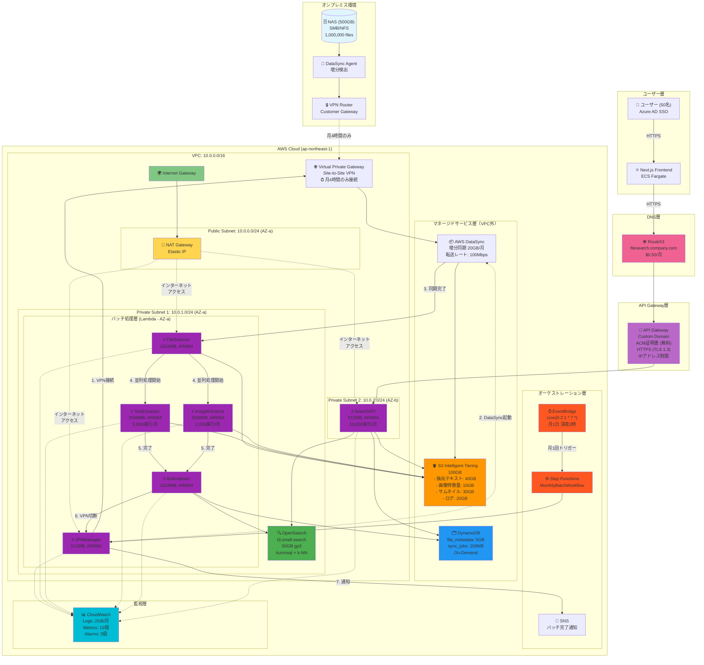
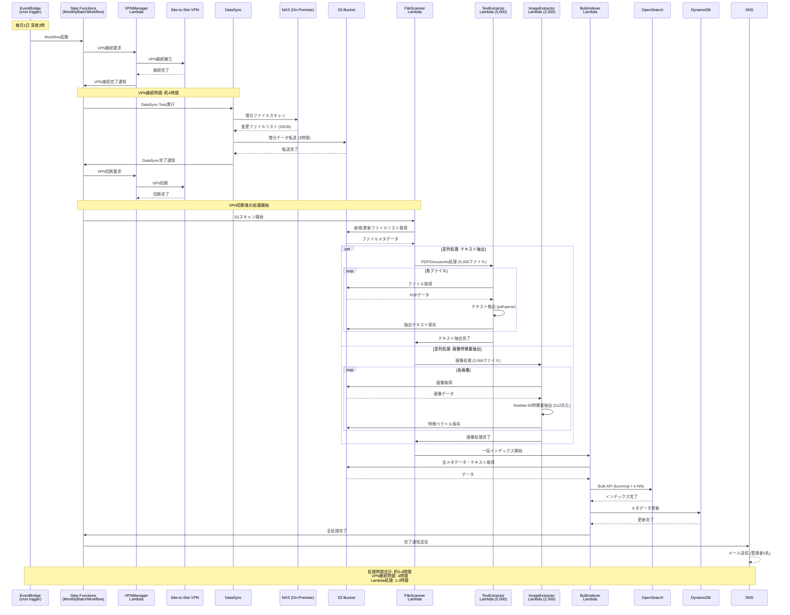
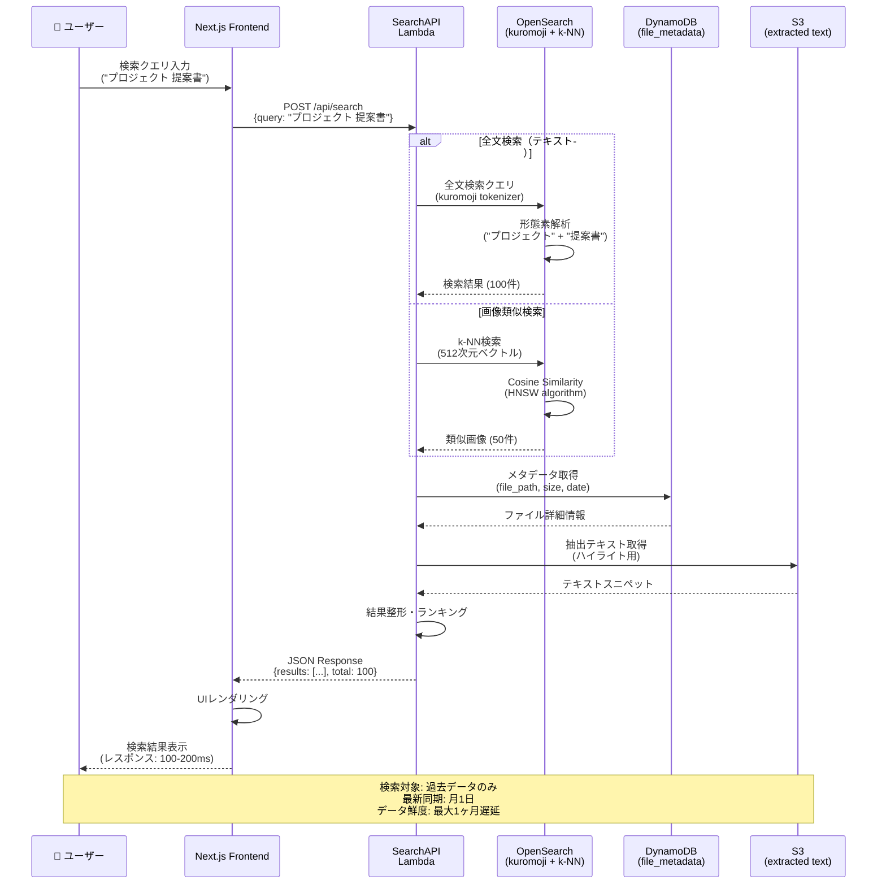
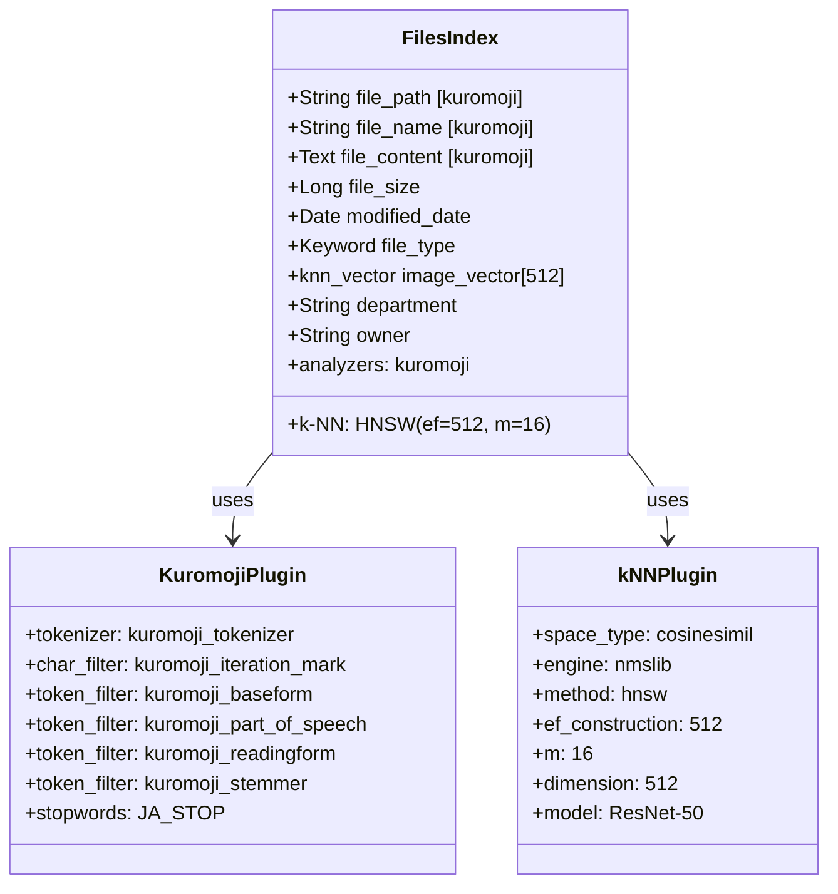
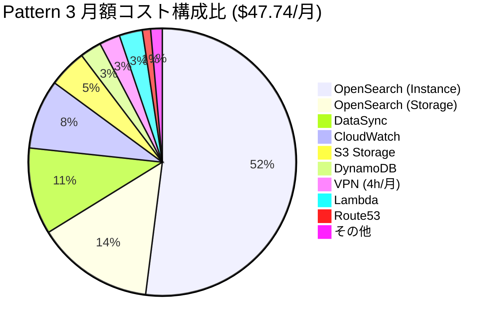
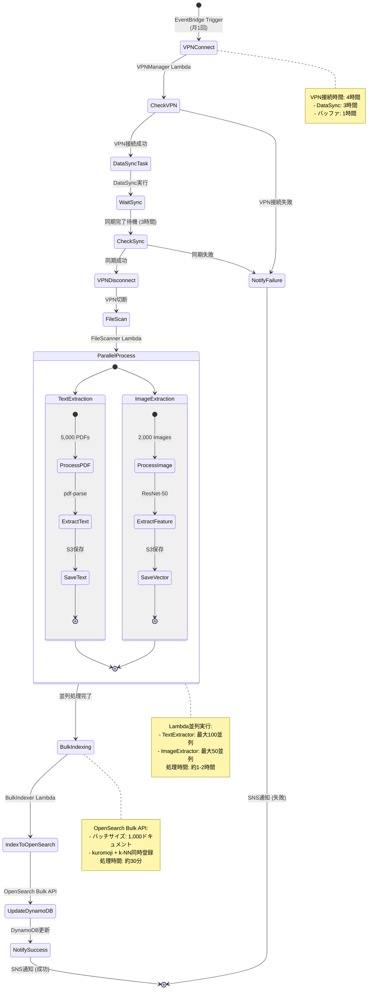
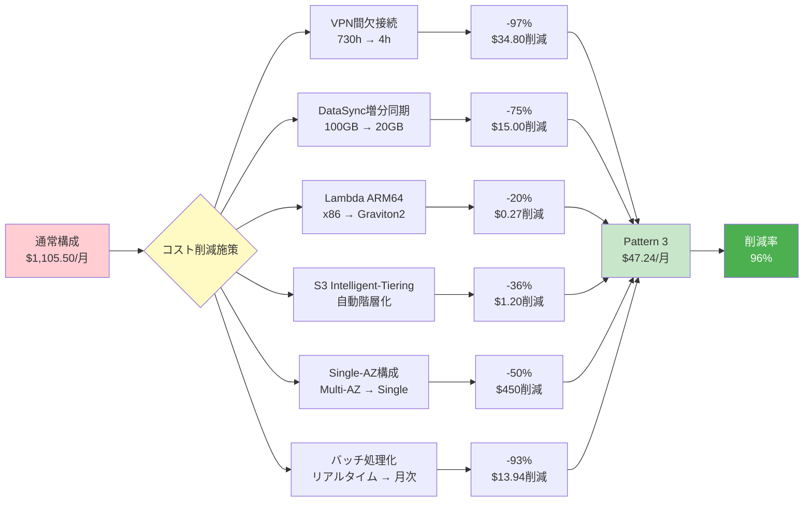

# Pattern 3: 月次バッチ同期アーキテクチャ（NAS-AWS ハイブリッド）

## システム概要

Pattern 3は、過去データのみを検索対象とするコスト最適化アーキテクチャです。
ファイル実体はオンプレミスNASに保持し、メタデータと抽出テキストのみをAWSで管理します。

**主要な特徴:**
- 🔄 月1回の増分同期（VPN接続は月4時間のみ）
- 💰 月額コスト $47.74（Pattern 2比96%削減）
- 🔒 HTTPS暗号化（ACM証明書無料、Route53 $0.50/月）
- 🔍 全文検索（kuromoji）+ 画像類似検索（k-NN）対応
- 📦 100万ファイル対応
- ⚡ ARM64 (Graviton2) 全Lambda最適化

---

## アーキテクチャ図

### 全体構成図

---

## 月次バッチ同期フロー詳細

---

## ユーザー検索フロー

---

## OpenSearch インデックス構造

---

## コスト構成円グラフ（構成比）

---

## Step Functions ワークフロー図

---

## 主要コスト削減施策

---

## 技術スタック

### Lambda Runtime
- **Architecture**: ARM64 (Graviton2)
- **Runtime**: Node.js 20.x / Python 3.11
- **Cost Benefit**: 20%削減 + 高性能

### OpenSearch Plugins
1. **analysis-kuromoji**
   - 日本語形態素解析
   - 辞書: mecab-ipadic
   - トークナイザー: kuromoji_tokenizer

2. **k-NN plugin**
   - Algorithm: HNSW (Hierarchical Navigable Small World)
   - Distance: Cosine Similarity
   - Vector Dimension: 512
   - Index Parameters: ef_construction=512, m=16

### ML Model
- **画像特徴抽出**: ResNet-50 (PyTorch)
- **テキスト抽出**: pdf-parse, pdfplumber

---

## スケーリングシナリオ

| ユーザー数 | ファイル数 | OpenSearch | Lambda | 月額コスト | 増加率 |
|----------|----------|-----------|--------|----------|-------|
| 50 | 1,000,000 | t3.small | 512-2048MB | $47.24 | - |
| 100 | 1,000,000 | t3.small | 512-2048MB | $48.29 | +2% |
| 200 | 2,000,000 | t3.medium | 1024-2048MB | $73.70 | +56% |
| 500 | 5,000,000 | r6g.large | 2048-3008MB | $123.17 | +161% |

---

## 運用考慮事項

### バッチ実行タイミング
- **推奨**: 毎月1日 深夜2時（業務時間外）
- **VPN接続時間**: 4時間（2:00-6:00）
- **Lambda処理**: VPN切断後1-2時間

### 監視項目
1. VPN接続成功率
2. DataSync転送完了時間
3. Lambda並列実行数
4. OpenSearchインデックス成功率
5. 検索レスポンスタイム

### アラート設定
1. バッチ失敗 → SNS即時通知
2. VPN接続失敗 → 再試行 + 通知
3. OpenSearchディスク使用率 > 80%
4. 検索エラー率 > 5%

---

## 改訂履歴

| 版数 | 日付 | 改訂内容 |
|-----|------|---------|
| 1.0 | 2025-01-18 | Pattern 3アーキテクチャ図初版作成 |
