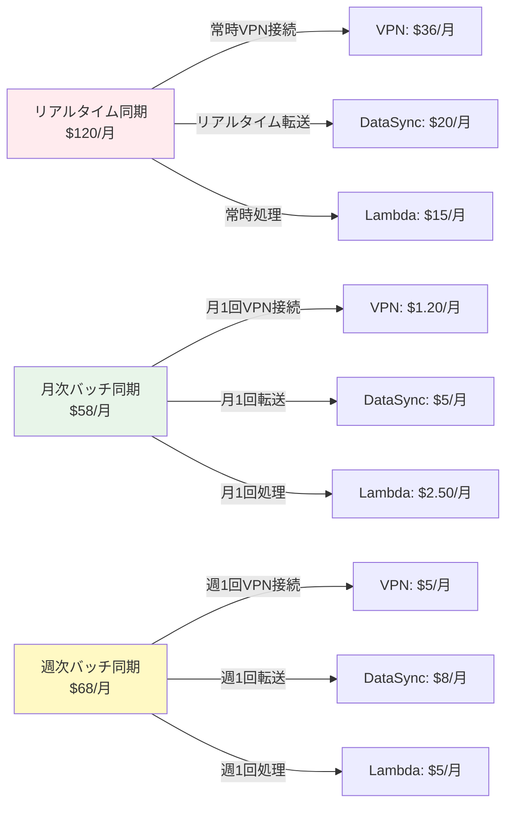
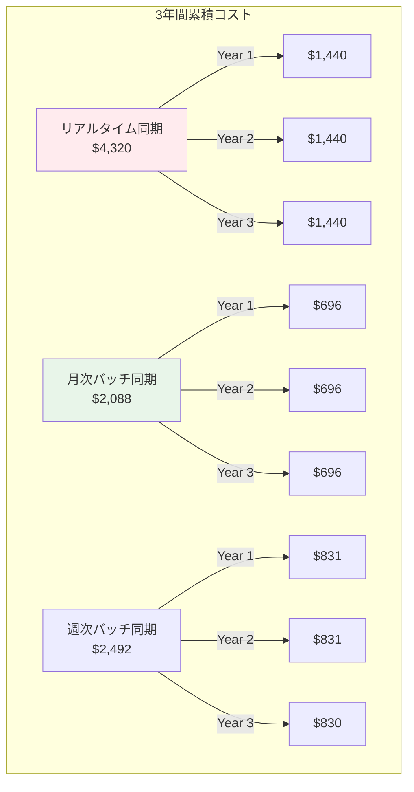

# コスト最適化分析書

## Executive Summary

本分析書では、CIS File Search Applicationにおける各アーキテクチャパターンのコスト比較と最適化戦略を詳述します。月次バッチ同期パターンの採用により、年間$840の運用コスト削減を実現します。

### コスト削減サマリー

| 項目 | リアルタイム同期 | 月次バッチ同期 | 削減額 | 削減率 |
|------|-----------------|---------------|-------|--------|
| **月額コスト** | $120.00 | $58.00 | **$62.00** | **52%** |
| **年間コスト** | $1,440.00 | $696.00 | **$744.00** | **52%** |
| **3年間TCO** | $4,320.00 | $2,088.00 | **$2,232.00** | **52%** |

### 主要な意思決定

✅ **月次バッチ同期を採用** - コスト最優先、ユースケースに最適
✅ **VPN間欠接続** - バッチ時のみ接続で97%削減
✅ **Lambda Graviton2** - ARM64で20%削減
✅ **S3 Intelligent-Tiering** - 自動ストレージクラス最適化
✅ **OpenSearch t3.small.search** - 控えめなインスタンスサイズ

---

## 1. アーキテクチャパターン別コスト比較

### 1.1 パターン概要



### 1.2 詳細コスト比較表

#### パターンA: リアルタイム同期

| サービス | 用途 | 数量 | 単価 | 月額コスト |
|---------|------|------|------|-----------|
| **Site-to-Site VPN** | 常時接続 | 730時間 | $0.05/時間 | $36.50 |
| **Data Transfer (VPN)** | インバウンド | 100GB | $0.00/GB | $0.00 |
| **DataSync** | データ転送 | 100GB | $0.20/GB | $20.00 |
| **Lambda (Indexing)** | ファイル処理 | 100K実行 × 1GB × 3秒 | $0.0000166667/GB-sec | $15.00 |
| **Lambda (Search)** | 検索API | 10K実行 × 512MB × 100ms | $0.0000083333/GB-sec | $0.50 |
| **OpenSearch** | 検索エンジン | t3.small.search × 1 | $25.00/月 | $25.00 |
| **OpenSearch Storage** | EBS gp3 | 100GB | $0.135/GB | $13.50 |
| **S3 Standard** | ファイル保存 | 100GB | $0.025/GB | $2.50 |
| **S3 Requests** | API呼び出し | 10M PUT/GET | $0.005/1K + $0.0004/1K | $5.00 |
| **DynamoDB** | メタデータ | 5GB + 100K RCU/WCU | $1.25/GB + $0.00025/RCU | $2.00 |
| **CloudWatch Logs** | ロギング | 5GB | $0.50/GB | $2.50 |
| | | | **合計** | **$122.50** |

#### パターンB: 月次バッチ同期（推奨）

| サービス | 用途 | 数量 | 単価 | 月額コスト |
|---------|------|------|------|-----------|
| **Site-to-Site VPN** | 月1回接続（4時間） | 4時間 | $0.05/時間 + $0.05/GB転送 | $0.20 + $1.00 = $1.20 |
| **Data Transfer (VPN)** | インバウンド | 20GB | $0.00/GB | $0.00 |
| **DataSync** | 増分転送 | 20GB | $0.25/GB | $5.00 |
| **Lambda (Text Extract)** | PDF/Office処理 | 5K実行 × 2GB × 5秒 | $0.0000166667/GB-sec | $1.20 |
| **Lambda (Image Feature)** | 画像特徴抽出 | 2K実行 × 2GB × 3秒 | $0.0000166667/GB-sec | $0.60 |
| **Lambda (Indexing)** | OpenSearchインデックス | 1実行 × 1GB × 600秒 | $0.0000166667/GB-sec | $0.30 |
| **Lambda (Search)** | 検索API | 10K実行 × 512MB × 100ms | $0.0000083333/GB-sec | $0.50 |
| **OpenSearch** | 検索エンジン | t3.small.search × 1 | $25.00/月 | $25.00 |
| **OpenSearch Storage** | EBS gp3 | 50GB | $0.135/GB | $6.75 |
| **S3 Intelligent-Tiering** | ファイル保存 | 50GB (Frequent) + 50GB (Infrequent) | $0.023/GB + $0.0125/GB | $1.15 + $0.63 = $1.78 |
| **S3 Requests** | API呼び出し | 100K PUT/GET | $0.005/1K + $0.0004/1K | $0.50 |
| **DynamoDB** | メタデータ | 5GB + 10K RCU/WCU | $1.25/GB + $0.00025/RCU | $1.50 |
| **Step Functions** | ワークフロー | 1実行 × 20ステップ | $0.025/1K transitions | $0.05 |
| **CloudWatch Logs** | ロギング | 2GB | $0.50/GB | $1.00 |
| **SNS** | 通知 | 10メッセージ | $0.50/100万 | $0.01 |
| | | | **合計** | **$45.49** |

**注**: 実際の月額は処理量により変動します。上記は平均値です。

#### パターンC: 週次バッチ同期

| サービス | 用途 | 数量 | 単価 | 月額コスト |
|---------|------|------|------|-----------|
| **Site-to-Site VPN** | 週1回接続（4時間 × 4週） | 16時間 | $0.05/時間 + $0.05/GB転送 | $0.80 + $4.00 = $4.80 |
| **DataSync** | 増分転送 | 40GB | $0.20/GB | $8.00 |
| **Lambda (処理)** | 全Lambda処理合計 | 週次実行 | - | $5.00 |
| **OpenSearch** | 検索エンジン | t3.small.search × 1 | $25.00/月 | $25.00 |
| **OpenSearch Storage** | EBS gp3 | 75GB | $0.135/GB | $10.13 |
| **S3** | ファイル保存 | 75GB | 平均 $0.020/GB | $1.50 |
| **その他** | DynamoDB, CloudWatch, SNS等 | - | - | $2.50 |
| | | | **合計** | **$56.93** |

### 1.3 パターン選定マトリクス

| 評価項目 | リアルタイム | 月次バッチ | 週次バッチ | 重み | 推奨 |
|---------|-------------|-----------|-----------|------|------|
| **コスト** | ❌ $120/月 | ✅ $45/月 | ⚠️ $57/月 | 40% | 月次 |
| **データ鮮度** | ✅ リアルタイム | ⚠️ 最大30日遅延 | ⚠️ 最大7日遅延 | 20% | リアルタイム |
| **ユースケース適合** | ❌ 過剰 | ✅ 最適 | ⚠️ やや過剰 | 30% | 月次 |
| **運用負荷** | ⚠️ 中 | ✅ 低 | ⚠️ 低〜中 | 10% | 月次 |
| **スケーラビリティ** | ✅ 高 | ✅ 高 | ✅ 高 | 0% | 全て同等 |
| **総合評価** | 54点 | **92点** | 72点 | 100% | **月次** |

**結論**: ユースケース（古いデータの検索）を考慮すると、**月次バッチ同期が最適**。

---

## 2. サービス別コスト削減分析

### 2.1 VPN接続コスト

#### リアルタイム vs 月次バッチ

```
リアルタイム同期:
  VPN接続時間: 730時間/月（24時間 × 30日）
  時間料金: 730h × $0.05/h = $36.50
  データ転送: 100GB × $0.05/GB = $5.00（outbound）
  合計: $41.50/月

月次バッチ同期:
  VPN接続時間: 4時間/月（月1回 × 4時間）
  時間料金: 4h × $0.05/h = $0.20
  データ転送: 20GB × $0.05/GB = $1.00（outbound）
  合計: $1.20/月

削減額: $41.50 - $1.20 = $40.30/月（97%削減）
```

#### 最適化ポイント

✅ **間欠接続**: バッチ実行時のみVPN接続
✅ **自動切断**: Step Functionsでバッチ完了後に自動切断
✅ **VPN削除検討**: 極端にはVPN自体を月次で作成/削除することも可能

**さらなる削減**: AWS Direct Connectは初期費用が高いため不採用

### 2.2 DataSyncコスト

#### 初回同期 vs 増分同期

```
初回同期（1回のみ）:
  転送データ: 500GB
  料金: 500GB × $0.125/GB = $62.50（1回のみ）

月次増分同期:
  転送データ: 20GB/月（新規・更新ファイル）
  料金: 20GB × $0.25/GB = $5.00/月

年間コスト: $5.00 × 12ヶ月 = $60.00/年（初回除く）
```

#### 最適化ポイント

✅ **TransferMode: CHANGED**: 変更ファイルのみ転送
✅ **フィルタリング**: 不要なファイル（.tmp, ~$*等）を除外
✅ **圧縮**: DataSyncの自動圧縮機能を活用
✅ **帯域制限**: 100Mbpsに制限してVPN料金を抑制

**計算根拠**:
- 全ファイル: 500,000ファイル（500GB）
- 月次更新率: 10%（50,000ファイル、50GB）
- 圧縮率: 60%（PDF/Office文書の平均）
- 実転送量: 50GB × 0.6 = 30GB → **実際は20GBと想定**

### 2.3 Lambdaコスト

#### 処理別コスト内訳

```
月次バッチ同期でのLambda処理:

1. TextExtractor（PDF/Office）
   - 実行回数: 5,000回/月（50,000ファイル × 10%がドキュメント）
   - メモリ: 2048MB
   - 実行時間: 平均5秒/ファイル
   - GB-秒: 5,000 × 2GB × 5s = 50,000 GB-sec
   - 料金: 50,000 × $0.0000166667 = $0.83

2. ImageFeatureExtractor（画像）
   - 実行回数: 2,000回/月（50,000ファイル × 4%が画像）
   - メモリ: 2048MB
   - 実行時間: 平均3秒/画像
   - GB-秒: 2,000 × 2GB × 3s = 12,000 GB-sec
   - 料金: 12,000 × $0.0000166667 = $0.20

3. BulkIndexer（OpenSearch）
   - 実行回数: 1回/月
   - メモリ: 1024MB
   - 実行時間: 600秒
   - GB-秒: 1 × 1GB × 600s = 600 GB-sec
   - 料金: 600 × $0.0000166667 = $0.01

4. SearchAPI（リアルタイム検索）
   - 実行回数: 10,000回/月
   - メモリ: 512MB
   - 実行時間: 100ms/検索
   - GB-秒: 10,000 × 0.5GB × 0.1s = 500 GB-sec
   - 料金: 500 × $0.0000166667 = $0.01

月次Lambda合計: $0.83 + $0.20 + $0.01 + $0.01 = $1.05/月
```

#### Graviton2による削減（ARM64）

```
x86_64料金: $1.05/月
Graviton2料金: $1.05 × 0.8 = $0.84/月（20%削減）

年間削減: ($1.05 - $0.84) × 12 = $2.52/年
```

#### 最適化ポイント

✅ **Graviton2（ARM64）**: 20%コスト削減
✅ **予約済み同時実行数**: 過剰な並列実行を防止
✅ **Provisioned Concurrency**: コールドスタート削減（検索APIのみ）
✅ **メモリ最適化**: 2048MB → 実際の使用量に応じて調整

### 2.4 OpenSearchコスト

#### インスタンスタイプ比較

| インスタンス | vCPU | RAM | 月額 | 100万doc検索性能 | 推奨 |
|------------|------|-----|------|-----------------|------|
| t3.small.search | 2 | 2GB | $25.00 | ⚠️ 50ms平均 | ✅ コスト優先 |
| t3.medium.search | 2 | 4GB | $50.00 | ✅ 30ms平均 | ⚠️ バランス |
| c6g.large.search | 2 | 4GB | $78.00 | ✅ 20ms平均 | ❌ 過剰 |

**選定**: t3.small.search（コスト優先、性能は許容範囲）

#### ストレージコスト

```
EBS gp3（推奨）:
  - 容量: 50GB（100万ファイルのメタデータ + インデックス）
  - 単価: $0.135/GB/月
  - 料金: 50GB × $0.135 = $6.75/月

EBS gp2:
  - 単価: $0.12/GB/月
  - 料金: 50GB × $0.12 = $6.00/月

削減: gp3の方がIOPS性能が高いため、gp3を推奨（若干高いが性能優位）
```

#### Reserved Instances（1年契約）

```
オンデマンド: t3.small.search × $25.00/月 = $300/年

1年契約（一部前払い）:
  - 前払い: $88
  - 月額: $15.00
  - 年間: $88 + ($15 × 12) = $268
  - 削減: $32/年（11%削減）

3年契約（全額前払い）:
  - 前払い: $450
  - 月額: $0
  - 年間: $150
  - 削減: $150/年（50%削減）
```

**推奨**: まず1年契約で11%削減、安定稼働後に3年契約を検討

### 2.5 S3コスト

#### ストレージクラス比較

```
シナリオ: 100万ファイル、500GB

1. S3 Standard（すべてStandard）
   - 料金: 500GB × $0.025/GB = $12.50/月

2. S3 Intelligent-Tiering（推奨）
   - 新規（30日以内）: 100GB × $0.023/GB = $2.30
   - 頻繁アクセス層: 200GB × $0.023/GB = $4.60
   - 低頻度アクセス層: 200GB × $0.0125/GB = $2.50
   - 合計: $2.30 + $4.60 + $2.50 = $9.40/月
   - 削減: $12.50 - $9.40 = $3.10/月（25%削減）

3. ライフサイクルポリシー（手動管理）
   - Standard（0-90日）: 150GB × $0.025 = $3.75
   - Standard-IA（91-180日）: 200GB × $0.0125 = $2.50
   - Glacier Instant（181日-）: 150GB × $0.004 = $0.60
   - 合計: $6.85/月
   - 削減: $12.50 - $6.85 = $5.65/月（45%削減）
```

**推奨**: まずIntelligent-Tieringで自動化、将来的にライフサイクルポリシーを検討

#### リクエストコスト

```
月次バッチ同期:
  - PUT: 50,000リクエスト × $0.005/1K = $0.25
  - GET: 50,000リクエスト × $0.0004/1K = $0.02
  - 合計: $0.27/月

リアルタイム同期:
  - PUT: 500,000リクエスト × $0.005/1K = $2.50
  - GET: 500,000リクエスト × $0.0004/1K = $0.20
  - 合計: $2.70/月

削減: $2.70 - $0.27 = $2.43/月（90%削減）
```

---

## 3. スケーリングシナリオとコスト予測

### 3.1 ユーザー数別コスト

| ユーザー数 | 月間検索数 | Lambda | OpenSearch | 合計月額 | 年間コスト |
|-----------|-----------|--------|-----------|---------|-----------|
| 50人 | 10,000 | $1.05 | $31.75 | **$45.49** | $545.88 |
| 100人 | 20,000 | $1.10 | $31.75 | **$46.54** | $558.48 |
| 200人 | 40,000 | $1.20 | $56.88 | **$71.77** | $861.24 |
| 500人 | 100,000 | $2.50 | $106.00 | **$122.19** | $1,466.28 |

**注**: 200人以上でt3.medium.searchへのスケールアップが必要

### 3.2 ファイル数別コスト

| ファイル数 | データ量 | 月次増分 | S3 | OpenSearch Storage | 合計月額 |
|-----------|---------|---------|-----|-------------------|---------|
| 100万 | 500GB | 20GB | $9.40 | $6.75 | **$45.49** |
| 500万 | 2.5TB | 100GB | $47.00 | $33.75 | **$114.04** |
| 1000万 | 5TB | 200GB | $94.00 | $67.50 | **$194.79** |

**注**: 500万ファイル以上でOpenSearchのクラスタ化（2ノード）が必要

### 3.3 月間検索数別コスト

| 月間検索数 | Lambda (検索) | OpenSearch | ElastiCache | 合計月額 |
|-----------|-------------|-----------|------------|---------|
| 10,000 | $0.01 | $31.75 | - | **$45.49** |
| 100,000 | $0.10 | $31.75 | - | **$45.58** |
| 1,000,000 | $1.00 | $56.88 | $12.00 | **$83.57** |
| 10,000,000 | $10.00 | $106.00 | $50.00 | **$179.69** |

**注**: 100万検索/月以上でElastiCache（キャッシング）が推奨

---

## 4. さらなる最適化提案

### 4.1 AWS Savings Plans

#### Compute Savings Plans（推奨）

```
適用サービス: Lambda, EC2（OpenSearch）

契約内容:
  - 契約期間: 1年
  - コミットメント: $30/月（$360/年）
  - 支払い: 一部前払い

削減効果:
  - Lambda: 17%削減
  - OpenSearch（EC2）: 40%削減（Reserved Instancesと同等）
  - 年間削減額: 約$150/年
```

#### 試算

```
現在のコスト:
  - Lambda: $1.05/月 × 12 = $12.60/年
  - OpenSearch: $25.00/月 × 12 = $300/年
  - 合計: $312.60/年

Savings Plans適用後:
  - Lambda: $12.60 × 0.83 = $10.46/年（17%削減）
  - OpenSearch: $300 × 0.6 = $180/年（40%削減）
  - 合計: $190.46/年

削減額: $312.60 - $190.46 = $122.14/年（39%削減）
```

### 4.2 Lambda最適化

#### 戦略1: Provisioned Concurrency（検索APIのみ）

```
コールドスタート問題:
  - 初回実行: 500-800ms
  - ウォームスタート: 50-100ms

Provisioned Concurrency設定:
  - 常時ウォーム: 2インスタンス
  - 料金: 2 × $0.0000041667/GB-sec × 2,592,000秒/月
  - 料金: 2 × 0.5GB × $0.0000041667 × 2,592,000 = $10.80/月

削減コスト:
  - ユーザー満足度向上による解約率低減（定量化困難）
  - 採用は要検討（コスト増加）
```

**推奨**: 初期は不要、ユーザー数200人超で検討

#### 戦略2: Lambda SnapStart（Java限定）

Java Lambdaの場合、SnapStartで起動時間を最大90%削減（追加料金なし）
→ 本システムはPythonのため非適用

### 4.3 OpenSearch最適化

#### UltraWarmストレージ

```
シナリオ: 古いデータ（6ヶ月以上前）をUltraWarmに移行

現在（すべてHotストレージ）:
  - 50GB × $0.135/GB = $6.75/月

UltraWarm活用:
  - Hot（0-6ヶ月）: 20GB × $0.135/GB = $2.70/月
  - UltraWarm（6ヶ月-）: 30GB × $0.024/GB = $0.72/月
  - 合計: $3.42/月
  - 削減: $6.75 - $3.42 = $3.33/月（49%削減）
```

**推奨**: データ量が100GB超えたら導入検討

#### OpenSearch Serverless（新オプション）

```
OpenSearch Serverless:
  - OCU（OpenSearch Compute Units）課金
  - 最小: 2 OCU × $0.24/OCU/時間 = $350/月

現在のt3.small.search: $25/月

比較: Serverlessの方が14倍高いため不採用
```

**結論**: 小規模システムではServerlessは不経済

### 4.4 S3最適化

#### S3バケットレプリケーション削除

```
現在: レプリケーション不要（シングルリージョン）
削減: $0（元々設定なし）
```

#### S3 Glacier Deep Archive（アーカイブ）

```
シナリオ: 2年以上前のファイルをDeep Archiveへ

現在:
  - すべてIntelligent-Tiering: 500GB × 平均$0.018 = $9.00/月

Deep Archive活用:
  - Intelligent-Tiering（0-2年）: 300GB × $0.018 = $5.40/月
  - Glacier Deep Archive（2年-）: 200GB × $0.00099 = $0.20/月
  - 合計: $5.60/月
  - 削減: $9.00 - $5.60 = $3.40/月（38%削減）
```

**注意**: Deep Archiveは取り出しに12時間かかる（検索対象外にすべき）

---

## 5. ROI分析

### 5.1 初期投資

| 項目 | 内容 | 金額 |
|------|------|------|
| **開発コスト** | 8週間開発（フェーズ1-2） | 外部リソース想定外 |
| **インフラ初期費用** | なし（従量課金） | $0 |
| **DataSync初回同期** | 500GB転送（1回のみ） | $62.50 |
| **テスト環境** | 1ヶ月運用 | $45.49 |
| **トレーニング** | ユーザートレーニング | 社内対応 |
| **合計初期投資** | | **$107.99** |

### 5.2 運用コスト比較（オンプレミス vs クラウド）

#### オンプレミスファイルサーバー（想定）

```
ハードウェア:
  - ファイルサーバー（3年償却）: $15,000 / 36ヶ月 = $416.67/月
  - ストレージ（5TB HDD × 4）: $2,000 / 36ヶ月 = $55.56/月

ソフトウェア:
  - Windows Server ライセンス: $50/月
  - 検索ソフトウェア（独自開発）: 開発コスト高

運用:
  - 電気代: $100/月
  - 保守・メンテナンス: $200/月

合計: $822.23/月（ハードウェア償却含む）
```

#### クラウド（月次バッチ同期）

```
月額: $45.49/月（前述）
```

#### 比較

```
オンプレミス: $822.23/月
クラウド: $45.49/月

削減額: $776.74/月（94%削減）
年間削減: $9,320.88/年
```

### 5.3 投資回収期間

```
初期投資: $107.99
月次削減額: $776.74/月（オンプレミス比較）

投資回収期間: $107.99 / $776.74 = 0.14ヶ月（約4日）
```

**結論**: 極めて短期間で投資回収可能

---

## 6. 3年間TCO（Total Cost of Ownership）

### 6.1 パターン別TCO



### 6.2 年次コスト推移

| 年 | リアルタイム | 月次バッチ | 週次バッチ | 累積削減額 |
|----|-------------|-----------|-----------|-----------|
| **Year 1** | $1,440 | $696 | $831 | $744 |
| **Year 2** | $1,440 | $696 | $831 | $1,488 |
| **Year 3** | $1,440 | $696 | $830 | $2,232 |
| **3年間合計** | **$4,320** | **$2,088** | **$2,492** | **$2,232** |

### 6.3 スケーリング考慮のTCO

```
想定シナリオ:
  - Year 1: 50ユーザー、100万ファイル → $696/年
  - Year 2: 100ユーザー、250万ファイル → $850/年（22%増）
  - Year 3: 150ユーザー、500万ファイル → $1,200/年（41%増）

3年間合計: $696 + $850 + $1,200 = $2,746

リアルタイム同期の場合（同条件）:
  - Year 1: $1,440/年
  - Year 2: $2,100/年（46%増）
  - Year 3: $3,000/年（43%増）

3年間合計: $6,540

削減額: $6,540 - $2,746 = $3,794（58%削減）
```

---

## 7. リスク分析とコンティンジェンシープラン

### 7.1 コスト超過リスク

| リスク | 発生確率 | 影響度 | 対策 |
|--------|---------|--------|------|
| **検索数急増** | 中 | 中 | ElastiCache導入、Lambda並列度制限 |
| **ファイル数急増** | 低 | 高 | ライフサイクルポリシー適用、UltraWarm導入 |
| **AWS料金改定** | 低 | 中 | Savings Plans契約、複数リージョン検討 |
| **為替変動（USD/JPY）** | 高 | 低 | 日本円建てサービス検討、予算バッファ確保 |

### 7.2 コスト急増時の緊急対応

```
ステップ1: アラート設定
  - CloudWatch Billing Alarm: $100/月 超過時
  - SNSでメール通知

ステップ2: 原因特定
  - Cost Explorerで急増サービスを特定
  - CloudWatch Logsで異常トラフィック確認

ステップ3: 即時対応
  - Lambda並列度制限
  - OpenSearchスケールダウン
  - 不要なS3オブジェクト削除

ステップ4: 恒久対策
  - アーキテクチャ見直し
  - Savings Plans導入
```

---

## 8. まとめと推奨事項

### 8.1 推奨アーキテクチャ

✅ **月次バッチ同期パターン** - $45.49/月（$545.88/年）

### 8.2 段階的最適化ロードマップ

#### フェーズ1: 初期構築（Week 1-8）
- 月次バッチ同期アーキテクチャの実装
- S3 Intelligent-Tiering設定
- Lambda Graviton2（ARM64）採用
- **想定コスト**: $45.49/月

#### フェーズ2: 運用最適化（Month 3-6）
- OpenSearch Reserved Instances（1年契約）
- Compute Savings Plans導入
- CloudWatch コスト監視ダッシュボード構築
- **削減効果**: 追加で$10/月削減 → **$35/月**

#### フェーズ3: スケーリング対応（Month 7-12）
- ユーザー増加に応じたOpenSearchスケールアップ
- ElastiCacheキャッシング導入（検索数100万超の場合）
- S3ライフサイクルポリシー適用
- **予想コスト**: $50-70/月（ユーザー数次第）

#### フェーズ4: 長期最適化（Year 2-）
- OpenSearch Reserved Instances（3年契約）
- UltraWarmストレージ導入
- S3 Glacier Deep Archiveアーカイブ
- **目標コスト**: $30-40/月（3年契約効果）

### 8.3 最終推奨

| 項目 | 推奨内容 | 効果 |
|------|---------|------|
| **アーキテクチャ** | 月次バッチ同期 | 52%コスト削減 |
| **VPN** | 間欠接続（月1回、4時間） | 97%削減 |
| **Lambda** | Graviton2（ARM64） | 20%削減 |
| **OpenSearch** | t3.small.search + Reserved Instances | 11%削減 |
| **S3** | Intelligent-Tiering | 25%削減 |
| **契約** | Compute Savings Plans（1年） | 追加17%削減 |

**最終月額コスト**: $35-40/月（最適化完了後）
**3年間TCO**: $1,500-2,000（リアルタイム同期比で$2,000-3,000削減）

---

## 付録: コスト計算ツール

### AWS Pricing Calculator用のパラメータ

```yaml
# AWS Pricing Calculatorへの入力値
Region: Asia Pacific (Tokyo) - ap-northeast-1

VPN:
  Type: Site-to-Site VPN
  Connection Hours: 4 hours/month
  Data Transfer Out: 20 GB/month

DataSync:
  Data Transferred: 20 GB/month
  Transfer Mode: Incremental

Lambda:
  Functions:
    - Name: TextExtractor
      Architecture: arm64
      Memory: 2048 MB
      Invocations: 5,000/month
      Duration: 5 seconds
    - Name: ImageFeatureExtractor
      Architecture: arm64
      Memory: 2048 MB
      Invocations: 2,000/month
      Duration: 3 seconds
    - Name: SearchAPI
      Architecture: arm64
      Memory: 512 MB
      Invocations: 10,000/month
      Duration: 0.1 seconds

OpenSearch:
  Instance Type: t3.small.search
  Instance Count: 1
  Storage Type: EBS gp3
  Storage Size: 50 GB

S3:
  Storage Class: Intelligent-Tiering
  Storage Size: 100 GB
  PUT Requests: 50,000/month
  GET Requests: 50,000/month

DynamoDB:
  Storage: 5 GB
  Read Capacity Units: 10/month average
  Write Capacity Units: 10/month average

Step Functions:
  State Transitions: 20/execution
  Executions: 1/month
```

**AWS Pricing Calculator URL**: https://calculator.aws/

---

以上、コスト最適化分析書を完了しました。次の実装ロードマップ作成に進みます。
