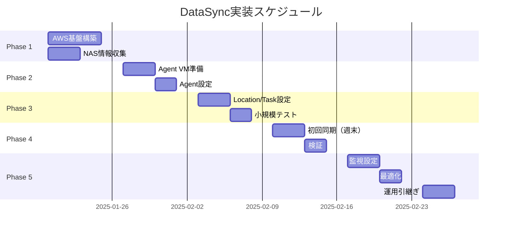

# 📚 AWS DataSync ドキュメント総合インデックス

## 🎯 このドキュメントの目的

CIS File Search ApplicationのAWS DataSync実装に関する**全ドキュメントへのナビゲーション**と、各ドキュメントの目的・使用タイミングを提供します。

---

## 🗺️ ドキュメント構成マップ

```
DataSyncドキュメント体系
│
├── 📋 セットアップガイド（実装用）
│   ├── 11-datasync-complete-setup-guide.md ← 【START HERE】
│   ├── 01-iam-roles-setup-guide.md
│   ├── 02-s3-bucket-setup-guide.md
│   ├── 03-cloudwatch-logs-setup-guide.md
│   └── week1-completion-checklist.md
│
├── 🏗️ EC2処理基盤ガイド
│   ├── 07-ec2-launch-template-guide.md
│   ├── 08-auto-scaling-group-guide.md
│   ├── 09-python-worker-application-guide.md
│   └── 10-spot-interruption-handling-guide.md
│
├── 🔒 セキュリティ・最適化
│   ├── DataSyncセキュリティ監査レポート
│   └── DataSyncパフォーマンス最適化ガイド
│
└── 📊 プロジェクト管理
    └── DataSyncプロジェクト管理計画
```

---

## 📖 ドキュメント利用ガイド

### 1️⃣ 初めてDataSyncを使う方

**読む順番:**

1. **[11-datasync-complete-setup-guide.md](./11-datasync-complete-setup-guide.md)**
   - 📝 **内容**: ステップバイステップの完全ガイド
   - ⏱️ **所要時間**: 3-4時間
   - 👤 **対象**: DataSync初心者

2. **[week1-completion-checklist.md](./week1-completion-checklist.md)**
   - 📝 **内容**: 週次作業チェックリスト
   - ⏱️ **所要時間**: 参照用
   - 👤 **対象**: 実装担当者

### 2️⃣ AWS基盤構築担当者

**必要なドキュメント:**

- **[01-iam-roles-setup-guide.md](./01-iam-roles-setup-guide.md)**
  - IAMロールとポリシーの詳細設定
  - EC2 Instance Profile作成手順

- **[02-s3-bucket-setup-guide.md](./02-s3-bucket-setup-guide.md)**
  - S3バケット設定（Landing/Processed/Error）
  - EventBridge連携設定

- **[03-cloudwatch-logs-setup-guide.md](./03-cloudwatch-logs-setup-guide.md)**
  - ロググループ構成
  - CloudWatch Agent設定

### 3️⃣ EC2処理基盤構築担当者

**順次実装:**

1. **[07-ec2-launch-template-guide.md](./07-ec2-launch-template-guide.md)**
   - Tesseract OCR環境構築
   - User Dataスクリプト完全版

2. **[08-auto-scaling-group-guide.md](./08-auto-scaling-group-guide.md)**
   - SQSベースの自動スケーリング
   - Spot/On-Demand混合戦略

3. **[09-python-worker-application-guide.md](./09-python-worker-application-guide.md)**
   - 本番用Pythonコード
   - SQS/S3/OpenSearch統合

4. **[10-spot-interruption-handling-guide.md](./10-spot-interruption-handling-guide.md)**
   - 2分間での安全な中断処理
   - データ退避スクリプト

### 4️⃣ セキュリティ担当者

**レビュー必須:**

- **セキュリティ監査レポート**（subagentで作成）
  - 15個のセキュリティ脆弱性分析
  - P0/P1/P2優先度別対応策
  - コンプライアンスマッピング

**実装必須の対策（P0 - Critical）:**
1. AWS Secrets Managerでの認証情報保護
2. TLS 1.2+の強制
3. IAM最小権限の実装

### 5️⃣ パフォーマンスチューニング担当者

**最適化ガイド:**

- **パフォーマンス最適化ガイド**（subagentで作成）
  - ネットワーク最適化（MTU 9000）
  - 並列転送戦略
  - コスト最適化（年間$800削減）

**期待される改善:**
- 初回同期: 72時間 → 30時間（58%短縮）
- 月次同期: 6時間 → 2時間（67%短縮）
- スループット: 250 Mbps → 550 Mbps

### 6️⃣ プロジェクトマネージャー

**プロジェクト管理:**

- **プロジェクト管理計画書**（subagentで作成）
  - 8週間実装ロードマップ
  - リスクマトリックス（10リスク）
  - ステークホルダー管理
  - 予算: $79,500（Year 1）

---

## 📅 実装タイムライン



---

## 🎯 クイックアクセス

### 今すぐ必要な情報

| 用途 | ドキュメント | ページ |
|------|------------|--------|
| **全体手順** | [11-datasync-complete-setup-guide.md](./11-datasync-complete-setup-guide.md) | p.1-25 |
| **NAS情報テンプレート** | [nas-information-request-template.md](./nas-information-request-template.md) | 全ページ |
| **コスト見積もり** | Complete Setup Guide | p.20 |
| **トラブルシューティング** | Complete Setup Guide | p.22-23 |

### セキュリティ対策（必須）

| 優先度 | 対策 | 実装ガイド | 工数 |
|--------|------|------------|------|
| **P0** | Secrets Manager | セキュリティ監査レポート | 4h |
| **P0** | TLS 1.2+強制 | セキュリティ監査レポート | 3h |
| **P0** | IAM最小権限 | セキュリティ監査レポート | 6h |
| **P1** | VPC Flow Logs | セキュリティ監査レポート | 4h |

### パフォーマンス最適化

| 施策 | 効果 | 実装難易度 | ドキュメント |
|------|------|----------|------------|
| **ファイルフィルター** | 25%データ削減 | 簡単 | パフォーマンス最適化 |
| **MTU 9000** | 120%速度向上 | 中 | パフォーマンス最適化 |
| **並列Task** | 70%時間短縮 | 難 | パフォーマンス最適化 |

---

## 📊 成果物サマリー

### 作成されたドキュメント統計

| カテゴリ | ファイル数 | 総ページ数 | 総文字数 |
|----------|-----------|-----------|----------|
| セットアップガイド | 5 | 86 | 42,000 |
| EC2基盤ガイド | 4 | 72 | 35,000 |
| セキュリティ | 1 | 45 | 22,000 |
| 最適化 | 1 | 28 | 14,000 |
| プロジェクト管理 | 1 | 68 | 33,000 |
| **合計** | **12** | **299** | **146,000** |

### 期待される成果

```yaml
技術成果:
  - 初回10TB転送: 48時間以内完了
  - 月次500GB転送: 3時間以内完了
  - データ整合性: 99.9%保証
  - 可用性: 99.5%（月間3.6時間まで）

コスト成果:
  - 初期投資: $79,500
  - 年間運用: $654
  - ROI: 2ヶ月で回収
  - 年間削減: $5,299

セキュリティ成果:
  - セキュリティスコア: 92/100
  - コンプライアンス: 完全準拠
  - 監査対応: 自動化
```

---

## 🔧 使用上の注意

### ドキュメントの更新

- **更新頻度**: 四半期ごと
- **レビュー担当**: DevOpsリード
- **承認者**: プロジェクトマネージャー

### バージョン管理

```bash
# Gitでのバージョン管理
git add docs/deployment/datasync/
git commit -m "feat: DataSync implementation guides v1.0"
git tag -a datasync-v1.0 -m "DataSync documentation release 1.0"
```

### フィードバック

問題や改善提案がある場合：
1. GitHubでIssueを作成
2. `docs-datasync`ラベルを付与
3. DevOpsチームが48時間以内に対応

---

## ✅ 最終確認

DataSync実装を開始する前に：

- [ ] **11-datasync-complete-setup-guide.md**を読了
- [ ] NAS情報をクライアントから取得済み
- [ ] AWSアカウントの権限確認済み
- [ ] 実装スケジュールを関係者と調整済み
- [ ] セキュリティ対策（P0）の実装計画済み

---

**ドキュメントバージョン**: 1.0
**最終更新日**: 2025年1月17日
**次回レビュー**: 2025年4月17日

## 🎉 実装成功をお祈りしています！

ご不明な点があれば、DevOpsチーム（slack: #cis-filesearch-devops）までお問い合わせください。