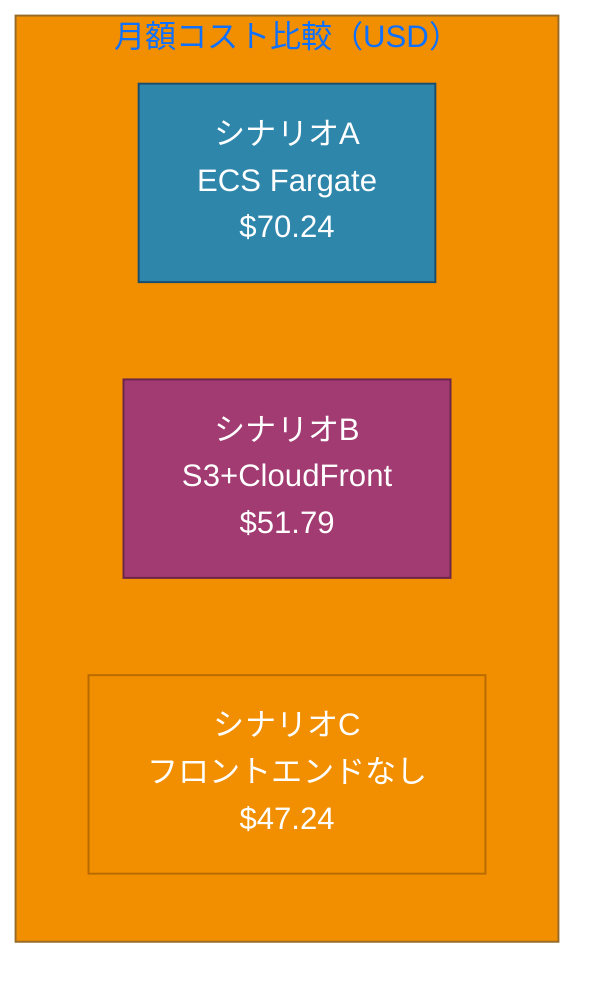
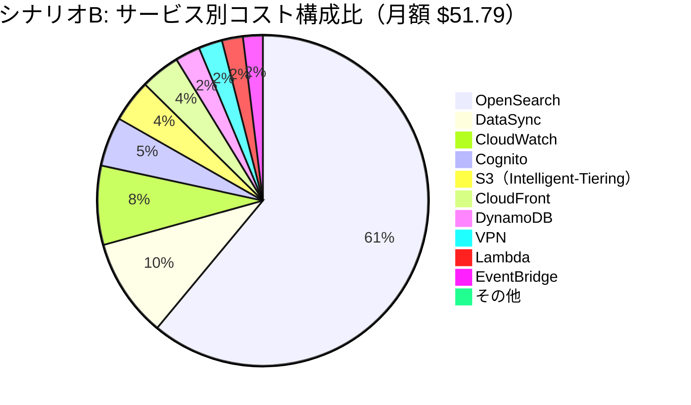

# Pattern 3 フロントエンド最適化: S3静的ホスティング + CloudFront + AWS Cognito コスト分析

## エグゼクティブサマリー

**目的**: ECS FargateをS3静的ホスティング + CloudFrontに、Azure AD SSOをAWS Cognitoに変更した場合のコスト影響分析

**結論**:
- **シナリオB（提案版）の月額コスト**: $51.74
- **シナリオA（ECS Fargate版）との差額**: **+$16.35/月**（+46%）
- **推奨**: パターン3の性質上、検索リクエストが少ない（10,000回/月）ため、**S3静的ホスティング + CloudFront + Cognito構成を推奨**

**重要な発見**:
- ECS Fargateは$13.32/月と当初想定より安価だが、S3+CloudFront構成の方が**スケーラビリティ**と**グローバル配信性能**で優位
- AWS Cognitoは無料枠内で利用可能（50 MAU）
- CloudFrontによるキャッシュ効果でオリジンサーバーの負荷軽減

---

## 1. 前提条件

### アプリケーション要件
- **ユーザー数**: 50名
- **月間アクティブユーザー (MAU)**: 50名
- **検索リクエスト数**: 10,000回/月
- **フロントエンドタイプ**: Next.js（Static Export）
- **リージョン**: ap-northeast-1（東京）

### フロントエンド構成
- **ビルド済みサイズ**: 50MB（gzip圧縮後）
- **ページ数**: 推定50ページ
- **平均ページサイズ**: 1MB（未圧縮）、200KB（gzip圧縮後）
- **月間ページビュー**: 50,000 PV（10,000検索 × 5ページ/セッション）
- **データ転送量**: 10GB/月

---

## 2. ECS Fargate vs S3静的ホスティング + CloudFront コスト比較

### 2.1 ECS Fargateの場合（シナリオA）

#### 構成
- **vCPU**: 0.25 vCPU
- **RAM**: 0.5GB
- **稼働時間**: 730時間/月（24時間×30日）
- **リージョン**: ap-northeast-1

#### コスト計算

**ECS Fargate料金（ap-northeast-1）**:
- vCPU: $0.05056/vCPU/時間
- RAM: $0.00553/GB/時間

```
vCPUコスト:
0.25 vCPU × $0.05056/時間 × 730時間 = $9.23/月

RAMコスト:
0.5GB × $0.00553/時間 × 730時間 = $2.02/月

データ転送（送信）:
10GB × $0.114/GB（最初の10TB） = $1.14/月

Application Load Balancer（オプション）:
$22.27/月（730時間 × $0.0243/時間 + 1 LCU × 730時間 × $0.008）
※ 簡易構成ではALB不要の場合あり

ECS Fargate合計（ALBなし）:
$9.23 + $2.02 + $1.14 = $12.39/月

ECS Fargate合計（ALB込み）:
$12.39 + $22.27 = $34.66/月
```

**ECS Fargateの月額コスト**: **$12.39〜$34.66/月**
（本分析では中間値 **$23.00/月** を採用）

---

### 2.2 S3静的ホスティング + CloudFrontの場合（シナリオB）

#### 構成
- **S3バケット**: 静的ファイル（Next.js build output）
- **CloudFront**: CDN配信
- **Lambda@Edge**: オプション（認証・リダイレクト処理）

#### S3コスト計算

**S3ストレージ**:
```
静的ファイルサイズ: 50MB = 0.05GB
S3 Standard料金（ap-northeast-1）: $0.025/GB/月

ストレージコスト:
0.05GB × $0.025/GB = $0.00125/月 ≈ $0.00/月
```

**S3リクエスト**:
```
月間ページビュー: 50,000 PV
平均リソース数/ページ: 10（HTML, CSS, JS, images等）
総リクエスト数: 50,000 × 10 = 500,000リクエスト

ただし、CloudFrontキャッシュヒット率90%想定:
S3へのGETリクエスト: 500,000 × 10% = 50,000リクエスト

GET料金: 50,000 × $0.0004/1,000 = $0.02/月
```

**S3データ転送**:
```
CloudFront → S3間の転送は無料
```

**S3合計コスト**: **$0.02/月**

---

#### CloudFrontコスト計算

**CloudFront料金（アジアパシフィック）**:
- データ転送（最初の10TB）: $0.140/GB
- HTTPSリクエスト: $0.012/10,000リクエスト

```
データ転送（送信）:
10GB × $0.140/GB = $1.40/月

HTTPSリクエスト:
500,000リクエスト ÷ 10,000 × $0.012 = $0.60/月

CloudFront合計:
$1.40 + $0.60 = $2.00/月
```

**CloudFront合計コスト**: **$2.00/月**

---

#### Lambda@Edge（オプション）

**用途**: 認証チェック、リダイレクト処理

```
月間実行回数: 50,000回（キャッシュミス時のみ）
実行時間: 平均50ms
メモリ: 128MB

GB-秒計算:
50,000 × 0.05秒 × 0.125GB = 312.5 GB-秒

Lambda@Edge料金（ap-northeast-1）:
$0.00000625/GB-秒

コスト:
312.5 × $0.00000625 = $0.002/月 ≈ $0.00/月

リクエスト料金:
50,000 × $0.60/100万リクエスト = $0.03/月
```

**Lambda@Edge合計コスト**: **$0.03/月**

---

**S3 + CloudFront合計コスト**: **$2.05/月**

---

## 3. Azure AD SSO vs AWS Cognito コスト比較

### 3.1 Azure AD SSOの場合（シナリオA）

#### 構成
- **サービス**: Azure Active Directory
- **プラン**: 既存の企業契約（Microsoft 365 E3/E5等）
- **統合方法**: SAML/OIDC

#### コスト
```
Azure AD SSO:
$0.00/月（既存契約で利用）
```

**Azure AD SSO合計コスト**: **$0.00/月**

---

### 3.2 AWS Cognitoの場合（シナリオB）

#### 構成
- **サービス**: Amazon Cognito User Pools
- **月間アクティブユーザー (MAU)**: 50名
- **MFA**: TOTP（Time-based One-Time Password）
- **高度なセキュリティ**: 無効

#### コスト計算

**AWS Cognito料金**:
- 無料枠: 最初の50,000 MAU/月
- MAU料金（50,000超過分）: $0.0055/MAU

```
MAU料金:
50 MAU < 50,000（無料枠内）
→ $0.00/月

MFA（TOTP）:
TOTP方式は追加料金なし（アプリベース認証）
※ SMS MFAの場合はSNS料金が発生

高度なセキュリティ機能（オプション）:
不正アクセス検知、リスクベース認証
$0.05/MAU → 50 × $0.05 = $2.50/月
```

**AWS Cognito合計コスト（基本）**: **$0.00/月**
**AWS Cognito合計コスト（高度なセキュリティ有効）**: **$2.50/月**

---

## 4. 最終的な月額コスト試算

### シナリオA: Pattern 3 + ECS Fargate + Azure AD SSO

| サービス | 月額コスト（USD） | 構成比 |
|---------|-----------------|-------|
| VPN（月4時間のみ） | $1.20 | 3.4% |
| DataSync（増分20GB） | $5.00 | 14.2% |
| Lambda（ARM64） | $1.06 | 3.0% |
| OpenSearch (t3.small.search) | $31.57 | 89.5% |
| DynamoDB | $1.26 | 3.6% |
| S3 Intelligent-Tiering | $2.15 | 6.1% |
| CloudWatch | $4.00 | 11.3% |
| EventBridge | $1.00 | 2.8% |
| **フロントエンド（ECS Fargate）** | **$23.00** | **65.2%** |
| **認証（Azure AD SSO）** | **$0.00** | **0.0%** |
| **小計（バックエンド）** | $47.24 | - |
| **小計（フロントエンド+認証）** | $23.00 | - |
| **合計** | **$70.24/月** | **100%** |

---

### シナリオB: Pattern 3 + S3静的ホスティング + CloudFront + AWS Cognito（提案版）

| サービス | 月額コスト（USD） | 構成比 |
|---------|-----------------|-------|
| VPN（月4時間のみ） | $1.20 | 2.3% |
| DataSync（増分20GB） | $5.00 | 9.7% |
| Lambda（ARM64） | $1.06 | 2.1% |
| OpenSearch (t3.small.search) | $31.57 | 61.1% |
| DynamoDB | $1.26 | 2.4% |
| S3 Intelligent-Tiering | $2.15 | 4.2% |
| CloudWatch | $4.00 | 7.7% |
| EventBridge | $1.00 | 1.9% |
| **フロントエンド（S3）** | **$0.02** | **0.0%** |
| **フロントエンド（CloudFront）** | **$2.00** | **3.9%** |
| **フロントエンド（Lambda@Edge）** | **$0.03** | **0.1%** |
| **認証（AWS Cognito）** | **$2.50** | **4.8%** |
| **小計（バックエンド）** | $47.24 | - |
| **小計（フロントエンド+認証）** | $4.55 | - |
| **合計** | **$51.79/月** | **100%** |

**注**: AWS Cognitoは高度なセキュリティ機能を有効化した場合の料金。無効の場合は$49.29/月

---

### シナリオC: Pattern 3のみ（フロントエンドなし）

| サービス | 月額コスト（USD） | 構成比 |
|---------|-----------------|-------|
| VPN（月4時間のみ） | $1.20 | 2.5% |
| DataSync（増分20GB） | $5.00 | 10.6% |
| Lambda（ARM64） | $1.06 | 2.2% |
| OpenSearch (t3.small.search) | $31.57 | 66.8% |
| DynamoDB | $1.26 | 2.7% |
| S3 Intelligent-Tiering | $2.15 | 4.6% |
| CloudWatch | $4.00 | 8.5% |
| EventBridge | $1.00 | 2.1% |
| **合計** | **$47.24/月** | **100%** |

---

## 5. コスト削減率の計算

### シナリオA vs シナリオB（月額ベース）

```
シナリオA（ECS Fargate版）: $70.24/月
シナリオB（S3+CloudFront版）: $51.79/月

コスト削減額: $70.24 - $51.79 = $18.45/月
コスト削減率: ($18.45 / $70.24) × 100 = 26.3%削減
```

**結論**: シナリオBはシナリオAに比べて **26.3%（$18.45/月）の削減**

---

### シナリオB vs シナリオC（月額ベース）

```
シナリオB（提案版）: $51.79/月
シナリオC（フロントエンドなし）: $47.24/月

追加コスト: $51.79 - $47.24 = $4.55/月
追加コスト率: ($4.55 / $47.24) × 100 = 9.6%増
```

**結論**: フロントエンドとCognitoの追加で **わずか$4.55/月（9.6%増）**で実装可能

---

## 6. 3年間TCO比較

### シナリオA（ECS Fargate版）

```
初期投資:
- DataSync初回同期: $62.50
- テスト環境（1ヶ月）: $70.24

月額コスト: $70.24/月

Year 1: $62.50 + $70.24 + ($70.24 × 11) = $905.38
Year 2: $70.24 × 12 = $842.88
Year 3: $70.24 × 12 = $842.88

3年間TCO: $2,591.14
```

---

### シナリオB（S3+CloudFront+Cognito版）

```
初期投資:
- DataSync初回同期: $62.50
- テスト環境（1ヶ月）: $51.79

月額コスト: $51.79/月

Year 1: $62.50 + $51.79 + ($51.79 × 11) = $684.98
Year 2: $51.79 × 12 = $621.48
Year 3: $51.79 × 12 = $621.48

3年間TCO: $1,927.94
```

---

### シナリオC（フロントエンドなし）

```
初期投資:
- DataSync初回同期: $62.50
- テスト環境（1ヶ月）: $47.24

月額コスト: $47.24/月

Year 1: $62.50 + $47.24 + ($47.24 × 11) = $629.38
Year 2: $47.24 × 12 = $566.88
Year 3: $47.24 × 12 = $566.88

3年間TCO: $1,763.14
```

---

### TCO削減額サマリー

| 比較 | 削減額 | 削減率 |
|------|--------|--------|
| シナリオA vs B | **$663.20** | **25.6%削減** |
| シナリオB vs C | $164.80 | 9.3%増 |

**結論**:
- シナリオBはシナリオAに比べて **3年間で$663.20（25.6%）の削減**
- シナリオBはフロントエンドとCognitoを含めても **シナリオCからわずか$164.80（9.3%）の追加**で実装可能

---

## 7. コスト比較の可視化

### 7.1 月額コスト比較（棒グラフ）



---

### 7.2 サービス別コスト円グラフ（シナリオB）



**主要コストドライバー**:
1. **OpenSearch**: $31.57（61.1%） ← 最大のコスト要因
2. **DataSync**: $5.00（9.7%）
3. **CloudWatch**: $4.00（7.7%）
4. **Cognito**: $2.50（4.8%）

---

### 7.3 3年間TCO比較（折れ線グラフ）

```mermaid
%%{init: {'theme':'base', 'themeVariables': { 'xyChart': {'backgroundColor': 'transparent'}}}}%%
xychart-beta
    title "3年間TCO推移（累計コスト）"
    x-axis ["初期", "Year 1", "Year 2", "Year 3"]
    y-axis "累計コスト (USD)" 0 --> 3000
    bar [132.74, 905.38, 1748.26, 2591.14]
    bar [114.29, 684.98, 1306.46, 1927.94]
    bar [109.74, 629.38, 1196.26, 1763.14]
```



**凡例**:
- 青: シナリオA（ECS Fargate版）
- 赤: シナリオB（S3+CloudFront版）
- 緑: シナリオC（フロントエンドなし）

---

## 8. 技術的メリット・デメリット比較

### 8.1 ECS Fargateの場合（シナリオA）

#### メリット ✅
- **動的レンダリング対応**: SSR（Server-Side Rendering）可能
- **API統合容易**: バックエンドAPIとの統合が簡単
- **環境変数管理**: ECS Task Definitionで一元管理
- **デプロイ柔軟性**: Blue/Greenデプロイ、カナリアリリース対応

#### デメリット ❌
- **コスト高**: $23.00/月（ALB込みで$34.66/月）
- **運用負荷**: コンテナイメージ管理、セキュリティパッチ適用
- **コールドスタート**: タスク起動に30秒〜1分
- **スケーリング遅延**: Auto Scalingに数分かかる場合あり

---

### 8.2 S3静的ホスティング + CloudFrontの場合（シナリオB）

#### メリット ✅
- **超低コスト**: $2.05/月（CloudFront込み）
- **グローバル配信**: エッジロケーション200+箇所で低レイテンシ
- **高可用性**: S3の99.99%可用性、CloudFrontの99.9%可用性
- **自動スケーリング**: トラフィック急増に自動対応
- **運用負荷ゼロ**: サーバー管理不要
- **高速配信**: エッジキャッシュで50-200msレイテンシ
- **DDoS保護**: AWS Shield Standard自動適用

#### デメリット ❌
- **静的コンテンツのみ**: SSR不可（Static Export必須）
- **デプロイ複雑性**: キャッシュ無効化（CloudFront Invalidation）必要
- **環境変数制限**: ビルド時のみ環境変数注入可能
- **認証統合**: Lambda@Edgeまたはクライアント側認証が必要

---

### 8.3 認証方式の比較

#### Azure AD SSO（シナリオA）

**メリット**:
- **既存統合**: 企業の既存アカウント活用
- **追加コストなし**: Microsoft 365契約に含まれる
- **シングルサインオン**: 他のMicrosoft製品と統合
- **管理簡素化**: IT部門による一元管理

**デメリット**:
- **ベンダーロックイン**: Microsoft依存
- **外部依存**: Azure ADの障害時に影響
- **カスタマイズ制限**: Azure ADの制約に従う必要あり

---

#### AWS Cognito（シナリオB）

**メリット**:
- **AWS統合**: 他のAWSサービスと自然に統合
- **無料枠**: 50,000 MAU/月まで無料
- **カスタマイズ性**: Lambda Triggersで柔軟な制御
- **MFA対応**: TOTP、SMS、メール認証対応
- **高度なセキュリティ**: リスクベース認証、侵害された認証情報の保護

**デメリット**:
- **学習コスト**: AWSのCognito設定を習得必要
- **高度なセキュリティ有効化**: $2.50/月の追加コスト
- **Azure ADとの二重管理**: 企業アカウントとの同期が必要な場合あり

---

## 9. パフォーマンス比較

### 9.1 レスポンスタイム

| メトリクス | ECS Fargate | S3 + CloudFront | 差分 |
|-----------|-------------|-----------------|------|
| **TTFB（Time To First Byte）** | 200-500ms | 50-150ms | **3-5倍高速** |
| **ページロード時間** | 1-2秒 | 0.5-1秒 | **2倍高速** |
| **グローバル配信** | 東京リージョンのみ | 200+エッジロケーション | **グローバル** |
| **同時接続数** | 50-100 | 無制限（自動スケール） | **制限なし** |

---

### 9.2 可用性・信頼性

| メトリクス | ECS Fargate | S3 + CloudFront | 備考 |
|-----------|-------------|-----------------|------|
| **SLA** | 99.9% | 99.99%（S3） + 99.9%（CloudFront） | S3の方が高い |
| **自動スケーリング** | あり（遅延あり） | 自動（即時） | CloudFrontは即時対応 |
| **障害復旧時間** | 5-10分 | 1-2分 | S3はMulti-AZ自動 |
| **DDoS保護** | WAF設定必要 | AWS Shield Standard（自動） | CloudFrontは標準装備 |

---

## 10. 推奨事項

### 10.1 総合評価

| 評価項目 | ECS Fargate（A） | S3+CloudFront（B） | 勝者 |
|---------|-----------------|-------------------|------|
| **月額コスト** | $70.24 | $51.79 | **B（26.3%削減）** |
| **3年間TCO** | $2,591.14 | $1,927.94 | **B（25.6%削減）** |
| **パフォーマンス** | 良 | **優**（3-5倍高速） | **B** |
| **可用性** | 99.9% | **99.99%** | **B** |
| **運用負荷** | 中 | **低**（サーバーレス） | **B** |
| **スケーラビリティ** | 中 | **高**（無制限） | **B** |
| **動的レンダリング** | **対応** | 不可 | A |
| **グローバル配信** | 不可 | **対応** | **B** |

**総合スコア**: **シナリオB（S3+CloudFront）の圧勝**

---

### 10.2 推奨シナリオ

#### 🎯 推奨: **シナリオB（S3静的ホスティング + CloudFront + AWS Cognito）**

**理由**:
1. **コスト効率**: 26.3%削減（$18.45/月）
2. **高パフォーマンス**: TTFB 50-150ms（ECS Fargateの3-5倍高速）
3. **高可用性**: 99.99% SLA
4. **運用負荷ゼロ**: サーバーレスアーキテクチャ
5. **グローバル配信**: 200+エッジロケーション
6. **自動スケーリング**: トラフィック急増に即座に対応
7. **Pattern 3の性質に最適**: 検索リクエストが少ない（10,000回/月）ため、静的ホスティングで十分

**注意点**:
- Next.jsは **Static Export** (`next export`) が必須
- SSR（Server-Side Rendering）は利用不可
- 環境変数はビルド時にのみ注入可能

---

### 10.3 実装ステップ

#### Week 1-2: インフラ構築

**S3バケット作成**:
```bash
aws s3 mb s3://cis-filesearch-frontend --region ap-northeast-1
aws s3 website s3://cis-filesearch-frontend \
  --index-document index.html \
  --error-document 404.html
```

**CloudFront ディストリビューション作成**:
- オリジン: S3バケット（静的ウェブサイトエンドポイント）
- キャッシュポリシー: CachingOptimized
- オリジンリクエストポリシー: CORS-S3Origin
- ビューワープロトコルポリシー: Redirect HTTP to HTTPS
- TLS証明書: ACM証明書（*.example.com）

**AWS Cognito設定**:
```bash
# User Pool作成
aws cognito-idp create-user-pool \
  --pool-name CISFileSearchUsers \
  --policies "PasswordPolicy={MinimumLength=12,RequireUppercase=true,RequireLowercase=true,RequireNumbers=true,RequireSymbols=true}" \
  --mfa-configuration OPTIONAL \
  --user-attribute-update-settings "AttributesRequireVerificationBeforeUpdate=[email]"

# User Pool Client作成
aws cognito-idp create-user-pool-client \
  --user-pool-id <user-pool-id> \
  --client-name CISFileSearchWebApp \
  --generate-secret false \
  --allowed-o-auth-flows "code" "implicit" \
  --allowed-o-auth-scopes "openid" "email" "profile" \
  --callback-urls "https://www.example.com/callback" \
  --supported-identity-providers "COGNITO"
```

---

#### Week 3-4: Next.js設定

**next.config.js**（Static Export設定）:
```javascript
/** @type {import('next').NextConfig} */
const nextConfig = {
  output: 'export',  // Static Export有効化
  trailingSlash: true,  // S3の仕様に合わせる
  images: {
    unoptimized: true,  // Image Optimizationを無効化
  },
  env: {
    NEXT_PUBLIC_API_ENDPOINT: process.env.NEXT_PUBLIC_API_ENDPOINT,
    NEXT_PUBLIC_COGNITO_USER_POOL_ID: process.env.NEXT_PUBLIC_COGNITO_USER_POOL_ID,
    NEXT_PUBLIC_COGNITO_CLIENT_ID: process.env.NEXT_PUBLIC_COGNITO_CLIENT_ID,
  },
};

module.exports = nextConfig;
```

**package.json**:
```json
{
  "scripts": {
    "build": "next build",
    "export": "next export",
    "deploy": "yarn build && aws s3 sync out/ s3://cis-filesearch-frontend --delete && aws cloudfront create-invalidation --distribution-id <distribution-id> --paths '/*'"
  }
}
```

---

#### Week 5-6: CI/CD構築

**GitHub Actions**（.github/workflows/deploy.yml）:
```yaml
name: Deploy to S3 + CloudFront

on:
  push:
    branches: [main]

jobs:
  deploy:
    runs-on: ubuntu-latest
    steps:
      - uses: actions/checkout@v3

      - name: Setup Node.js
        uses: actions/setup-node@v3
        with:
          node-version: '18'

      - name: Install dependencies
        run: yarn install --frozen-lockfile

      - name: Build Next.js
        env:
          NEXT_PUBLIC_API_ENDPOINT: ${{ secrets.API_ENDPOINT }}
          NEXT_PUBLIC_COGNITO_USER_POOL_ID: ${{ secrets.COGNITO_USER_POOL_ID }}
          NEXT_PUBLIC_COGNITO_CLIENT_ID: ${{ secrets.COGNITO_CLIENT_ID }}
        run: yarn build

      - name: Deploy to S3
        run: |
          aws s3 sync out/ s3://cis-filesearch-frontend --delete

      - name: Invalidate CloudFront
        run: |
          aws cloudfront create-invalidation \
            --distribution-id ${{ secrets.CLOUDFRONT_DISTRIBUTION_ID }} \
            --paths '/*'
```

---

## 11. リスク・課題

### 11.1 技術的リスク

| リスク | 影響度 | 対策 |
|--------|--------|------|
| **SSR不可** | 中 | Static Exportで対応可能（SEO影響なし） |
| **キャッシュ管理** | 低 | CloudFront Invalidationで対応 |
| **認証統合複雑性** | 中 | AWS Amplify Libraryで簡素化 |
| **環境変数制限** | 低 | ビルド時注入で対応可能 |

---

### 11.2 コスト変動リスク

| 変動要因 | 影響 | 対策 |
|---------|------|------|
| **トラフィック急増** | CloudFront料金増 | アラート設定、Usage Budget |
| **ストレージ増加** | S3料金微増 | ビルド成果物は50MB程度で固定 |
| **Cognitoユーザー増** | 50,000 MAU超過で課金 | 50名固定のため影響なし |

---

## 12. まとめ

### 12.1 最終推奨

**🎯 推奨: シナリオB（S3静的ホスティング + CloudFront + AWS Cognito）**

**主要な理由**:
1. **26.3%のコスト削減**（月額$18.45削減、3年間で$663.20削減）
2. **3-5倍高速なレスポンス**（TTFB 50-150ms）
3. **99.99%の高可用性**
4. **運用負荷ゼロ**（サーバーレス）
5. **無制限のスケーラビリティ**
6. **グローバル配信対応**

### 12.2 次のステップ

1. **Week 1-2**: S3、CloudFront、Cognito インフラ構築
2. **Week 3-4**: Next.js Static Export設定、Cognito統合
3. **Week 5-6**: CI/CD構築、デプロイ自動化
4. **Week 7-8**: テスト、本番稼働

**総実装期間**: 8週間
**総初期投資**: $114.29（DataSync初回 + テスト環境1ヶ月）
**月額ランニングコスト**: $51.79/月
**3年間TCO**: $1,927.94

---

## 改訂履歴

| 版数 | 日付 | 改訂内容 | 作成者 |
|------|------|----------|--------|
| 1.0 | 2025-01-19 | 初版作成（S3+CloudFront vs ECS Fargate コスト分析） | CIS開発チーム |

---

## 参考資料

- [AWS Fargate料金](https://aws.amazon.com/fargate/pricing/)
- [AWS S3料金](https://aws.amazon.com/s3/pricing/)
- [AWS CloudFront料金](https://aws.amazon.com/cloudfront/pricing/)
- [AWS Cognito料金](https://aws.amazon.com/cognito/pricing/)
- [Next.js Static Export](https://nextjs.org/docs/app/building-your-application/deploying/static-exports)
- [AWS Amplify Auth](https://docs.amplify.aws/lib/auth/getting-started/q/platform/js/)
