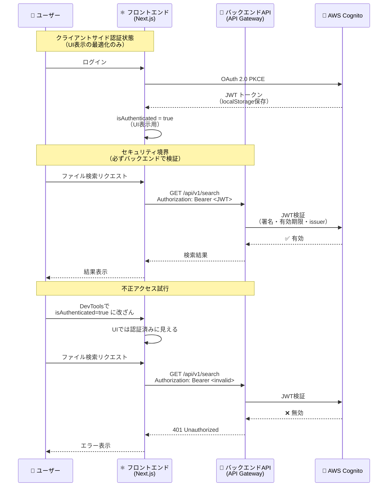

# P1: クライアントサイド認証状態の信頼性問題

## 問題の概要

**CVSS スコア**: 5.3 (Medium)
**優先度**: P1 (今週中に対応)

クライアントサイドの `isAuthenticated` 状態は改ざん可能であり、セキュリティ境界として扱ってはいけません。

## アーキテクチャの原則

### ✅ 正しいアプローチ



### ❌ 誤ったアプローチ（絶対に避ける）

```typescript
// ❌ クライアントサイドの認証状態を信頼してアクセス制御
const SearchPage = () => {
  const { isAuthenticated } = useAuth()

  // ❌ これだけではセキュリティが保証されない
  if (!isAuthenticated) {
    return <div>ログインしてください</div>
  }

  // ❌ バックエンド検証なしでデータ表示（危険）
  const files = fetchFiles() // トークン検証なし
  return <FileList files={files} />
}
```

```typescript
// ✅ 正しいアプローチ
const SearchPage = () => {
  const { isAuthenticated, getAccessToken } = useAuth()

  // ✅ UI最適化のために使用（セキュリティ境界ではない）
  if (!isAuthenticated) {
    return <div>ログインしてください</div>
  }

  // ✅ バックエンドAPIで必ずJWT検証
  const files = useQuery(['files'], async () => {
    const token = await getAccessToken()
    const response = await fetch('/api/v1/search', {
      headers: {
        Authorization: `Bearer ${token}` // バックエンドで検証される
      }
    })
    if (!response.ok) {
      throw new Error('Unauthorized')
    }
    return response.json()
  })

  return <FileList files={files.data} />
}
```

---

## 必須対策 1: API Gateway Cognito Authorizer の設定

すべての保護されたエンドポイントで JWT 検証を強制します。

### Terraform 設定例

```hcl
# API Gateway REST API
resource "aws_api_gateway_rest_api" "cis_file_search" {
  name        = "cis-file-search-api"
  description = "CIS File Search Application API"
}

# Cognito User Pool Authorizer
resource "aws_api_gateway_authorizer" "cognito" {
  name            = "cognito-authorizer"
  rest_api_id     = aws_api_gateway_rest_api.cis_file_search.id
  type            = "COGNITO_USER_POOLS"
  provider_arns   = [aws_cognito_user_pool.cis_file_search.arn]

  # JWT検証設定
  identity_source = "method.request.header.Authorization"
}

# 保護されたエンドポイント（検索API）
resource "aws_api_gateway_method" "search" {
  rest_api_id   = aws_api_gateway_rest_api.cis_file_search.id
  resource_id   = aws_api_gateway_resource.search.id
  http_method   = "GET"

  # ✅ Cognito Authorizerを強制
  authorization = "COGNITO_USER_POOLS"
  authorizer_id = aws_api_gateway_authorizer.cognito.id

  # ✅ スコープ検証（オプション）
  authorization_scopes = ["openid", "email", "profile"]
}

# Lambdaバックエンド
resource "aws_lambda_function" "search_handler" {
  function_name = "cis-file-search-handler"
  handler       = "index.handler"
  runtime       = "nodejs20.x"
  role          = aws_iam_role.lambda_execution.arn

  environment {
    variables = {
      # JWT検証用の環境変数
      COGNITO_USER_POOL_ID = aws_cognito_user_pool.cis_file_search.id
      COGNITO_REGION       = "ap-northeast-1"
    }
  }
}
```

### Lambda 内での JWT 検証（念のため二重チェック）

```typescript
// backend/src/handlers/search.ts
import { APIGatewayProxyEvent, APIGatewayProxyResult } from 'aws-lambda'
import { CognitoJwtVerifier } from 'aws-jwt-verify'

// JWT検証器の初期化（グローバルに1回だけ）
const verifier = CognitoJwtVerifier.create({
  userPoolId: process.env.COGNITO_USER_POOL_ID!,
  tokenUse: 'access',
  clientId: process.env.COGNITO_APP_CLIENT_ID!,
})

export const handler = async (
  event: APIGatewayProxyEvent
): Promise<APIGatewayProxyResult> => {
  try {
    // ✅ Authorization ヘッダーから JWT トークンを抽出
    const authHeader = event.headers.Authorization || event.headers.authorization
    if (!authHeader || !authHeader.startsWith('Bearer ')) {
      return {
        statusCode: 401,
        body: JSON.stringify({ error: 'Missing or invalid Authorization header' }),
        headers: {
          'Content-Type': 'application/json',
        },
      }
    }

    const token = authHeader.substring(7) // "Bearer " を削除

    // ✅ JWT 検証（署名・有効期限・issuer・audience）
    const payload = await verifier.verify(token)

    console.log('✅ JWT verified successfully:', {
      sub: payload.sub, // User ID
      username: payload.username,
      email: payload.email,
    })

    // ✅ ビジネスロジック実行（認証済みユーザーのみ）
    const results = await searchFiles(event.queryStringParameters?.q || '')

    return {
      statusCode: 200,
      body: JSON.stringify({
        results,
        user: {
          id: payload.sub,
          email: payload.email,
        },
      }),
      headers: {
        'Content-Type': 'application/json',
        'Access-Control-Allow-Origin': process.env.ALLOWED_ORIGIN!,
      },
    }
  } catch (error) {
    // ❌ JWT 検証失敗（無効なトークン）
    console.error('❌ JWT verification failed:', error)

    return {
      statusCode: 401,
      body: JSON.stringify({
        error: 'Invalid or expired token',
        message: error instanceof Error ? error.message : 'Unknown error',
      }),
      headers: {
        'Content-Type': 'application/json',
      },
    }
  }
}

// ファイル検索ロジック
async function searchFiles(query: string): Promise<any[]> {
  // OpenSearch/DynamoDB クエリ
  // ...
  return []
}
```

---

## 必須対策 2: フロントエンドでのエラーハンドリング

API が 401 Unauthorized を返した場合、強制的にログアウトさせます。

### 実装場所: `src/lib/apiClient.ts`

```typescript
/**
 * API クライアント（JWT トークン付き）
 */
import { getAccessToken } from '@/contexts/AuthContext'

export class ApiClient {
  private baseURL: string

  constructor(baseURL: string) {
    this.baseURL = baseURL
  }

  /**
   * 認証付きGETリクエスト
   */
  async get<T>(endpoint: string): Promise<T> {
    const token = await getAccessToken()

    if (!token) {
      throw new Error('Not authenticated')
    }

    const response = await fetch(`${this.baseURL}${endpoint}`, {
      method: 'GET',
      headers: {
        Authorization: `Bearer ${token}`,
        'Content-Type': 'application/json',
      },
    })

    // ✅ 401エラーの場合、強制ログアウト
    if (response.status === 401) {
      console.error('❌ JWT無効 - 強制ログアウト')
      // AuthContextのlogout()を呼び出す
      window.location.href = '/logout'
      throw new Error('Unauthorized - token expired or invalid')
    }

    if (!response.ok) {
      throw new Error(`API error: ${response.status}`)
    }

    return response.json()
  }

  /**
   * 認証付きPOSTリクエスト
   */
  async post<T>(endpoint: string, data: any): Promise<T> {
    const token = await getAccessToken()

    if (!token) {
      throw new Error('Not authenticated')
    }

    const response = await fetch(`${this.baseURL}${endpoint}`, {
      method: 'POST',
      headers: {
        Authorization: `Bearer ${token}`,
        'Content-Type': 'application/json',
      },
      body: JSON.stringify(data),
    })

    // ✅ 401エラーの場合、強制ログアウト
    if (response.status === 401) {
      console.error('❌ JWT無効 - 強制ログアウト')
      window.location.href = '/logout'
      throw new Error('Unauthorized - token expired or invalid')
    }

    if (!response.ok) {
      throw new Error(`API error: ${response.status}`)
    }

    return response.json()
  }
}

// シングルトンインスタンス
export const apiClient = new ApiClient(
  process.env.NEXT_PUBLIC_API_GATEWAY_URL || 'https://api.example.com/v1'
)
```

### 使用例

```typescript
// src/app/search/page.tsx
'use client'

import { useQuery } from '@tanstack/react-query'
import { apiClient } from '@/lib/apiClient'

interface SearchResult {
  id: string
  name: string
  path: string
}

export default function SearchPage() {
  const { isAuthenticated } = useAuth()

  // ✅ React Query で自動的にトークン付きリクエスト
  const { data, error, isLoading } = useQuery<SearchResult[]>({
    queryKey: ['search', 'my-query'],
    queryFn: () => apiClient.get<SearchResult[]>('/search?q=my-query'),
    enabled: isAuthenticated, // 認証済みの場合のみ実行
  })

  if (!isAuthenticated) {
    return <div>ログインしてください</div>
  }

  if (isLoading) return <div>読み込み中...</div>
  if (error) return <div>エラーが発生しました: {error.message}</div>

  return (
    <div>
      <h1>検索結果</h1>
      <ul>
        {data?.map((file) => (
          <li key={file.id}>
            {file.name} - {file.path}
          </li>
        ))}
      </ul>
    </div>
  )
}
```

---

## 必須対策 3: セキュリティテスト

### テストケース

```typescript
// __tests__/security/auth.test.ts
import { apiClient } from '@/lib/apiClient'

describe('認証セキュリティテスト', () => {
  it('無効なJWTトークンで401エラーが返されること', async () => {
    // Arrange: 無効なトークンをモック
    jest.spyOn(global, 'fetch').mockResolvedValueOnce({
      status: 401,
      ok: false,
      json: async () => ({ error: 'Invalid token' }),
    } as Response)

    // Act & Assert
    await expect(apiClient.get('/search')).rejects.toThrow('Unauthorized')
  })

  it('JWTトークンなしで401エラーが返されること', async () => {
    // Arrange: トークンなし
    jest.spyOn(global, 'fetch').mockResolvedValueOnce({
      status: 401,
      ok: false,
      json: async () => ({ error: 'Missing Authorization header' }),
    } as Response)

    // Act & Assert
    await expect(apiClient.get('/search')).rejects.toThrow('Unauthorized')
  })

  it('有効なJWTトークンで200 OKが返されること', async () => {
    // Arrange: 有効なトークン
    jest.spyOn(global, 'fetch').mockResolvedValueOnce({
      status: 200,
      ok: true,
      json: async () => ({ results: [] }),
    } as Response)

    // Act
    const result = await apiClient.get('/search')

    // Assert
    expect(result).toEqual({ results: [] })
  })
})
```

---

## チェックリスト

- [ ] API Gateway Cognito Authorizer を全エンドポイントに設定
- [ ] Lambda 内で JWT 検証を実装（二重チェック）
- [ ] フロントエンドで 401 エラーハンドリングを実装
- [ ] API クライアントを作成（`src/lib/apiClient.ts`）
- [ ] セキュリティテストを実装
- [ ] Postman/curl で手動テスト
  - 無効なトークンで 401 が返されるか
  - トークンなしで 401 が返されるか
  - 有効なトークンで 200 が返されるか

---

## 参考資料

- [AWS API Gateway Cognito Authorizer](https://docs.aws.amazon.com/apigateway/latest/developerguide/apigateway-integrate-with-cognito.html)
- [aws-jwt-verify (AWS公式ライブラリ)](https://github.com/awslabs/aws-jwt-verify)
- [OWASP API Security Top 10 - A01:2023 Broken Object Level Authorization](https://owasp.org/API-Security/editions/2023/en/0xa1-broken-object-level-authorization/)
