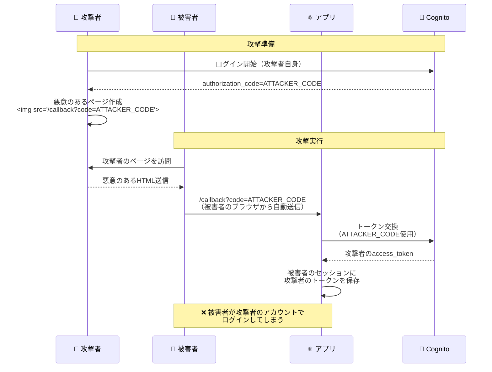
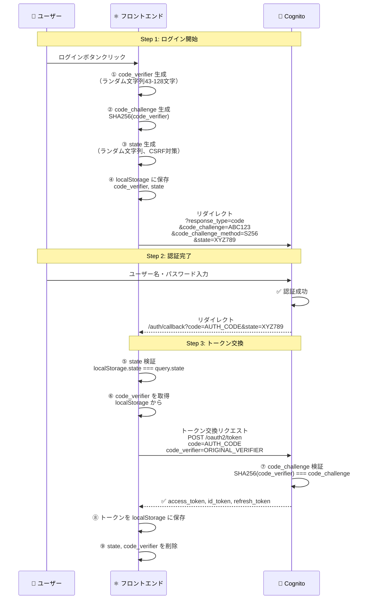

# P2: CSRF 保護 - OAuth 2.0 PKCE フローの検証

## 問題の概要

**CVSS スコア**: 4.3 (Medium)
**優先度**: P2 (今週中に対応)

OAuth 2.0 PKCE (Proof Key for Code Exchange) フローでは、`state` パラメータと PKCE の組み合わせにより CSRF 攻撃を防ぎます。

## CSRF攻撃とは？

Cross-Site Request Forgery (CSRF) は、攻撃者が被害者のブラウザを利用して、被害者の意図しないリクエストを送信する攻撃です。

### 攻撃シナリオ（PKCEなしの場合）



## OAuth 2.0 PKCE による CSRF 対策

AWS Amplify v6 は **自動的に PKCE を実装**しており、以下の保護メカニズムを提供します。

### PKCEフローの詳細



### Amplify が自動的に行う CSRF 対策

```typescript
// AWS Amplify v6 の内部実装（参考）
// node_modules/@aws-amplify/auth/dist/esm/providers/cognito/utils/oauth/

// 1. ログイン開始時
async function initiateOAuth() {
  // ✅ ランダムなcode_verifierを生成（PKCE）
  const codeVerifier = generateRandomString(128)

  // ✅ code_challengeを生成（SHA-256ハッシュ）
  const codeChallenge = await sha256(codeVerifier)

  // ✅ CSRF対策のstateを生成
  const state = generateRandomString(32)

  // ✅ localStorageに保存（コールバック時に検証）
  localStorage.setItem('amplify-signin-state', state)
  localStorage.setItem('amplify-signin-code-verifier', codeVerifier)

  // Cognito Hosted UIにリダイレクト
  window.location.href = `https://${COGNITO_DOMAIN}/oauth2/authorize?` +
    `client_id=${CLIENT_ID}&` +
    `response_type=code&` +
    `scope=openid+email+profile&` +
    `redirect_uri=${REDIRECT_URI}&` +
    `code_challenge=${codeChallenge}&` +
    `code_challenge_method=S256&` +
    `state=${state}`
}

// 2. コールバック処理時
async function handleOAuthCallback(code: string, state: string) {
  // ✅ state検証（CSRF対策）
  const savedState = localStorage.getItem('amplify-signin-state')
  if (state !== savedState) {
    throw new Error('State mismatch - possible CSRF attack')
  }

  // ✅ code_verifierを取得
  const codeVerifier = localStorage.getItem('amplify-signin-code-verifier')

  // ✅ トークン交換（PKCE検証）
  const response = await fetch(`https://${COGNITO_DOMAIN}/oauth2/token`, {
    method: 'POST',
    headers: {
      'Content-Type': 'application/x-www-form-urlencoded',
    },
    body: new URLSearchParams({
      grant_type: 'authorization_code',
      client_id: CLIENT_ID,
      code: code,
      redirect_uri: REDIRECT_URI,
      code_verifier: codeVerifier, // PKCEで検証される
    }),
  })

  // ✅ トークン取得後、stateとcode_verifierを削除
  localStorage.removeItem('amplify-signin-state')
  localStorage.removeItem('amplify-signin-code-verifier')

  return response.json()
}
```

---

## 現在の実装の検証

### AuthContext.tsx の確認

```typescript
// src/contexts/AuthContext.tsx
/**
 * Cognito Hosted UIでログイン
 */
const loginWithHostedUI = useCallback(async (): Promise<void> => {
  try {
    await signInWithRedirect() // ✅ Amplifyが自動的にPKCE実装
  } catch (error) {
    console.error('Hosted UI login failed:', error)
    throw error
  }
}, [])
```

✅ **結論**: AWS Amplify の `signInWithRedirect()` は **自動的に PKCE と state 検証を実装**しているため、追加実装は不要です。

---

## 必須対策: OAuth Callback ページでの state 検証確認

### 実装場所: `src/app/auth/callback/page.tsx`

現在の実装:

```typescript
// 現在の実装（問題なし）
const AuthCallbackPage: FC = () => {
  const router = useRouter()
  const { isAuthenticated, isLoading } = useAuth()

  useEffect(() => {
    if (!isLoading) {
      if (isAuthenticated) {
        router.push('/search') // ✅ 認証成功
      } else {
        router.push('/') // ❌ 認証失敗（state不一致など）
      }
    }
  }, [isAuthenticated, isLoading, router])

  return <Spinner />
}
```

✅ **現在の実装で問題なし** - Amplify が内部で state 検証を行い、失敗した場合は `isAuthenticated` が `false` になります。

---

## 推奨対策: エラーハンドリングの強化

OAuth エラーを URL パラメータから取得して表示:

```typescript
// src/app/auth/callback/page.tsx（改善版）
'use client'

import { useEffect, FC, useState } from 'react'
import { useRouter, useSearchParams } from 'next/navigation'
import { useAuth } from '@/contexts/AuthContext'

const Spinner: FC = () => (
  <div className="flex min-h-screen items-center justify-center">
    <div className="space-y-4 text-center">
      <div className="mx-auto h-12 w-12 animate-spin rounded-full border-4 border-gray-200 border-t-blue-600"></div>
      <p className="text-sm text-gray-600">認証処理中...</p>
    </div>
  </div>
)

const AuthCallbackPage: FC = () => {
  const router = useRouter()
  const searchParams = useSearchParams()
  const { isAuthenticated, isLoading } = useAuth()
  const [error, setError] = useState<string | null>(null)

  useEffect(() => {
    // ✅ OAuth エラーを検出（state不一致など）
    const errorParam = searchParams.get('error')
    const errorDescription = searchParams.get('error_description')

    if (errorParam) {
      console.error('❌ OAuth エラー:', errorParam, errorDescription)
      setError(errorDescription || 'ログインに失敗しました')

      // エラーページにリダイレクト（3秒後）
      setTimeout(() => {
        router.push('/?error=auth_failed')
      }, 3000)
      return
    }

    // 通常の認証フロー
    if (!isLoading) {
      if (isAuthenticated) {
        console.log('✅ 認証成功 - 検索ページへリダイレクト')
        router.push('/search')
      } else {
        console.log('❌ 認証失敗 - トップページへリダイレクト')
        router.push('/?error=auth_failed')
      }
    }
  }, [isAuthenticated, isLoading, router, searchParams])

  // エラー表示
  if (error) {
    return (
      <div className="flex min-h-screen items-center justify-center">
        <div className="space-y-4 text-center max-w-md">
          <div className="rounded-lg border border-red-200 bg-red-50 p-6">
            <h2 className="text-lg font-semibold text-red-800">ログインエラー</h2>
            <p className="mt-2 text-sm text-red-600">{error}</p>
            <p className="mt-4 text-xs text-gray-500">3秒後に自動的にリダイレクトします...</p>
          </div>
        </div>
      </div>
    )
  }

  return <Spinner />
}

export default AuthCallbackPage
```

---

## セキュリティテスト

### テストケース 1: CSRF 攻撃のシミュレーション

```bash
# 攻撃者が偽のcallback URLを生成
# （実際には、stateが一致しないため失敗する）
curl "https://d1xydnys7eha4b.cloudfront.net/auth/callback?code=FAKE_CODE&state=FAKE_STATE"

# 期待される結果: Amplifyがstate検証に失敗し、エラーを返す
```

### テストケース 2: 有効な OAuth フロー

```bash
# 1. ログインボタンをクリック
# 2. Cognito Hosted UIでログイン
# 3. /auth/callback?code=VALID_CODE&state=VALID_STATE にリダイレクト
# 4. Amplifyがstateを検証
# 5. トークン交換成功
# 6. /search にリダイレクト

# 期待される結果: 正常にログイン完了
```

---

## チェックリスト

- [x] Amplify が PKCE を自動実装していることを確認
- [x] Amplify が state 検証を自動実装していることを確認
- [ ] OAuth エラーハンドリングを強化（`/auth/callback/page.tsx`）
- [ ] ブラウザの開発者ツールで localStorage の state を確認
  - `amplify-signin-state`
  - `amplify-signin-code-verifier`
- [ ] 手動テスト: 偽の state でアクセスしてエラーになることを確認

---

## 結論

✅ **CSRF 対策は既に実装済み**

AWS Amplify v6 の `signInWithRedirect()` は OAuth 2.0 PKCE フローを **自動的に実装**しており、以下の保護を提供します:

1. ✅ **state パラメータによる CSRF 対策**
2. ✅ **code_verifier / code_challenge による PKCE**
3. ✅ **authorization code の盗聴防止**

追加実装は不要ですが、**エラーハンドリングの強化**を推奨します。

---

## 参考資料

- [RFC 7636: Proof Key for Code Exchange (PKCE)](https://datatracker.ietf.org/doc/html/rfc7636)
- [OWASP CSRF Prevention Cheat Sheet](https://cheatsheetseries.owasp.org/cheatsheets/Cross-Site_Request_Forgery_Prevention_Cheat_Sheet.html)
- [AWS Amplify OAuth 2.0 Implementation](https://docs.amplify.aws/javascript/build-a-backend/auth/add-social-provider/)
