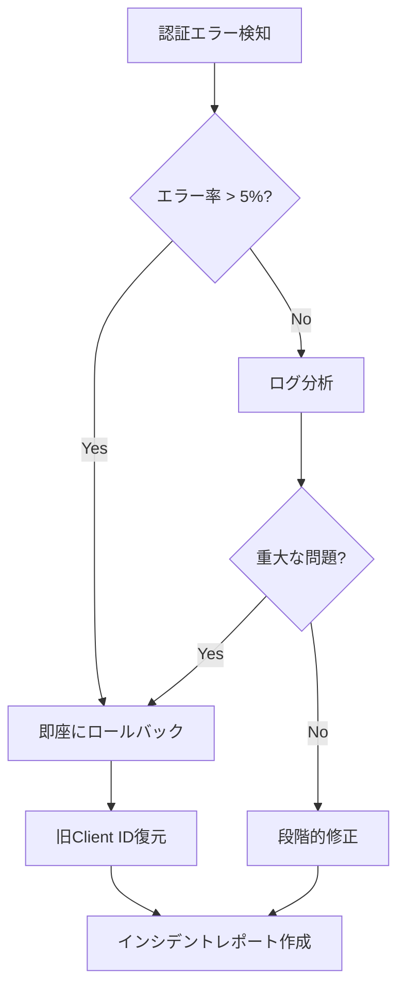

# 認証情報ローテーション戦略

## 概要

AWS Cognito App Client IDを含む認証情報の定期的なローテーションは、セキュリティベストプラクティスです。このドキュメントでは、安全かつダウンタイムなしでローテーションを実行する方法を説明します。

## ローテーションスケジュール

### 推奨ローテーション頻度

| 認証情報タイプ | 頻度 | 優先度 | 理由 |
|--------------|------|--------|------|
| **App Client ID** | 🟡 **6ヶ月ごと** | P2 | OAuth PKCEではSecretなしなので低リスク |
| **User Pool ID** | 🟢 **不要** | - | Poolそのものの変更は通常不要 |
| **Cognito Domain** | 🟢 **不要** | - | カスタムドメイン以外は変更不要 |
| **IAM Credentials** | 🔴 **90日ごと** | P0 | 最高リスク（該当する場合） |

### 緊急ローテーションが必要なケース

- 🚨 認証情報の漏洩が疑われる場合（即座に実行）
- 🚨 不正アクセスの検知（24時間以内）
- 🚨 セキュリティ侵害の報告（即座に実行）
- ⚠️ 開発者の退職・異動（1週間以内）
- ⚠️ コンプライアンス要件（規定期間内）

## ローテーション手順

### フェーズ1: 準備（ダウンタイムなし）

#### ステップ1: 新しいApp Clientの作成

```bash
# AWS CLI経由で新しいApp Clientを作成
aws cognito-idp create-user-pool-client \
  --user-pool-id ap-northeast-1_XXXXXXXXX \
  --client-name "cis-filesearch-app-v2" \
  --no-generate-secret \
  --explicit-auth-flows "ALLOW_REFRESH_TOKEN_AUTH" "ALLOW_USER_SRP_AUTH" \
  --supported-identity-providers "COGNITO" \
  --callback-urls "https://your-cloudfront-domain.cloudfront.net/auth/callback" \
  --logout-urls "https://your-cloudfront-domain.cloudfront.net" \
  --allowed-o-auth-flows "code" \
  --allowed-o-auth-scopes "openid" "email" "profile" \
  --allowed-o-auth-flows-user-pool-client \
  --region ap-northeast-1
```

**重要設定**:
- `--no-generate-secret`: Client Secretを生成しない（PKCE用）
- `--allowed-o-auth-flows "code"`: Authorization Code Flow（PKCE）
- `--allowed-o-auth-flows-user-pool-client`: OAuth flowを有効化

#### ステップ2: 新旧両方のClient IDを環境変数に追加

```bash
# 現在のClient ID
NEXT_PUBLIC_COGNITO_APP_CLIENT_ID=old-client-id-12345

# 新しいClient ID（フォールバック用）
NEXT_PUBLIC_COGNITO_APP_CLIENT_ID_NEW=new-client-id-67890
```

#### ステップ3: アプリケーションコードの更新（デュアルサポート）

```typescript
// lib/amplify.ts

const getCurrentClientId = (): string => {
  // 環境変数から日時を取得し、切り替えタイミングを制御
  const rotationDate = process.env.NEXT_PUBLIC_CLIENT_ROTATION_DATE;

  if (rotationDate && new Date() >= new Date(rotationDate)) {
    // ローテーション日を過ぎていれば新しいClient IDを使用
    return process.env.NEXT_PUBLIC_COGNITO_APP_CLIENT_ID_NEW!;
  }

  // それ以外は従来のClient IDを使用
  return process.env.NEXT_PUBLIC_COGNITO_APP_CLIENT_ID!;
};

export const amplifyConfig = {
  Auth: {
    Cognito: {
      userPoolId: process.env.NEXT_PUBLIC_COGNITO_USER_POOL_ID!,
      userPoolClientId: getCurrentClientId(),
      loginWith: {
        oauth: {
          domain: process.env.NEXT_PUBLIC_COGNITO_DOMAIN!,
          scopes: ['openid', 'email', 'profile'],
          redirectSignIn: [process.env.NEXT_PUBLIC_APP_URL!],
          redirectSignOut: [process.env.NEXT_PUBLIC_APP_URL!],
          responseType: 'code',
        },
      },
    },
  },
};
```

### フェーズ2: デプロイとモニタリング

#### ステップ4: Canary Deployment（段階的展開）

```bash
# ステージング環境にデプロイ
vercel deploy --target preview

# 動作確認（ログイン・ログアウト・トークンリフレッシュ）
# 問題なければ本番環境の10%のトラフィックに適用

vercel deploy --prod
# CloudFront Weighted Routing で 10% → 50% → 100% と段階的に移行
```

#### ステップ5: モニタリング（24-48時間）

監視すべき指標:

```typescript
// monitoring/auth-metrics.ts

interface AuthMetrics {
  loginSuccessRate: number;        // 目標: >99%
  loginFailureRate: number;        // 目標: <1%
  tokenRefreshSuccessRate: number; // 目標: >99.5%
  authErrorRate: number;           // 目標: <0.1%
  p95LoginLatency: number;         // 目標: <2000ms
}

// CloudWatch Alarmの設定
const alarms = [
  {
    name: 'HighAuthFailureRate',
    threshold: 5, // 5%以上のエラー率でアラート
    metric: 'AuthFailureRate',
    period: 300, // 5分間
  },
  {
    name: 'LoginLatencyHigh',
    threshold: 3000, // 3秒以上でアラート
    metric: 'LoginLatency',
    statistic: 'p95',
  },
];
```

### フェーズ3: カットオーバー

#### ステップ6: 完全移行

```bash
# 環境変数を新しいClient IDに完全移行
# Vercel Dashboard または CLI で更新
vercel env rm NEXT_PUBLIC_COGNITO_APP_CLIENT_ID production
vercel env add NEXT_PUBLIC_COGNITO_APP_CLIENT_ID production
# 新しいClient IDを入力

# 再デプロイ
vercel deploy --prod
```

#### ステップ7: 旧Client IDの無効化（猶予期間後）

```bash
# 7日間の猶予期間後、旧Client IDを削除
aws cognito-idp delete-user-pool-client \
  --user-pool-id ap-northeast-1_XXXXXXXXX \
  --client-id old-client-id-12345 \
  --region ap-northeast-1
```

**重要**: 猶予期間中は以下をモニタリング:
- 旧Client IDへのトラフィックがゼロになっているか
- キャッシュされたトークンが期限切れになっているか
- すべてのユーザーが新しいセッションを開始しているか

## ロールバック手順

### 緊急時のロールバック（5分以内）

```bash
# 環境変数を旧Client IDに戻す
vercel env rm NEXT_PUBLIC_COGNITO_APP_CLIENT_ID production
vercel env add NEXT_PUBLIC_COGNITO_APP_CLIENT_ID production
# 旧Client IDを入力

# 前のデプロイメントにロールバック
vercel rollback
```

### インシデント対応フロー



## ダウンタイム最小化のベストプラクティス

### 1. Blue-Green Deployment

```typescript
// config/auth-config.ts

interface AuthConfig {
  clientId: string;
  version: 'blue' | 'green';
  enabledAt: Date;
}

const authConfigs: AuthConfig[] = [
  {
    clientId: 'blue-client-id',
    version: 'blue',
    enabledAt: new Date('2025-01-01'),
  },
  {
    clientId: 'green-client-id',
    version: 'green',
    enabledAt: new Date('2025-07-01'),
  },
];

export const getActiveAuthConfig = (): AuthConfig => {
  const now = new Date();
  return authConfigs
    .filter(config => config.enabledAt <= now)
    .sort((a, b) => b.enabledAt.getTime() - a.enabledAt.getTime())[0];
};
```

### 2. Feature Flag による制御

```typescript
// lib/feature-flags.ts

import { useFeatureFlag } from '@/hooks/useFeatureFlag';

export const AuthClientRotation = () => {
  const { enabled, variant } = useFeatureFlag('auth-client-rotation');

  const clientId = enabled && variant === 'new'
    ? process.env.NEXT_PUBLIC_COGNITO_APP_CLIENT_ID_NEW
    : process.env.NEXT_PUBLIC_COGNITO_APP_CLIENT_ID;

  return clientId;
};
```

### 3. トラフィックの段階的移行

| フェーズ | トラフィック割合 | 期間 | ロールバック基準 |
|---------|----------------|------|----------------|
| Canary | 5% | 2時間 | エラー率 > 2% |
| Phase 1 | 25% | 12時間 | エラー率 > 1% |
| Phase 2 | 50% | 24時間 | エラー率 > 0.5% |
| Phase 3 | 100% | - | - |

## 自動化スクリプト

### ローテーション自動化

```bash
#!/bin/bash
# scripts/rotate-cognito-client.sh

set -e

USER_POOL_ID=$1
OLD_CLIENT_ID=$2
APP_URL=$3

echo "🔄 Starting Cognito Client rotation..."

# 1. 新しいClient Clientの作成
NEW_CLIENT_ID=$(aws cognito-idp create-user-pool-client \
  --user-pool-id "$USER_POOL_ID" \
  --client-name "cis-filesearch-app-$(date +%Y%m%d)" \
  --no-generate-secret \
  --explicit-auth-flows "ALLOW_REFRESH_TOKEN_AUTH" "ALLOW_USER_SRP_AUTH" \
  --callback-urls "$APP_URL/auth/callback" \
  --logout-urls "$APP_URL" \
  --allowed-o-auth-flows "code" \
  --allowed-o-auth-scopes "openid" "email" "profile" \
  --allowed-o-auth-flows-user-pool-client \
  --query 'UserPoolClient.ClientId' \
  --output text)

echo "✅ New Client ID created: $NEW_CLIENT_ID"

# 2. Vercel環境変数の更新
echo "📝 Updating Vercel environment variables..."
vercel env add NEXT_PUBLIC_COGNITO_APP_CLIENT_ID_NEW production <<< "$NEW_CLIENT_ID"

# 3. デプロイ
echo "🚀 Deploying to production..."
vercel deploy --prod

# 4. モニタリング待機
echo "⏳ Monitoring for 24 hours..."
echo "📊 Check CloudWatch dashboard: https://console.aws.amazon.com/cloudwatch"

# 5. 完了
echo "✅ Rotation initiated successfully!"
echo "⚠️ Remember to delete old client ID after 7 days: $OLD_CLIENT_ID"
```

### 使用方法

```bash
chmod +x scripts/rotate-cognito-client.sh

./scripts/rotate-cognito-client.sh \
  ap-northeast-1_XXXXXXXXX \
  old-client-id-12345 \
  https://your-cloudfront-domain.cloudfront.net
```

## ローテーション後の検証チェックリスト

- [ ] 新しいClient IDでログイン成功
- [ ] トークンリフレッシュが正常動作
- [ ] ログアウト後の再ログイン成功
- [ ] 複数ブラウザ/デバイスでの動作確認
- [ ] セッションタイムアウト後の再認証成功
- [ ] エラー率が通常レベル（<0.1%）
- [ ] レイテンシが正常範囲内（p95 < 2s）
- [ ] CloudWatchアラームが発火していない
- [ ] ユーザーからの苦情報告なし

## トラブルシューティング

### 問題: 新Client IDでログイン失敗

**原因**: Callback URLの設定ミス

**解決策**:
```bash
# Callback URLを確認
aws cognito-idp describe-user-pool-client \
  --user-pool-id ap-northeast-1_XXXXXXXXX \
  --client-id new-client-id \
  --query 'UserPoolClient.CallbackURLs'

# 正しいURLに更新
aws cognito-idp update-user-pool-client \
  --user-pool-id ap-northeast-1_XXXXXXXXX \
  --client-id new-client-id \
  --callback-urls "https://your-cloudfront-domain.cloudfront.net/auth/callback"
```

### 問題: トークンリフレッシュエラー

**原因**: Refresh Token Flowが無効

**解決策**:
```bash
aws cognito-idp update-user-pool-client \
  --user-pool-id ap-northeast-1_XXXXXXXXX \
  --client-id new-client-id \
  --explicit-auth-flows "ALLOW_REFRESH_TOKEN_AUTH" "ALLOW_USER_SRP_AUTH"
```

## セキュリティ監査ログ

すべてのローテーション操作をログに記録:

```json
{
  "event": "cognito_client_rotation",
  "timestamp": "2025-11-11T10:00:00Z",
  "userPoolId": "ap-northeast-1_XXXXXXXXX",
  "oldClientId": "old-client-id-12345",
  "newClientId": "new-client-id-67890",
  "initiatedBy": "admin@example.com",
  "reason": "scheduled_rotation",
  "status": "completed",
  "duration": "48h",
  "rollbackPerformed": false
}
```

## 参考リソース

- [AWS Cognito Client Rotation Best Practices](https://docs.aws.amazon.com/cognito/latest/developerguide/user-pool-settings-client-apps.html)
- [OAuth 2.0 PKCE Flow](https://oauth.net/2/pkce/)
- [Zero-Downtime Deployment Strategies](https://martinfowler.com/bliki/BlueGreenDeployment.html)
