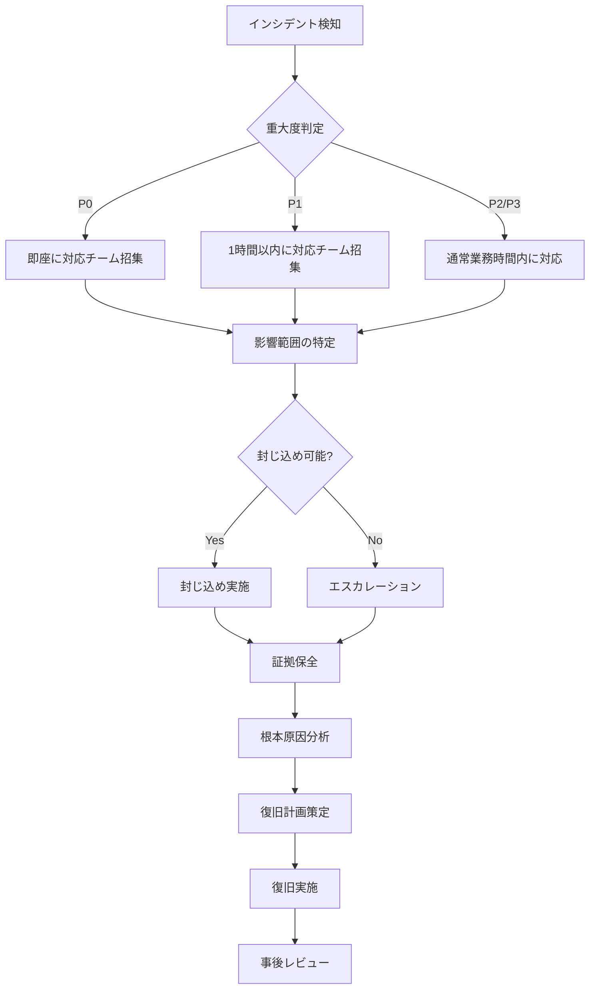

# インシデント対応計画（IRP: Incident Response Plan）

## 概要

CIS File Search Applicationにおけるセキュリティインシデント発生時の対応手順を定義します。迅速かつ適切な対応により、被害を最小化し、サービスの早期復旧を実現します。

---

## 1. インシデント分類と優先度

### 🚨 重大度レベル

| レベル | 説明 | 対応時間 | 通知先 |
|--------|------|---------|--------|
| **P0 - Critical** | サービス全体停止、大規模データ侵害 | **即座（15分以内）** | CEO、CTO、全チーム |
| **P1 - High** | 一部機能停止、認証関連の問題 | **1時間以内** | CTO、開発チーム、セキュリティチーム |
| **P2 - Medium** | パフォーマンス低下、軽微な脆弱性 | **4時間以内** | 開発チーム、セキュリティチーム |
| **P3 - Low** | 軽微なバグ、推奨設定の逸脱 | **24時間以内** | 担当開発者 |

### インシデント種別

#### 認証・認可関連

```typescript
enum AuthIncidentType {
  // P0 - Critical
  MASS_ACCOUNT_COMPROMISE = 'mass_account_compromise',         // 大量アカウント侵害
  COGNITO_SERVICE_OUTAGE = 'cognito_service_outage',           // Cognito障害
  CREDENTIAL_LEAK = 'credential_leak',                         // 認証情報漏洩

  // P1 - High
  BRUTE_FORCE_ATTACK = 'brute_force_attack',                   // ブルートフォース攻撃
  PRIVILEGE_ESCALATION = 'privilege_escalation',               // 権限昇格
  SESSION_HIJACKING = 'session_hijacking',                     // セッションハイジャック

  // P2 - Medium
  SUSPICIOUS_LOGIN_PATTERN = 'suspicious_login_pattern',       // 異常ログインパターン
  MFA_BYPASS_ATTEMPT = 'mfa_bypass_attempt',                   // MFA回避試行

  // P3 - Low
  PASSWORD_POLICY_VIOLATION = 'password_policy_violation',     // パスワードポリシー違反
  RATE_LIMIT_EXCEEDED = 'rate_limit_exceeded',                 // レート制限超過
}
```

#### データ侵害関連

```typescript
enum DataBreachType {
  // P0 - Critical
  DATABASE_BREACH = 'database_breach',                         // データベース侵害
  S3_BUCKET_EXPOSED = 's3_bucket_exposed',                     // S3バケット公開状態
  MASS_DATA_EXFILTRATION = 'mass_data_exfiltration',           // 大量データ流出

  // P1 - High
  UNAUTHORIZED_DATA_ACCESS = 'unauthorized_data_access',       // 不正データアクセス
  PII_EXPOSURE = 'pii_exposure',                               // 個人情報露出

  // P2 - Medium
  LOG_DATA_LEAK = 'log_data_leak',                             // ログデータ漏洩
  BACKUP_COMPROMISE = 'backup_compromise',                     // バックアップ侵害
}
```

---

## 2. インシデント検知

### 🔍 検知方法

#### 自動検知（CloudWatch Alarms）

```typescript
// monitoring/incident-detector.ts

interface SecurityAlert {
  alertId: string;
  type: AuthIncidentType | DataBreachType;
  severity: 'P0' | 'P1' | 'P2' | 'P3';
  detectedAt: Date;
  description: string;
  affectedResources: string[];
  metrics: Record<string, number>;
}

export const detectSecurityIncidents = async () => {
  const alerts: SecurityAlert[] = [];

  // 1. 異常なログイン失敗率
  const failedLoginRate = await getMetric('UserAuthenticationFailure');
  if (failedLoginRate > 20) {
    alerts.push({
      alertId: `ALERT-${Date.now()}`,
      type: AuthIncidentType.BRUTE_FORCE_ATTACK,
      severity: 'P1',
      detectedAt: new Date(),
      description: `異常なログイン失敗率を検知: ${failedLoginRate}/分`,
      affectedResources: ['Cognito User Pool'],
      metrics: { failedLoginRate },
    });
  }

  // 2. 異常な同時ログイン数
  const concurrentLogins = await getMetric('ConcurrentLoginSessions');
  if (concurrentLogins > 1000) {
    alerts.push({
      alertId: `ALERT-${Date.now()}`,
      type: AuthIncidentType.SUSPICIOUS_LOGIN_PATTERN,
      severity: 'P2',
      detectedAt: new Date(),
      description: `異常な同時ログイン数を検知: ${concurrentLogins}`,
      affectedResources: ['Cognito User Pool'],
      metrics: { concurrentLogins },
    });
  }

  // 3. S3バケットポリシー変更
  const s3PolicyChanges = await getS3PolicyChanges();
  if (s3PolicyChanges.length > 0) {
    alerts.push({
      alertId: `ALERT-${Date.now()}`,
      type: DataBreachType.S3_BUCKET_EXPOSED,
      severity: 'P0',
      detectedAt: new Date(),
      description: 'S3バケットポリシーが変更されました',
      affectedResources: s3PolicyChanges.map(c => c.bucketName),
      metrics: { changeCount: s3PolicyChanges.length },
    });
  }

  // アラート通知
  for (const alert of alerts) {
    await sendIncidentAlert(alert);
  }

  return alerts;
};
```

#### 手動報告

```typescript
// components/Security/IncidentReportForm.tsx

import { FC, useState } from 'react';

export const IncidentReportForm: FC = () => {
  const [incident, setIncident] = useState({
    type: '',
    severity: 'P2',
    description: '',
    discoveredBy: '',
    evidence: [],
  });

  const handleSubmit = async (e: React.FormEvent) => {
    e.preventDefault();

    const incidentId = `INC-${Date.now()}`;

    await createIncident({
      incidentId,
      ...incident,
      reportedAt: new Date(),
      status: 'NEW',
    });

    alert(`インシデント報告が受理されました: ${incidentId}`);
  };

  return (
    <form onSubmit={handleSubmit}>
      <h2>セキュリティインシデント報告</h2>

      <label>
        インシデント種別:
        <select
          value={incident.type}
          onChange={(e) => setIncident({ ...incident, type: e.target.value })}
          required
        >
          <option value="">選択してください</option>
          <option value="auth_issue">認証・認可の問題</option>
          <option value="data_breach">データ侵害</option>
          <option value="ddos_attack">DDoS攻撃</option>
          <option value="malware">マルウェア検知</option>
          <option value="other">その他</option>
        </select>
      </label>

      <label>
        重大度:
        <select
          value={incident.severity}
          onChange={(e) => setIncident({ ...incident, severity: e.target.value })}
        >
          <option value="P0">P0 - Critical</option>
          <option value="P1">P1 - High</option>
          <option value="P2">P2 - Medium</option>
          <option value="P3">P3 - Low</option>
        </select>
      </label>

      <label>
        詳細説明:
        <textarea
          value={incident.description}
          onChange={(e) => setIncident({ ...incident, description: e.target.value })}
          rows={5}
          required
        />
      </label>

      <button type="submit">報告する</button>
    </form>
  );
};
```

---

## 3. 初動対応（Initial Response）

### ⚡ 最初の15分間にやるべきこと



### 📋 初動対応チェックリスト

```typescript
// lib/incident/initial-response.ts

interface InitialResponseChecklist {
  incidentId: string;
  steps: {
    step: string;
    completed: boolean;
    completedAt?: Date;
    completedBy?: string;
  }[];
}

export const getInitialResponseChecklist = (
  incidentId: string
): InitialResponseChecklist => {
  return {
    incidentId,
    steps: [
      // Phase 1: Detection & Triage (0-15分)
      {
        step: '1. インシデント検知と記録',
        completed: false,
      },
      {
        step: '2. 重大度の判定（P0/P1/P2/P3）',
        completed: false,
      },
      {
        step: '3. インシデント対応チームへの通知',
        completed: false,
      },
      {
        step: '4. 初期影響範囲の特定',
        completed: false,
      },

      // Phase 2: Containment (15-60分)
      {
        step: '5. 侵害されたアカウントの無効化',
        completed: false,
      },
      {
        step: '6. 疑わしいIPアドレスのブロック',
        completed: false,
      },
      {
        step: '7. 影響を受けたシステムの隔離',
        completed: false,
      },
      {
        step: '8. 証拠の保全（ログ、スナップショット）',
        completed: false,
      },

      // Phase 3: Investigation (1-4時間)
      {
        step: '9. ログ分析による攻撃経路の特定',
        completed: false,
      },
      {
        step: '10. 影響を受けたユーザー数の確定',
        completed: false,
      },
      {
        step: '11. 流出データの範囲確定',
        completed: false,
      },
      {
        step: '12. 根本原因の特定',
        completed: false,
      },

      // Phase 4: Recovery (4-24時間)
      {
        step: '13. 脆弱性の修正',
        completed: false,
      },
      {
        step: '14. 侵害されたシステムの復旧',
        completed: false,
      },
      {
        step: '15. セキュリティ設定の強化',
        completed: false,
      },
      {
        step: '16. サービスの再開',
        completed: false,
      },

      // Phase 5: Post-Incident (24-72時間)
      {
        step: '17. 影響を受けたユーザーへの通知',
        completed: false,
      },
      {
        step: '18. 規制当局への報告（必要な場合）',
        completed: false,
      },
      {
        step: '19. インシデントレポートの作成',
        completed: false,
      },
      {
        step: '20. 事後レビューと改善策の実施',
        completed: false,
      },
    ],
  };
};
```

---

## 4. 封じ込め（Containment）

### 🛡️ 緊急対応アクション

#### アカウント侵害時の対応

```bash
#!/bin/bash
# scripts/emergency-account-lockdown.sh

set -e

USER_POOL_ID=$1
COMPROMISED_USER_EMAIL=$2

echo "🚨 緊急: アカウントロックダウン開始"

# 1. ユーザーを無効化
aws cognito-idp admin-disable-user \
  --user-pool-id "$USER_POOL_ID" \
  --username "$COMPROMISED_USER_EMAIL"

echo "✅ ユーザーを無効化しました: $COMPROMISED_USER_EMAIL"

# 2. すべてのリフレッシュトークンを無効化
aws cognito-idp admin-user-global-sign-out \
  --user-pool-id "$USER_POOL_ID" \
  --username "$COMPROMISED_USER_EMAIL"

echo "✅ すべてのセッションを終了しました"

# 3. 侵害されたユーザーのログを保存
aws logs filter-log-events \
  --log-group-name "/aws/cognito/cis-filesearch" \
  --filter-pattern "$COMPROMISED_USER_EMAIL" \
  --start-time $(date -u -d '7 days ago' +%s)000 \
  > "incident-logs-${COMPROMISED_USER_EMAIL}-$(date +%Y%m%d-%H%M%S).json"

echo "✅ ログを保存しました"

# 4. セキュリティチームに通知
aws sns publish \
  --topic-arn "arn:aws:sns:ap-northeast-1:123456789012:security-alerts" \
  --subject "🚨 アカウント侵害対応完了" \
  --message "ユーザー $COMPROMISED_USER_EMAIL のアカウントをロックダウンしました。"

echo "✅ セキュリティチームに通知しました"
```

#### 不正IPアドレスのブロック

```typescript
// lambda/block-malicious-ip.ts

import { WAFv2 } from 'aws-sdk';

const waf = new WAFv2({ region: 'us-east-1' }); // CloudFront用

export const blockMaliciousIP = async (ipAddress: string, reason: string) => {
  const ipSetId = process.env.WAF_IP_BLOCKLIST_ID!;

  try {
    // 1. 現在のIP SetをLock Token付きで取得
    const { IPSet, LockToken } = await waf.getIPSet({
      Name: 'MaliciousIPBlocklist',
      Id: ipSetId,
      Scope: 'CLOUDFRONT',
    }).promise();

    // 2. 新しいIPアドレスを追加
    const updatedAddresses = [
      ...(IPSet?.Addresses || []),
      `${ipAddress}/32`,
    ];

    // 3. IP Setを更新
    await waf.updateIPSet({
      Name: 'MaliciousIPBlocklist',
      Id: ipSetId,
      Scope: 'CLOUDFRONT',
      Addresses: updatedAddresses,
      LockToken: LockToken!,
    }).promise();

    console.log(`✅ IPアドレスをブロックしました: ${ipAddress}`);

    // 4. ログ記録
    await logSecurityAction({
      action: 'block_ip',
      ipAddress,
      reason,
      timestamp: new Date(),
    });
  } catch (error) {
    console.error('IP blocking failed:', error);
    throw error;
  }
};
```

---

## 5. 証拠保全（Evidence Collection）

### 📦 ログとデータの保存

```typescript
// lib/incident/evidence-collection.ts

interface EvidencePackage {
  incidentId: string;
  collectedAt: Date;
  evidence: {
    cognitoLogs: any[];
    cloudWatchLogs: any[];
    wafLogs: any[];
    s3AccessLogs: any[];
    systemSnapshots: string[];
  };
}

export const collectEvidence = async (
  incidentId: string,
  startTime: Date,
  endTime: Date
): Promise<EvidencePackage> => {
  console.log(`🔍 証拠保全開始: ${incidentId}`);

  // 1. Cognito認証ログ
  const cognitoLogs = await getCognitoLogs({
    logGroupName: '/aws/cognito/cis-filesearch',
    startTime,
    endTime,
  });

  // 2. CloudWatch Logs
  const cloudWatchLogs = await getCloudWatchLogs({
    logGroupName: '/aws/lambda/cis-filesearch',
    startTime,
    endTime,
  });

  // 3. WAF Logs
  const wafLogs = await getWAFLogs({
    webACLArn: process.env.WAF_WEB_ACL_ARN!,
    startTime,
    endTime,
  });

  // 4. S3アクセスログ
  const s3AccessLogs = await getS3AccessLogs({
    bucketName: 'cis-filesearch-logs',
    startTime,
    endTime,
  });

  // 5. システムスナップショット
  const systemSnapshots = await createSystemSnapshots();

  // 証拠パッケージを作成
  const evidencePackage: EvidencePackage = {
    incidentId,
    collectedAt: new Date(),
    evidence: {
      cognitoLogs,
      cloudWatchLogs,
      wafLogs,
      s3AccessLogs,
      systemSnapshots,
    },
  };

  // S3に保存（暗号化）
  await saveEvidenceToS3(evidencePackage);

  console.log(`✅ 証拠保全完了: ${evidencePackage.evidence.systemSnapshots.length}個のスナップショット`);

  return evidencePackage;
};
```

---

## 6. 根本原因分析（Root Cause Analysis）

### 🔬 5 Whys分析

```typescript
// lib/incident/root-cause-analysis.ts

interface RootCauseAnalysis {
  incidentId: string;
  symptom: string;
  whys: {
    question: string;
    answer: string;
  }[];
  rootCause: string;
  correctiveActions: string[];
  preventiveActions: string[];
}

export const performRootCauseAnalysis = (
  incidentId: string
): RootCauseAnalysis => {
  return {
    incidentId,
    symptom: 'ブルートフォース攻撃による大量のログイン失敗',
    whys: [
      {
        question: 'なぜブルートフォース攻撃が成功したのか？',
        answer: 'Rate Limitingが適切に機能していなかった',
      },
      {
        question: 'なぜRate Limitingが機能していなかったのか？',
        answer: 'Lambda関数のタイムアウトでDynamoDB書き込みが失敗していた',
      },
      {
        question: 'なぜタイムアウトが発生していたのか？',
        answer: 'DynamoDBのプロビジョニング容量が不足していた',
      },
      {
        question: 'なぜ容量不足に気づかなかったのか？',
        answer: 'CloudWatchアラームが設定されていなかった',
      },
      {
        question: 'なぜアラームが設定されていなかったのか？',
        answer: '監視設定のレビュープロセスが不十分だった',
      },
    ],
    rootCause: '監視設定のレビュープロセスが不十分で、DynamoDB容量監視が欠けていた',
    correctiveActions: [
      'DynamoDBをオンデマンド課金モデルに変更',
      'Lambda関数のタイムアウトを15秒に延長',
      'Rate Limiting機能の動作確認',
    ],
    preventiveActions: [
      'すべてのAWSリソースにCloudWatchアラーム設定',
      '月次での監視設定レビュープロセス導入',
      'インフラストラクチャのコードレビュー強化',
      '定期的な負荷テスト実施',
    ],
  };
};
```

---

## 7. 復旧（Recovery）

### 🔧 システム復旧手順

```bash
#!/bin/bash
# scripts/system-recovery.sh

set -e

echo "🔧 システム復旧プロセス開始"

# 1. 脆弱性の修正確認
echo "📝 Step 1: 脆弱性修正の確認"
# パッチ適用、コード修正を確認

# 2. セキュリティ設定の強化
echo "🛡️ Step 2: セキュリティ設定強化"

# Rate Limitingの有効化
aws lambda update-function-configuration \
  --function-name pre-auth-rate-limit \
  --timeout 15 \
  --memory-size 512

# DynamoDBをオンデマンドモードに変更
aws dynamodb update-table \
  --table-name LoginAttempts \
  --billing-mode PAY_PER_REQUEST

# 3. 監視の強化
echo "📊 Step 3: 監視強化"

# CloudWatchアラームの作成
aws cloudwatch put-metric-alarm \
  --alarm-name cognito-high-failed-logins \
  --alarm-description "High number of failed login attempts" \
  --metric-name UserAuthenticationFailure \
  --namespace AWS/Cognito \
  --statistic Sum \
  --period 300 \
  --threshold 10 \
  --comparison-operator GreaterThanThreshold \
  --evaluation-periods 1

# 4. システムテスト
echo "🧪 Step 4: システムテスト"

# 認証フローのテスト
yarn test:e2e --spec auth.spec.ts

# Rate Limitingのテスト
yarn test:integration --spec rate-limiting.spec.ts

# 5. 段階的復旧
echo "🚀 Step 5: 段階的サービス復旧"

# Canary Deployment (10% traffic)
aws cloudfront update-distribution \
  --id YOUR_DISTRIBUTION_ID \
  --distribution-config file://cloudfront-config-10percent.json

sleep 300  # 5分待機

# 正常性確認
if curl -f https://your-cloudfront-domain.cloudfront.net/health; then
  echo "✅ 10% traffic test passed"

  # 100% traffic
  aws cloudfront update-distribution \
    --id YOUR_DISTRIBUTION_ID \
    --distribution-config file://cloudfront-config-100percent.json

  echo "✅ Full traffic restored"
else
  echo "❌ Health check failed. Rolling back..."
  exit 1
fi

echo "✅ システム復旧完了"
```

---

## 8. 事後対応（Post-Incident Activities）

### 📝 インシデントレポート作成

```markdown
# インシデントレポート: INC-20251111-001

## エグゼクティブサマリー

- **インシデントID**: INC-20251111-001
- **発生日時**: 2025-11-11 10:30 JST
- **検知日時**: 2025-11-11 10:35 JST (5分後)
- **復旧日時**: 2025-11-11 14:00 JST (3.5時間後)
- **重大度**: P1 (High)
- **種別**: ブルートフォース攻撃
- **影響範囲**: 認証システム (ユーザーデータへの影響なし)
- **影響を受けたユーザー数**: 0人

## 詳細タイムライン

| 時刻 | イベント | 対応者 |
|------|---------|--------|
| 10:30 | 攻撃開始（1.2M requests/分） | - |
| 10:35 | CloudWatchアラーム発火 | System |
| 10:40 | インシデント対応チーム招集 | SecOps |
| 10:50 | 攻撃元IPアドレス特定 (15個) | SecOps |
| 11:00 | WAFルール適用でIPブロック | SecOps |
| 11:30 | Rate Limiting強化 | DevOps |
| 12:00 | 攻撃停止確認 | SecOps |
| 13:00 | 根本原因分析完了 | SecOps |
| 14:00 | システム復旧・正常化 | DevOps |

## 根本原因

DynamoDB容量不足によるRate Limiting機能の部分的障害。
Lambda関数がタイムアウトし、ログイン試行回数のカウントが正常に記録されなかった。

## 是正措置

1. ✅ DynamoDBをオンデマンド課金モデルに変更
2. ✅ Lambda関数のタイムアウトを15秒に延長
3. ✅ 15個の攻撃元IPアドレスをWAFでブロック
4. ✅ CloudWatchアラームを追加設定

## 予防措置

1. 📋 すべてのAWSリソースに監視アラーム設定（完了予定: 2025-11-20）
2. 📋 月次セキュリティレビュープロセスの導入（完了予定: 2025-12-01）
3. 📋 四半期ごとの負荷テスト実施（次回: 2026-02-01）

## 学んだ教訓

- Rate Limitingは複数レイヤー（WAF + Lambda）で実装すべき
- インフラリソースの容量監視は必須
- 定期的な負荷テストでボトルネックを事前発見

## 承認

- **作成者**: SecOps Team
- **レビュー**: CTO
- **承認日**: 2025-11-12
```

---

## 9. 通知とコミュニケーション

### 📢 ステークホルダーへの通知

#### 社内通知

```typescript
// lib/incident/notification.ts

interface IncidentNotification {
  severity: 'P0' | 'P1' | 'P2' | 'P3';
  recipients: string[];
  channel: 'email' | 'slack' | 'sms' | 'pagerduty';
}

export const getNotificationRecipients = (
  severity: string
): IncidentNotification => {
  switch (severity) {
    case 'P0':
      return {
        severity: 'P0',
        recipients: ['ceo@example.com', 'cto@example.com', 'all-engineers@example.com'],
        channel: 'pagerduty', // 即座に全員に通知
      };
    case 'P1':
      return {
        severity: 'P1',
        recipients: ['cto@example.com', 'secops@example.com', 'devops@example.com'],
        channel: 'slack',
      };
    case 'P2':
      return {
        severity: 'P2',
        recipients: ['secops@example.com', 'devops@example.com'],
        channel: 'slack',
      };
    case 'P3':
      return {
        severity: 'P3',
        recipients: ['secops@example.com'],
        channel: 'email',
      };
    default:
      throw new Error('Invalid severity level');
  }
};
```

#### ユーザーへの通知（データ侵害時）

```typescript
// components/Security/DataBreachNotification.tsx

export const DataBreachNotificationEmail = ({
  userName,
  incidentDate,
  affectedData,
}: {
  userName: string;
  incidentDate: Date;
  affectedData: string[];
}) => {
  return `
件名: 【重要】セキュリティインシデントのお知らせ

${userName} 様

平素より、CIS File Searchをご利用いただき、誠にありがとうございます。

このたび、${incidentDate.toLocaleDateString('ja-JP')}に発生したセキュリティインシデントにより、
お客様の一部の個人情報が影響を受けた可能性がございます。

【影響を受けた可能性のあるデータ】
${affectedData.map(data => `- ${data}`).join('\n')}

【当社の対応】
- インシデント発生後、直ちにシステムを調査し、脆弱性を修正いたしました
- 影響を受けたすべてのお客様に本メールで通知しております
- セキュリティ対策を強化し、再発防止に努めております

【お客様へのお願い】
- パスワードの変更をお願いいたします
- 不審な活動がないか、アカウントを確認してください
- 身に覚えのないアクセスを発見した場合は、直ちにご連絡ください

【お問い合わせ先】
セキュリティ担当: security@example.com
電話: 03-XXXX-XXXX (平日 9:00-18:00)

この度は、お客様に多大なご心配とご迷惑をおかけし、深くお詫び申し上げます。
今後とも、より一層のセキュリティ強化に取り組んでまいります。

CIS File Search セキュリティチーム
`;
};
```

---

## 10. 定期訓練とレビュー

### 🎯 インシデント対応訓練

```typescript
// scripts/incident-response-drill.ts

interface IncidentDrill {
  drillId: string;
  scenario: string;
  objectives: string[];
  participants: string[];
  scheduledAt: Date;
  duration: number; // 分
}

export const scheduleIncidentDrill = (): IncidentDrill => {
  return {
    drillId: `DRILL-${Date.now()}`,
    scenario: 'Cognitoユーザープール侵害シミュレーション',
    objectives: [
      '検知から15分以内にインシデント対応チーム招集',
      '30分以内に影響範囲を特定',
      '1時間以内に侵害されたアカウントを無効化',
      '2時間以内に根本原因を特定',
    ],
    participants: [
      'CTO',
      'SecOps Team (3名)',
      'DevOps Team (2名)',
      'Customer Support (1名)',
    ],
    scheduledAt: new Date('2025-12-01T14:00:00Z'),
    duration: 120, // 2時間
  };
};
```

**年間訓練スケジュール**:

| 四半期 | 訓練シナリオ | 目的 |
|--------|------------|------|
| Q1 | ブルートフォース攻撃 | Rate Limiting検証 |
| Q2 | データ侵害 | 証拠保全とGDPR通知 |
| Q3 | DDoS攻撃 | WAF/CloudFront対応 |
| Q4 | 内部脅威 | アクセス制御とログ分析 |

---

## まとめ

このインシデント対応計画は、セキュリティインシデント発生時の迅速かつ適切な対応を可能にします。

**重要なポイント**:
- ✅ 重大度に応じた対応時間を厳守
- ✅ 証拠保全を最優先
- ✅ 影響を受けたユーザーへの迅速な通知
- ✅ 定期的な訓練と計画の見直し

セキュリティは継続的な改善プロセスです。このIRPを定期的にレビューし、最新の脅威に対応できるよう更新してください。
