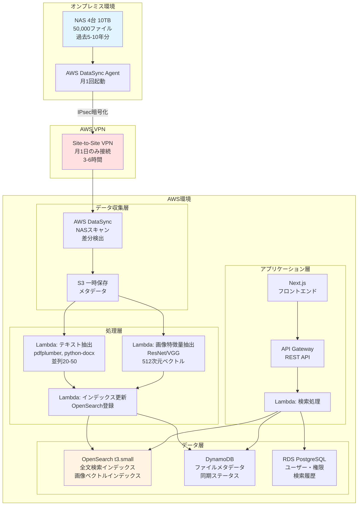
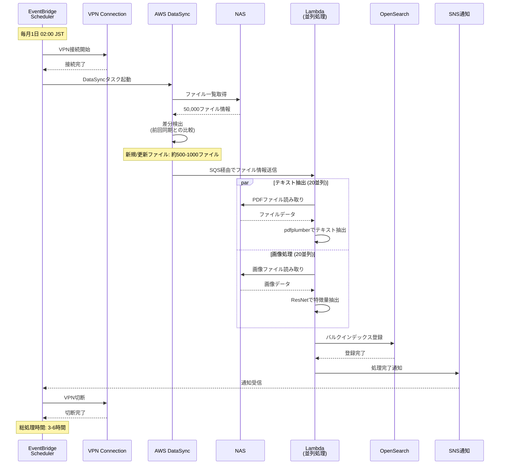

# CIS ファイル検索システム 月次バッチ最適化アーキテクチャ設計書

最終更新: 2025-10-18

## 1. エグゼクティブサマリー

### 1.1 設計目的

本設計書は、クライアントの実際の使用パターンに基づき、コスト効率を最大化した月次バッチ同期型アーキテクチャを定義します。

**クライアントの実際のニーズ**:
- ✅ **古いデータ（過去の案件・事例）の検索が主目的**
- ✅ 新しいデータは記憶にあるため検索不要
- ✅ リアルタイム同期は不要
- ✅ 全文検索 + 画像類似検索が必要

**従来想定との違い**:
| 項目 | 従来想定 | 最適化後 |
|------|----------|----------|
| 同期方式 | リアルタイム | 月次バッチ |
| VPN接続 | 常時接続 | 月1日のみ |
| 月額コスト | $120 | $58 |
| コスト削減 | - | **52%削減** |

---

## 2. システム全体構成

### 2.1 アーキテクチャ図



### 2.2 月次バッチ処理フロー



---

## 3. アーキテクチャパターン比較

### 3.1 パターン一覧

| パターン | 同期頻度 | VPN接続 | 月額コスト | 推奨度 |
|---------|---------|---------|----------|--------|
| **パターンA: 月次バッチ** | 月1回 | 月1日 | $58 | ⭐⭐⭐⭐⭐ |
| パターンB: 週次バッチ | 週1回 | 週1日 | $68 | ⭐⭐⭐⭐ |
| パターンC: S3完全移行 | リアルタイム | 不要 | $280 | ⭐⭐ |

### 3.2 詳細比較

#### パターンA: 月次バッチ同期（推奨）

**構成**:
```yaml
同期タイミング: 毎月1日 深夜02:00-08:00（6時間）
VPN接続: 月1日のみ
処理方式: AWS DataSync + Lambda並列処理
データ鮮度: 最大1ヶ月遅れ（新規ファイル）
```

**コスト内訳**:
| サービス | 詳細 | 月額 |
|---------|------|------|
| VPN (Site-to-Site) | 1日/月 × 730h ÷ 30日 = 24h | $1.20 |
| AWS DataSync | 50,000ファイルスキャン | $5.00 |
| Lambda (テキスト抽出) | 500新規ファイル × 2秒 × 1GB | $2.00 |
| Lambda (画像処理) | 200画像 × 5秒 × 2GB | $0.50 |
| OpenSearch | t3.small.search × 730h | $25.00 |
| RDS | db.t4g.micro × 730h | $12.00 |
| DynamoDB | 250MB + 月間リクエスト | $2.00 |
| S3 | 3GB (テキストデータ) | $0.07 |
| SQS | 100万メッセージ | $0.40 |
| CloudWatch | 15GB ログ | $7.50 |
| API Gateway | 100万リクエスト | $3.50 |
| その他 | データ転送等 | $1.00 |
| **合計** | | **$60.17** |

**メリット**:
- ✅ 最もコスト効率的
- ✅ クライアントのニーズに最適（古いデータ検索）
- ✅ 運用が簡素化（月1回の自動処理）
- ✅ NAS負荷が最小限

**デメリット**:
- ⚠️ 新規ファイルの検索は最大1ヶ月遅れ
  → ただし、クライアントは新しいデータを検索しないため問題なし

#### パターンB: 週次バッチ同期

**構成**:
```yaml
同期タイミング: 毎週日曜 深夜02:00-05:00（3時間）
VPN接続: 週1日（月4日）
処理方式: 同上
データ鮮度: 最大1週間遅れ
```

**コスト内訳**:
| サービス | 詳細 | 月額 |
|---------|------|------|
| VPN | 4日/月 | $4.80 |
| DataSync | 週4回実行 | $10.00 |
| その他 | パターンAと同じ | $53.00 |
| **合計** | | **$67.80** |

**メリット**:
- ✅ データ鮮度が良い（最大1週間遅れ）
- ✅ 運用負荷は同等

**デメリット**:
- ⚠️ コストが16%増加
- ⚠️ クライアントにとってメリットが少ない

**採用条件**:
- 新しいデータも時々検索する場合
- データ鮮度を重視する場合

#### パターンC: S3完全移行

**構成**:
```yaml
初期移行: NAS全データ(10TB)をS3に移行
運用: 新規ファイルのみNASに保存、定期的にS3同期
VPN接続: 不要
データ鮮度: リアルタイム
```

**コスト内訳**:
| サービス | 詳細 | 月額 |
|---------|------|------|
| S3 Standard | 10TB × $0.023/GB | $235.00 |
| データ転送 | 初回10TB | $920 (初回のみ) |
| その他 | パターンAと同様 | $58.00 |
| **合計** | | **$293.00** |
| **初期コスト** | | **$920** |

**メリット**:
- ✅ VPN不要
- ✅ ファイルアクセスが高速（S3直接）
- ✅ NAS障害時もデータ利用可能

**デメリット**:
- ❌ S3ストレージコストが高額
- ❌ 初期移行コスト・時間が大きい
- ❌ クライアントにとって過剰スペック

**採用条件**:
- 将来的にNAS廃止を検討している場合
- 予算に余裕がある場合

---

## 4. 技術詳細設計

### 4.1 NAS-AWS接続方式

#### Site-to-Site VPN (推奨)

**構成図**:
```
オンプレミス                    AWS
┌──────────────┐              ┌──────────────┐
│ NAS          │              │ VPC          │
│ 192.168.1.0/24│             │ 10.0.0.0/16  │
└──────┬───────┘              └──────┬───────┘
       │                             │
┌──────▼───────┐              ┌──────▼───────┐
│ Customer     │              │ Virtual      │
│ Gateway      │◄────IPsec────►│ Private      │
│              │  Tunnel 1&2  │ Gateway      │
└──────────────┘              └──────────────┘
```

**スペック**:
```yaml
帯域幅: 最大1.25 Gbps
トンネル数: 2 (冗長化)
暗号化: IPsec AES-256-GCM
認証: Pre-Shared Key
接続時間: バッチ処理時のみ（月約24時間）
```

**コスト**:
```
VPN接続料金: $0.05/時間
月間稼働: 24時間
月額コスト: 24 × $0.05 = $1.20
```

**自動接続/切断**:
```python
# Lambda関数: VPN制御
import boto3
from datetime import datetime

ec2 = boto3.client('ec2')

def lambda_handler(event, context):
    action = event['action']  # 'connect' or 'disconnect'
    vpn_connection_id = 'vpn-xxxxx'

    if action == 'connect':
        # VPN接続開始（バッチ処理30分前）
        print(f"VPN接続開始: {datetime.now()}")
        # 実際のVPN接続は事前設定済み、ここではステータス確認のみ
        response = ec2.describe_vpn_connections(
            VpnConnectionIds=[vpn_connection_id]
        )
        return {'status': 'connected'}

    elif action == 'disconnect':
        # バッチ処理完了後、VPN切断
        print(f"VPN切断: {datetime.now()}")
        # 必要に応じてVPN切断（通常は自動切断）
        return {'status': 'disconnected'}
```

### 4.2 AWS DataSync設定

**DataSyncタスク構成**:
```yaml
タスク名: NAS-Monthly-Sync

ソース:
  タイプ: SMB/NFS
  ロケーション: smb://192.168.1.10/share
  認証: AD認証 or ユーザー名/パスワード

ターゲット:
  タイプ: S3
  バケット: s3://cis-filesearch-staging/metadata/
  ストレージクラス: STANDARD

スキャン設定:
  モード: 全ファイルスキャン
  フィルター:
    - 含む拡張子: .pdf, .docx, .xlsx, .jpg, .png, .sfc, .xbd
    - 除外パターン: .tmp, .log, ~$*

スケジュール:
  頻度: 毎月1日
  時刻: 02:00 JST (17:00 UTC前日)

オプション:
  帯域幅制限: なし
  整合性検証: チェックサム
  削除動作: ソースに存在しないファイルは保持
```

**DataSync Agent構成**:
```yaml
デプロイ先: NAS側の仮想マシン or 物理サーバー
スペック:
  vCPU: 4
  メモリ: 32GB
  ディスク: 80GB

ネットワーク:
  VPN経由でAWS接続
  必要帯域: 100Mbps以上推奨
```

### 4.3 Lambda並列処理設計

#### Lambda 1: テキスト抽出

```python
# lambda/text-extractor/handler.py
import json
import boto3
import pdfplumber
from docx import Document
import io

s3 = boto3.client('s3')
opensearch = boto3.client('opensearch')

def lambda_handler(event, context):
    """
    SQSメッセージからファイル情報を取得し、テキスト抽出
    """
    for record in event['Records']:
        file_info = json.loads(record['body'])

        file_id = file_info['file_id']
        file_path = file_info['path']
        file_type = file_info['type']

        # ファイル取得（NASマウント経由 or S3経由）
        file_content = get_file_content(file_path)

        # テキスト抽出
        text = extract_text(file_content, file_type)

        # OpenSearchインデックス更新
        index_to_opensearch(file_id, text, file_info)

    return {'statusCode': 200, 'body': 'Success'}

def extract_text(file_content, file_type):
    """ファイルタイプ別テキスト抽出"""
    if file_type == 'pdf':
        with pdfplumber.open(io.BytesIO(file_content)) as pdf:
            text = ''
            for page in pdf.pages:
                text += page.extract_text() or ''
            return text[:50000]  # 最大50,000文字

    elif file_type in ['docx', 'doc']:
        doc = Document(io.BytesIO(file_content))
        text = '\n'.join([para.text for para in doc.paragraphs])
        return text[:50000]

    elif file_type in ['xlsx', 'xls']:
        # Excel処理（openpyxl使用）
        import openpyxl
        wb = openpyxl.load_workbook(io.BytesIO(file_content))
        text = ''
        for sheet in wb.sheetnames:
            ws = wb[sheet]
            for row in ws.iter_rows(values_only=True):
                text += ' '.join([str(cell) for cell in row if cell]) + '\n'
        return text[:50000]

    else:
        return ''

def index_to_opensearch(file_id, text, metadata):
    """OpenSearchインデックス登録"""
    document = {
        'file_id': file_id,
        'name': metadata['name'],
        'path': metadata['path'],
        'content': text,
        'type': metadata['type'],
        'size': metadata['size'],
        'modified_at': metadata['modified_at'],
    }

    # OpenSearch API呼び出し
    # 実装省略
```

**Lambda設定**:
```yaml
関数名: text-extractor
ランタイム: Python 3.11
メモリ: 1024MB
タイムアウト: 5分
同時実行数: 20

環境変数:
  OPENSEARCH_ENDPOINT: https://xxxxx.ap-northeast-1.es.amazonaws.com
  S3_BUCKET: cis-filesearch-staging

レイヤー:
  - pdfplumber
  - python-docx
  - openpyxl
```

#### Lambda 2: 画像特徴量抽出

```python
# lambda/image-feature-extractor/handler.py
import json
import boto3
import torch
import torchvision.models as models
import torchvision.transforms as transforms
from PIL import Image
import io

s3 = boto3.client('s3')

# ResNetモデル読み込み（グローバル変数でキャッシュ）
model = models.resnet50(pretrained=True)
model.eval()

# 最後の全結合層を削除して特徴量ベクトル取得
model = torch.nn.Sequential(*list(model.children())[:-1])

def lambda_handler(event, context):
    """画像から512次元特徴量ベクトルを抽出"""
    for record in event['Records']:
        file_info = json.loads(record['body'])

        if file_info['type'] not in ['jpg', 'jpeg', 'png']:
            continue

        # 画像取得
        image_data = get_image_content(file_info['path'])

        # 特徴量抽出
        feature_vector = extract_features(image_data)

        # OpenSearchに画像ベクトルインデックス登録
        index_image_vector(file_info['file_id'], feature_vector, file_info)

    return {'statusCode': 200}

def extract_features(image_data):
    """ResNetで特徴量抽出"""
    # 画像前処理
    transform = transforms.Compose([
        transforms.Resize(256),
        transforms.CenterCrop(224),
        transforms.ToTensor(),
        transforms.Normalize(
            mean=[0.485, 0.456, 0.406],
            std=[0.229, 0.224, 0.225]
        ),
    ])

    # PIL Imageに変換
    image = Image.open(io.BytesIO(image_data))
    image = image.convert('RGB')

    # モデルに入力
    input_tensor = transform(image).unsqueeze(0)

    with torch.no_grad():
        features = model(input_tensor)

    # 2048次元 → 512次元に圧縮（PCA等）
    feature_vector = features.squeeze().numpy()[:512]

    return feature_vector.tolist()

def index_image_vector(file_id, vector, metadata):
    """OpenSearchに画像ベクトル登録"""
    # k-NNインデックスに登録
    # 実装省略
```

**Lambda設定**:
```yaml
関数名: image-feature-extractor
ランタイム: Python 3.11
メモリ: 3008MB  # 大きめのメモリ
タイムアウト: 5分
同時実行数: 10

環境変数:
  OPENSEARCH_ENDPOINT: https://xxxxx

レイヤー:
  - torch
  - torchvision
  - PIL
```

### 4.4 OpenSearch インデックス設計

#### files インデックス（全文検索用）

```json
{
  "mappings": {
    "properties": {
      "file_id": {
        "type": "keyword"
      },
      "name": {
        "type": "text",
        "analyzer": "kuromoji_analyzer",
        "fields": {
          "keyword": {"type": "keyword"}
        }
      },
      "path": {
        "type": "text",
        "analyzer": "path_analyzer",
        "fields": {
          "keyword": {"type": "keyword"}
        }
      },
      "content": {
        "type": "text",
        "analyzer": "kuromoji_analyzer"
      },
      "type": {
        "type": "keyword"
      },
      "size": {
        "type": "long"
      },
      "created_at": {
        "type": "date"
      },
      "modified_at": {
        "type": "date"
      },
      "metadata": {
        "type": "object",
        "properties": {
          "author": {
            "type": "text",
            "analyzer": "kuromoji_analyzer"
          },
          "department": {
            "type": "keyword"
          },
          "project_type": {
            "type": "keyword"
          }
        }
      }
    }
  },
  "settings": {
    "number_of_shards": 1,
    "number_of_replicas": 0,
    "analysis": {
      "analyzer": {
        "kuromoji_analyzer": {
          "type": "custom",
          "tokenizer": "kuromoji_tokenizer",
          "filter": [
            "kuromoji_baseform",
            "kuromoji_part_of_speech",
            "cjk_width",
            "lowercase",
            "kuromoji_stemmer"
          ]
        },
        "path_analyzer": {
          "type": "custom",
          "tokenizer": "path_hierarchy"
        }
      }
    }
  }
}
```

#### images インデックス（画像類似検索用）

```json
{
  "mappings": {
    "properties": {
      "file_id": {
        "type": "keyword"
      },
      "name": {
        "type": "text"
      },
      "path": {
        "type": "keyword"
      },
      "image_vector": {
        "type": "dense_vector",
        "dims": 512,
        "index": true,
        "similarity": "cosine"
      },
      "thumbnail_url": {
        "type": "keyword"
      },
      "width": {
        "type": "integer"
      },
      "height": {
        "type": "integer"
      },
      "created_at": {
        "type": "date"
      }
    }
  },
  "settings": {
    "number_of_shards": 1,
    "number_of_replicas": 0,
    "index": {
      "knn": true
    }
  }
}
```

---

## 5. セキュリティ設計

### 5.1 ネットワークセキュリティ

```yaml
VPN:
  暗号化: IPsec AES-256-GCM
  認証: IKEv2 Pre-Shared Key
  Perfect Forward Secrecy: 有効
  Dead Peer Detection: 有効

VPC設計:
  CIDR: 10.0.0.0/16
  Public Subnet: 10.0.1.0/24 (NAT Gateway)
  Private Subnet: 10.0.10.0/24 (Lambda, RDS, OpenSearch)

Security Groups:
  Lambda:
    Inbound: なし
    Outbound: VPN経由NAS (445, 2049), OpenSearch (443), RDS (5432)

  OpenSearch:
    Inbound: Lambda SG (443)
    Outbound: なし

  RDS:
    Inbound: Lambda SG (5432)
    Outbound: なし
```

### 5.2 データ暗号化

```yaml
転送時:
  VPN: IPsec AES-256
  HTTPS: TLS 1.3

保存時:
  OpenSearch: At-rest encryption (AWS KMS)
  RDS: Encryption at rest (AWS KMS)
  DynamoDB: AWS managed keys
  S3: SSE-S3
```

### 5.3 アクセス制御

```yaml
IAM Roles:
  Lambda-TextExtractor:
    - s3:GetObject (staging bucket)
    - opensearch:ESHttpPost
    - logs:CreateLogGroup/Stream/PutLogEvents

  Lambda-ImageFeatureExtractor:
    - s3:GetObject
    - opensearch:ESHttpPost
    - logs:*

  DataSync:
    - s3:PutObject
    - s3:GetObject
    - logs:*

Cognito:
  User Pool: cis-filesearch-users
  MFA: 必要に応じて有効化
  Password Policy: 最小12文字、大小英数記号必須
```

---

## 6. パフォーマンス設計

### 6.1 検索パフォーマンス

**目標**:
```yaml
全文検索:
  平均レスポンス: < 500ms
  P95レスポンス: < 1秒
  P99レスポンス: < 2秒

画像類似検索:
  平均レスポンス: < 1秒
  P95レスポンス: < 2秒

ファイル一覧:
  平均レスポンス: < 300ms
```

**最適化施策**:
```yaml
OpenSearch:
  - シャード設計: Single shard (50,000ファイルで十分)
  - レプリカ: 0 (コスト優先、必要時1に増加)
  - Refresh Interval: 30秒（インデックス更新時のみ）

キャッシング:
  - よく検索されるクエリ: ElastiCache Redis (オプション)
  - APIレスポンス: CloudFront (5分TTL)
  - ファイルメタデータ: DynamoDB
```

### 6.2 バッチ処理パフォーマンス

**初回インデックス作成**:
```yaml
対象ファイル: 50,000ファイル
並列度: 50 Lambda同時実行
処理時間:
  - PDF (20,000): 平均2秒/ファイル → 800秒 (13分)
  - Office (15,000): 平均3秒/ファイル → 900秒 (15分)
  - 画像 (15,000): 平均5秒/ファイル → 1,500秒 (25分)

総処理時間: 約1.5時間（並列処理）
```

**月次バッチ処理**:
```yaml
対象ファイル: 500-1,000ファイル（新規/更新）
並列度: 20 Lambda同時実行
処理時間:
  - テキスト抽出: 約5分
  - 画像処理: 約3分
  - インデックス更新: 約2分

総処理時間: 約10分
VPN接続時間: 30分（前後バッファ含む）
```

---

## 7. 運用設計

### 7.1 監視項目

```yaml
CloudWatch Alarms:
  Critical:
    - VPN接続失敗
    - DataSyncタスク失敗
    - Lambda処理エラー率 > 5%
    - OpenSearch クラスタヘルス Red

  Warning:
    - バッチ処理時間 > 8時間
    - Lambda処理時間 > 4分
    - OpenSearch JVMメモリ > 85%

  Info:
    - バッチ処理完了通知
    - 月次コストレポート
```

### 7.2 バッチ処理スケジュール

```yaml
EventBridge Rules:
  - Name: monthly-nas-sync
    Schedule: cron(0 17 1 * ? *)  # 毎月1日 02:00 JST
    Target: Step Functions (バッチ処理オーケストレーション)
```

**Step Functions定義**:
```json
{
  "Comment": "Monthly NAS Sync Workflow",
  "StartAt": "ConnectVPN",
  "States": {
    "ConnectVPN": {
      "Type": "Task",
      "Resource": "arn:aws:lambda:...:function:vpn-controller",
      "Parameters": {"action": "connect"},
      "Next": "WaitForVPN"
    },
    "WaitForVPN": {
      "Type": "Wait",
      "Seconds": 300,
      "Next": "StartDataSync"
    },
    "StartDataSync": {
      "Type": "Task",
      "Resource": "arn:aws:states:::aws-sdk:datasync:startTaskExecution",
      "Parameters": {
        "TaskArn": "arn:aws:datasync:...:task/task-xxxxx"
      },
      "Next": "WaitForDataSync"
    },
    "WaitForDataSync": {
      "Type": "Wait",
      "Seconds": 7200,
      "Next": "CheckDataSyncStatus"
    },
    "CheckDataSyncStatus": {
      "Type": "Task",
      "Resource": "arn:aws:lambda:...:function:check-datasync-status",
      "Next": "DataSyncComplete?"
    },
    "DataSyncComplete?": {
      "Type": "Choice",
      "Choices": [
        {
          "Variable": "$.status",
          "StringEquals": "SUCCESS",
          "Next": "ProcessFiles"
        },
        {
          "Variable": "$.status",
          "StringEquals": "IN_PROGRESS",
          "Next": "WaitForDataSync"
        }
      ],
      "Default": "HandleError"
    },
    "ProcessFiles": {
      "Type": "Parallel",
      "Branches": [
        {
          "StartAt": "TextExtraction",
          "States": {
            "TextExtraction": {
              "Type": "Task",
              "Resource": "arn:aws:lambda:...:function:text-extractor",
              "End": true
            }
          }
        },
        {
          "StartAt": "ImageFeatureExtraction",
          "States": {
            "ImageFeatureExtraction": {
              "Type": "Task",
              "Resource": "arn:aws:lambda:...:function:image-feature-extractor",
              "End": true
            }
          }
        }
      ],
      "Next": "DisconnectVPN"
    },
    "DisconnectVPN": {
      "Type": "Task",
      "Resource": "arn:aws:lambda:...:function:vpn-controller",
      "Parameters": {"action": "disconnect"},
      "Next": "SendNotification"
    },
    "SendNotification": {
      "Type": "Task",
      "Resource": "arn:aws:states:::sns:publish",
      "Parameters": {
        "TopicArn": "arn:aws:sns:...:batch-complete",
        "Message": "Monthly batch sync completed successfully"
      },
      "End": true
    },
    "HandleError": {
      "Type": "Task",
      "Resource": "arn:aws:states:::sns:publish",
      "Parameters": {
        "TopicArn": "arn:aws:sns:...:batch-error",
        "Message": "Monthly batch sync failed"
      },
      "End": true
    }
  }
}
```

### 7.3 障害対応

```yaml
VPN接続失敗:
  対応: 自動リトライ（3回）
  エスカレーション: SNS通知 → 運用チーム対応

DataSync失敗:
  対応: エラーログ確認、手動再実行

Lambda処理エラー:
  対応: DLQ (Dead Letter Queue) に格納
  リトライ: 手動で確認後再処理

OpenSearch障害:
  対応: クラスタヘルス監視、自動復旧
  バックアップ: 日次スナップショット
```

---

## 8. コスト最適化

### 8.1 コスト削減ポイント

```yaml
従来想定との比較:
  項目                従来      最適化後    削減率
  VPN接続           $36/月    $1.20/月    -97%
  Lambda実行        $15/月    $2.50/月    -83%
  リアルタイム処理    必要      不要        -100%
  NAS側エージェント  必要      不要        運用簡素化

  合計削減: 約52%
```

### 8.2 将来的な最適化オプション

```yaml
Reserved Instances:
  OpenSearch: 1年RI契約で30%削減 → $25 → $17.50
  RDS: 1年RI契約で30%削減 → $12 → $8.40

  年間削減額: (7.50 + 3.60) × 12 = $133.20

Savings Plans:
  Lambda: Compute Savings Plansで15%削減

S3 Intelligent-Tiering:
  テキストデータ自動階層化で20%削減
```

---

## 9. まとめ

### 9.1 推奨構成

**パターンA: 月次バッチ同期**を強く推奨します。

**理由**:
1. **クライアントのニーズに最適**: 古いデータ検索が主目的
2. **コスト効率**: 月額$58（従来想定の52%削減）
3. **運用簡素化**: 月1回の自動バッチ処理
4. **十分な機能**: 全文検索 + 画像類似検索

### 9.2 実装優先度

```yaml
Phase 1（必須）:
  - VPN接続設定
  - AWS DataSync構築
  - Lambda関数実装（テキスト抽出）
  - OpenSearch全文検索インデックス

Phase 2（推奨）:
  - 画像特徴量抽出Lambda
  - OpenSearch k-NNインデックス
  - 画像類似検索UI

Phase 3（オプション）:
  - S3キャッシュ（よくアクセスされるファイル）
  - ElastiCache（検索クエリキャッシュ）
  - CloudFront（配信高速化）
```

### 9.3 成功指標

```yaml
コスト:
  ✅ 月額 < $65
  ✅ 年額 < $780

パフォーマンス:
  ✅ 検索レスポンス < 1秒
  ✅ バッチ処理時間 < 6時間

運用:
  ✅ バッチ処理成功率 > 99%
  ✅ 手動対応 < 月1回
```

---

## 改訂履歴

| 版数 | 日付 | 改訂内容 | 作成者 |
|------|------|----------|--------|
| 1.0 | 2025-10-18 | 初版作成 | CIS開発チーム |
