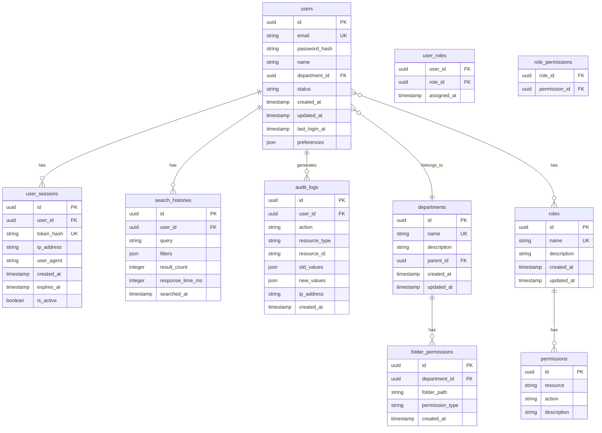
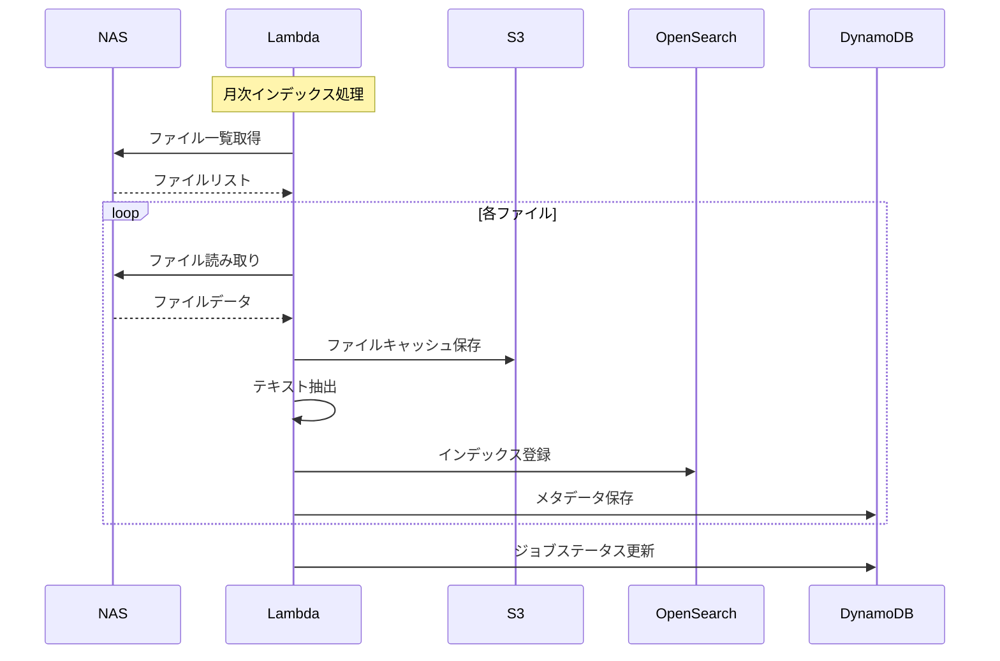

# CIS ファイル検索システム データベース設計書

## 1. データベース構成概要

### 1.1 データストア配置

```
┌─────────────────────────────────────────────────────────────┐
│                     データストア構成                          │
├─────────────────────────────────────────────────────────────┤
│  RDS (PostgreSQL)  │  ユーザー管理、権限、監査ログ           │
│  DynamoDB          │  セッション、キャッシュ、メタデータ     │
│  OpenSearch        │  全文検索インデックス                   │
│  S3                │  ファイルストレージ、ログアーカイブ     │
└─────────────────────────────────────────────────────────────┘
```

## 2. RDS (PostgreSQL) スキーマ設計

### 2.1 ER図



### 2.2 テーブル定義

#### users テーブル

```sql
CREATE TABLE users (
    id UUID PRIMARY KEY DEFAULT gen_random_uuid(),
    email VARCHAR(255) UNIQUE NOT NULL,
    password_hash VARCHAR(255) NOT NULL,
    name VARCHAR(100) NOT NULL,
    department_id UUID REFERENCES departments(id),
    status VARCHAR(20) NOT NULL DEFAULT 'active',
    created_at TIMESTAMP NOT NULL DEFAULT CURRENT_TIMESTAMP,
    updated_at TIMESTAMP NOT NULL DEFAULT CURRENT_TIMESTAMP,
    last_login_at TIMESTAMP,
    preferences JSONB DEFAULT '{}'::jsonb,

    INDEX idx_users_email (email),
    INDEX idx_users_department (department_id),
    INDEX idx_users_status (status)
);
```

#### departments テーブル

```sql
CREATE TABLE departments (
    id UUID PRIMARY KEY DEFAULT gen_random_uuid(),
    name VARCHAR(100) UNIQUE NOT NULL,
    description TEXT,
    parent_id UUID REFERENCES departments(id),
    created_at TIMESTAMP NOT NULL DEFAULT CURRENT_TIMESTAMP,
    updated_at TIMESTAMP NOT NULL DEFAULT CURRENT_TIMESTAMP,

    INDEX idx_departments_name (name),
    INDEX idx_departments_parent (parent_id)
);
```

#### roles テーブル

```sql
CREATE TABLE roles (
    id UUID PRIMARY KEY DEFAULT gen_random_uuid(),
    name VARCHAR(50) UNIQUE NOT NULL,
    description TEXT,
    created_at TIMESTAMP NOT NULL DEFAULT CURRENT_TIMESTAMP,
    updated_at TIMESTAMP NOT NULL DEFAULT CURRENT_TIMESTAMP,

    INDEX idx_roles_name (name)
);
```

#### user_roles テーブル

```sql
CREATE TABLE user_roles (
    user_id UUID REFERENCES users(id) ON DELETE CASCADE,
    role_id UUID REFERENCES roles(id) ON DELETE CASCADE,
    assigned_at TIMESTAMP NOT NULL DEFAULT CURRENT_TIMESTAMP,

    PRIMARY KEY (user_id, role_id),
    INDEX idx_user_roles_user (user_id),
    INDEX idx_user_roles_role (role_id)
);
```

#### permissions テーブル

```sql
CREATE TABLE permissions (
    id UUID PRIMARY KEY DEFAULT gen_random_uuid(),
    resource VARCHAR(50) NOT NULL,
    action VARCHAR(50) NOT NULL,
    description TEXT,

    UNIQUE KEY uk_permissions (resource, action),
    INDEX idx_permissions_resource (resource)
);
```

#### role_permissions テーブル

```sql
CREATE TABLE role_permissions (
    role_id UUID REFERENCES roles(id) ON DELETE CASCADE,
    permission_id UUID REFERENCES permissions(id) ON DELETE CASCADE,

    PRIMARY KEY (role_id, permission_id),
    INDEX idx_role_permissions_role (role_id)
);
```

#### folder_permissions テーブル

```sql
CREATE TABLE folder_permissions (
    id UUID PRIMARY KEY DEFAULT gen_random_uuid(),
    department_id UUID REFERENCES departments(id) ON DELETE CASCADE,
    folder_path VARCHAR(500) NOT NULL,
    permission_type VARCHAR(20) NOT NULL,
    created_at TIMESTAMP NOT NULL DEFAULT CURRENT_TIMESTAMP,

    INDEX idx_folder_permissions_dept (department_id),
    INDEX idx_folder_permissions_path (folder_path)
);
```

#### user_sessions テーブル

```sql
CREATE TABLE user_sessions (
    id UUID PRIMARY KEY DEFAULT gen_random_uuid(),
    user_id UUID REFERENCES users(id) ON DELETE CASCADE,
    token_hash VARCHAR(255) UNIQUE NOT NULL,
    ip_address INET,
    user_agent TEXT,
    created_at TIMESTAMP NOT NULL DEFAULT CURRENT_TIMESTAMP,
    expires_at TIMESTAMP NOT NULL,
    is_active BOOLEAN DEFAULT true,

    INDEX idx_sessions_user (user_id),
    INDEX idx_sessions_token (token_hash),
    INDEX idx_sessions_expires (expires_at)
);
```

#### search_histories テーブル

```sql
CREATE TABLE search_histories (
    id UUID PRIMARY KEY DEFAULT gen_random_uuid(),
    user_id UUID REFERENCES users(id) ON DELETE CASCADE,
    query TEXT NOT NULL,
    filters JSONB,
    result_count INTEGER,
    response_time_ms INTEGER,
    searched_at TIMESTAMP NOT NULL DEFAULT CURRENT_TIMESTAMP,

    INDEX idx_search_histories_user (user_id),
    INDEX idx_search_histories_date (searched_at)
);

-- パーティショニング（月別）
CREATE TABLE search_histories_2025_01 PARTITION OF search_histories
    FOR VALUES FROM ('2025-01-01') TO ('2025-02-01');
```

#### audit_logs テーブル

```sql
CREATE TABLE audit_logs (
    id UUID PRIMARY KEY DEFAULT gen_random_uuid(),
    user_id UUID REFERENCES users(id),
    action VARCHAR(50) NOT NULL,
    resource_type VARCHAR(50),
    resource_id VARCHAR(255),
    old_values JSONB,
    new_values JSONB,
    ip_address INET,
    created_at TIMESTAMP NOT NULL DEFAULT CURRENT_TIMESTAMP,

    INDEX idx_audit_logs_user (user_id),
    INDEX idx_audit_logs_action (action),
    INDEX idx_audit_logs_date (created_at)
);

-- パーティショニング（月別）
CREATE TABLE audit_logs_2025_01 PARTITION OF audit_logs
    FOR VALUES FROM ('2025-01-01') TO ('2025-02-01');
```

## 3. DynamoDB テーブル設計

### 3.1 file_metadata テーブル

```yaml
TableName: file_metadata
PartitionKey: file_id (String)
SortKey: version (Number)
Attributes:
  - file_id: String
  - version: Number
  - name: String
  - path: String
  - size: Number
  - type: String
  - mime_type: String
  - created_at: String (ISO 8601)
  - modified_at: String (ISO 8601)
  - created_by: String
  - modified_by: String
  - checksum: String
  - metadata: Map
    - pages: Number
    - author: String
    - title: String
    - tags: List<String>
  - indexed_at: String
  - index_status: String

GlobalSecondaryIndexes:
  - GSI1:
      PartitionKey: path
      SortKey: modified_at
  - GSI2:
      PartitionKey: type
      SortKey: size
```

### 3.2 search_cache テーブル

```yaml
TableName: search_cache
PartitionKey: query_hash (String)
SortKey: timestamp (Number)
Attributes:
  - query_hash: String
  - timestamp: Number
  - query: String
  - filters: Map
  - results: List
  - result_count: Number
  - ttl: Number (Unix timestamp)

TimeToLive:
  AttributeName: ttl
```

### 3.3 user_preferences テーブル

```yaml
TableName: user_preferences
PartitionKey: user_id (String)
Attributes:
  - user_id: String
  - search_history: List<Map>
  - saved_searches: List<Map>
  - ui_settings: Map
    - theme: String
    - language: String
    - results_per_page: Number
  - notifications: Map
  - last_updated: String
```

### 3.4 index_jobs テーブル

```yaml
TableName: index_jobs
PartitionKey: job_id (String)
SortKey: created_at (String)
Attributes:
  - job_id: String
  - created_at: String
  - status: String
  - type: String (full/incremental)
  - progress: Number
  - files_processed: Number
  - files_total: Number
  - started_at: String
  - completed_at: String
  - error_details: Map
  - statistics: Map

GlobalSecondaryIndexes:
  - GSI1:
      PartitionKey: status
      SortKey: created_at
```

## 4. OpenSearch インデックス設計

### 4.1 files インデックス

```json
{
  "mappings": {
    "properties": {
      "file_id": {
        "type": "keyword"
      },
      "name": {
        "type": "text",
        "analyzer": "kuromoji_analyzer",
        "fields": {
          "keyword": {
            "type": "keyword"
          }
        }
      },
      "path": {
        "type": "text",
        "analyzer": "path_analyzer",
        "fields": {
          "keyword": {
            "type": "keyword"
          }
        }
      },
      "content": {
        "type": "text",
        "analyzer": "kuromoji_analyzer"
      },
      "type": {
        "type": "keyword"
      },
      "size": {
        "type": "long"
      },
      "created_at": {
        "type": "date"
      },
      "modified_at": {
        "type": "date"
      },
      "metadata": {
        "type": "object",
        "properties": {
          "author": {
            "type": "text",
            "analyzer": "kuromoji_analyzer",
            "fields": {
              "keyword": {
                "type": "keyword"
              }
            }
          },
          "title": {
            "type": "text",
            "analyzer": "kuromoji_analyzer"
          },
          "tags": {
            "type": "keyword"
          },
          "pages": {
            "type": "integer"
          }
        }
      },
      "permissions": {
        "type": "nested",
        "properties": {
          "department_id": {
            "type": "keyword"
          },
          "access_level": {
            "type": "keyword"
          }
        }
      },
      "suggest": {
        "type": "completion",
        "analyzer": "kuromoji_analyzer"
      }
    }
  },
  "settings": {
    "number_of_shards": 3,
    "number_of_replicas": 2,
    "analysis": {
      "analyzer": {
        "kuromoji_analyzer": {
          "type": "custom",
          "tokenizer": "kuromoji_tokenizer",
          "filter": [
            "kuromoji_baseform",
            "kuromoji_part_of_speech",
            "cjk_width",
            "stop",
            "kuromoji_stemmer",
            "lowercase"
          ]
        },
        "path_analyzer": {
          "type": "custom",
          "tokenizer": "path_hierarchy"
        }
      }
    }
  }
}
```

### 4.2 images インデックス

```json
{
  "mappings": {
    "properties": {
      "file_id": {
        "type": "keyword"
      },
      "name": {
        "type": "text"
      },
      "path": {
        "type": "keyword"
      },
      "vector": {
        "type": "dense_vector",
        "dims": 512,
        "index": true,
        "similarity": "cosine"
      },
      "metadata": {
        "type": "object",
        "properties": {
          "width": {"type": "integer"},
          "height": {"type": "integer"},
          "format": {"type": "keyword"},
          "color_space": {"type": "keyword"},
          "exif": {"type": "object", "enabled": false}
        }
      },
      "created_at": {
        "type": "date"
      }
    }
  }
}
```

## 5. S3 バケット構造

### 5.1 バケット設計

```
cis-filesearch-prod/
├── file-cache/                 # ファイルキャッシュ
│   ├── {year}/{month}/{day}/
│   │   └── {file_id}
├── thumbnails/                  # サムネイル画像
│   ├── small/
│   │   └── {file_id}.jpg
│   ├── medium/
│   │   └── {file_id}.jpg
│   └── large/
│       └── {file_id}.jpg
├── index-snapshots/            # インデックスバックアップ
│   └── {date}/
│       └── snapshot.tar.gz
├── logs/                       # アプリケーションログ
│   ├── access/
│   │   └── {year}/{month}/{day}/
│   ├── error/
│   │   └── {year}/{month}/{day}/
│   └── audit/
│       └── {year}/{month}/{day}/
└── temp/                       # 一時ファイル
    └── uploads/
        └── {session_id}/
```

### 5.2 ライフサイクルポリシー

```json
{
  "Rules": [
    {
      "Id": "delete-temp-files",
      "Status": "Enabled",
      "Prefix": "temp/",
      "Expiration": {
        "Days": 1
      }
    },
    {
      "Id": "archive-logs",
      "Status": "Enabled",
      "Prefix": "logs/",
      "Transitions": [
        {
          "Days": 30,
          "StorageClass": "STANDARD_IA"
        },
        {
          "Days": 90,
          "StorageClass": "GLACIER"
        }
      ]
    },
    {
      "Id": "delete-old-thumbnails",
      "Status": "Enabled",
      "Prefix": "thumbnails/",
      "Expiration": {
        "Days": 30
      }
    }
  ]
}
```

## 6. キャッシング戦略

### 6.1 ElastiCache Redis

```yaml
キャッシュキー設計:
  user_session: "session:{token_hash}"
  search_result: "search:{query_hash}:{filters_hash}"
  file_metadata: "file:{file_id}"
  user_preferences: "user:pref:{user_id}"

TTL設定:
  user_session: 3600 (1時間)
  search_result: 300 (5分)
  file_metadata: 86400 (1日)
  user_preferences: 604800 (7日)
```

## 7. データ同期フロー

### 7.1 NAS → S3 → OpenSearch



## 8. バックアップとリカバリ

### 8.1 バックアップ戦略

| データストア | バックアップ方法 | 頻度 | 保持期間 |
|------------|--------------|------|----------|
| RDS | 自動バックアップ | 日次 | 7日 |
| RDS | 手動スナップショット | 週次 | 30日 |
| DynamoDB | Point-in-time Recovery | 継続的 | 35日 |
| OpenSearch | スナップショット | 日次 | 7日 |
| S3 | Cross-Region Replication | リアルタイム | - |

### 8.2 リカバリ手順

```bash
# RDSの復元
aws rds restore-db-instance-from-db-snapshot \
    --db-instance-identifier cis-db-restored \
    --db-snapshot-identifier cis-db-snapshot-20250115

# DynamoDBの復元
aws dynamodb restore-table-to-point-in-time \
    --source-table-name file_metadata \
    --target-table-name file_metadata_restored \
    --restore-date-time 2025-01-15T10:00:00Z

# OpenSearchの復元
POST _snapshot/backup/snapshot_20250115/_restore
{
  "indices": "files",
  "rename_pattern": "(.+)",
  "rename_replacement": "restored_$1"
}
```

## 9. パフォーマンス最適化

### 9.1 インデックス最適化

```sql
-- PostgreSQL
CREATE INDEX CONCURRENTLY idx_users_email_lower
ON users(LOWER(email));

CREATE INDEX idx_search_histories_user_date
ON search_histories(user_id, searched_at DESC);

-- 統計情報の更新
ANALYZE users;
ANALYZE search_histories;
```

### 9.2 クエリ最適化

```sql
-- 検索履歴の集計（最適化済み）
WITH recent_searches AS (
  SELECT user_id, query, COUNT(*) as count
  FROM search_histories
  WHERE searched_at >= NOW() - INTERVAL '30 days'
  GROUP BY user_id, query
)
SELECT u.name, rs.query, rs.count
FROM recent_searches rs
JOIN users u ON u.id = rs.user_id
WHERE rs.count > 5
ORDER BY rs.count DESC;
```

## 10. セキュリティ設計

### 10.1 暗号化

- **保存時暗号化**:
  - RDS: AWS KMS (AES-256)
  - DynamoDB: AWS managed keys
  - S3: SSE-S3
  - OpenSearch: node-to-node encryption

### 10.2 アクセス制御

```sql
-- Row Level Security
CREATE POLICY department_access ON folder_permissions
    FOR SELECT
    USING (department_id IN (
        SELECT department_id FROM users
        WHERE id = current_setting('app.user_id')::uuid
    ));
```

---

## 改訂履歴

| 版数 | 日付 | 改訂内容 | 作成者 |
|------|------|----------|--------|
| 1.0 | 2025-01-15 | 初版作成 | CIS開発チーム |