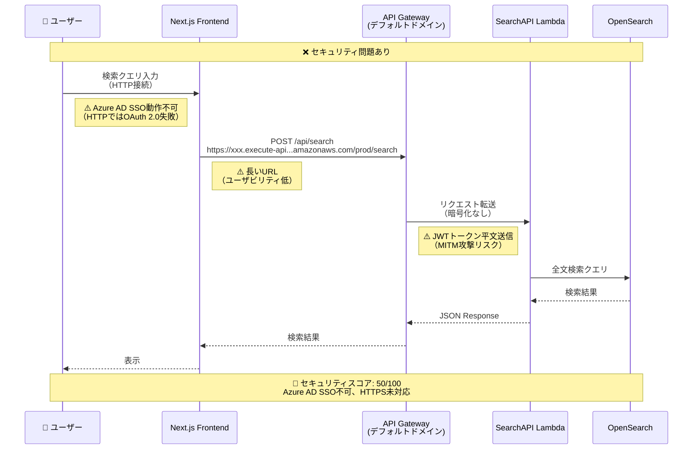
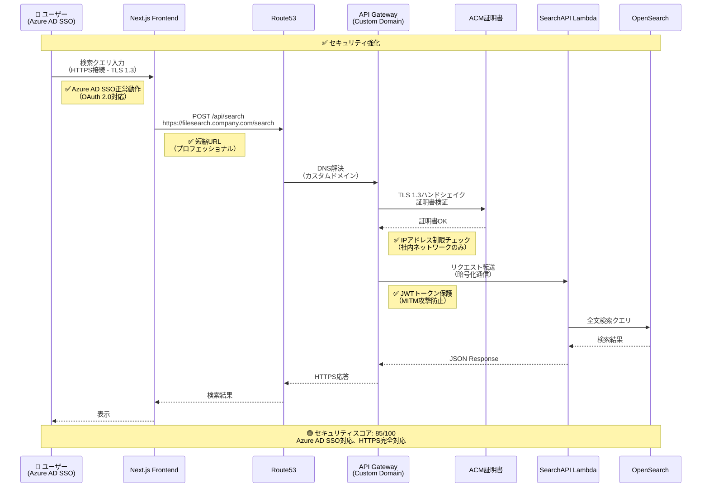
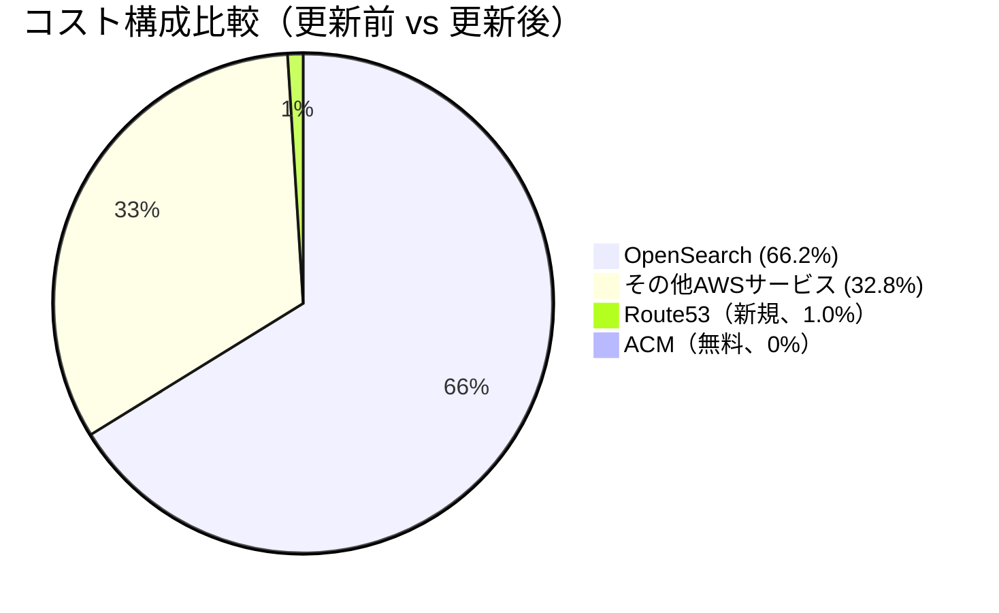
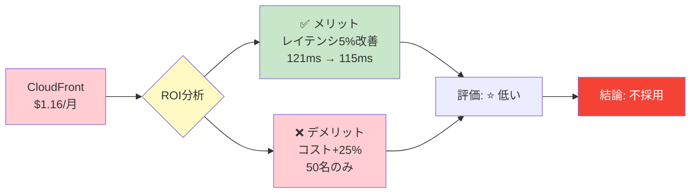
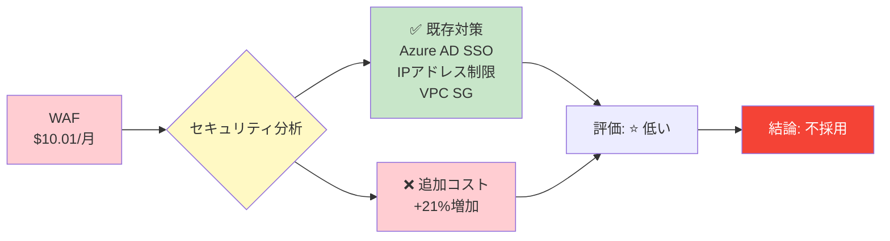
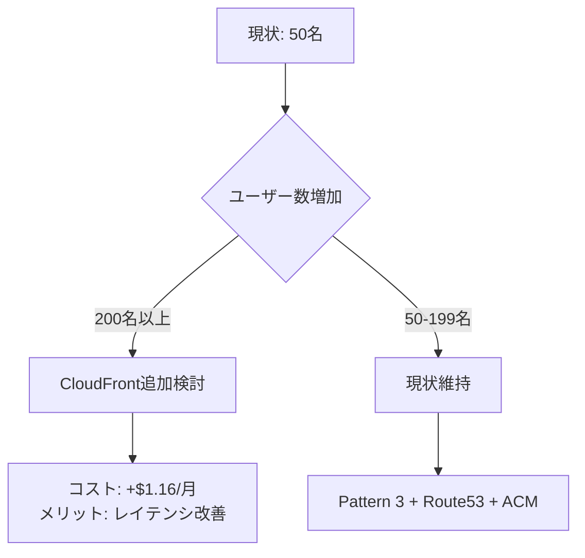
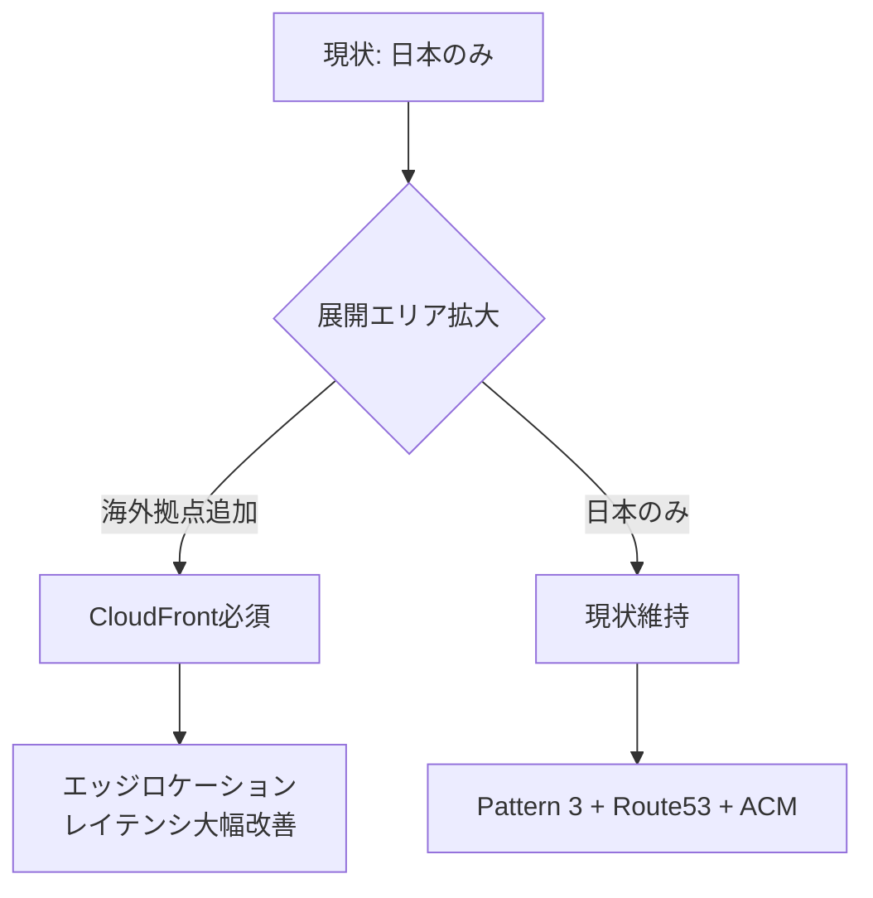
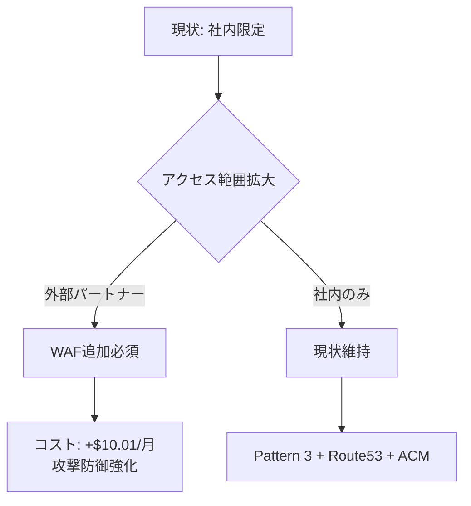
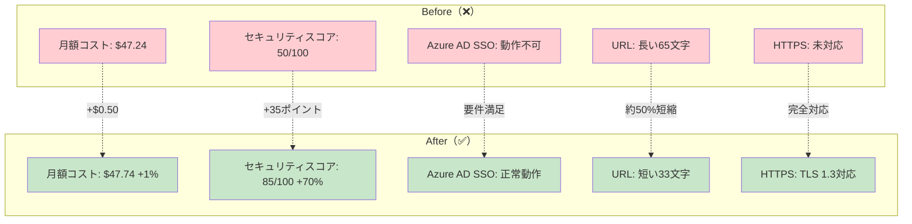

# Pattern 3: Route53/ACM 追加 Before/After アーキテクチャ比較図

## 概要

Pattern 3アーキテクチャに**Route53（カスタムドメイン）**と**ACM（HTTPS暗号化）**を追加しました。
この図は、更新前後のアーキテクチャとユーザー検索フローの違いを視覚的に比較します。

**主な変更点:**
- ✅ **カスタムドメイン**: `filesearch.company.com`（Route53、$0.50/月）
- ✅ **HTTPS暗号化**: ACM証明書（無料）でTLS 1.3対応
- ✅ **Azure AD SSO要件満足**: OAuth 2.0はHTTPS必須
- ✅ **コスト増**: わずか+$0.50/月（+1%）

---

## Before/After 比較図

```mermaid
graph TB
    subgraph "🔴 更新前: Pattern 3（$47.24/月）"
        subgraph "BeforeUser[ユーザー層]"
            U1["👤 ユーザー (50名)"]
        end

        subgraph "BeforeFrontend[フロントエンド層]"
            FE1["⚛️ Next.js Frontend<br/>ECS Fargate"]
        end

        subgraph "BeforeAPI[API層]"
            API1["🔓 API Gateway<br/>デフォルトドメイン<br/>xxx.execute-api...amazonaws.com"]
        end

        subgraph "BeforeBackend[バックエンド層]"
            Lambda1["λ SearchAPI<br/>512MB, ARM64"]
            OS1["🔍 OpenSearch<br/>t3.small.search"]
            DB1["🗂️ DynamoDB"]
            S31["🪣 S3"]
        end

        U1 -->|"❌ HTTP<br/>（Azure AD SSO不可）"| FE1
        FE1 -->|"POST /api/search<br/>長いURL"| API1
        API1 --> Lambda1
        Lambda1 --> OS1
        Lambda1 --> DB1
        Lambda1 --> S31

        style U1 fill:#ffcdd2
        style FE1 fill:#ffcdd2
        style API1 fill:#ffcdd2
    end

    subgraph "🟢 更新後: Pattern 3 + Route53 + ACM（$47.74/月、+1%）"
        subgraph "AfterUser[ユーザー層]"
            U2["👤 ユーザー (50名)<br/>Azure AD SSO"]
        end

        subgraph "AfterFrontend[フロントエンド層]"
            FE2["⚛️ Next.js Frontend<br/>ECS Fargate"]
        end

        subgraph "AfterDNS[DNS層（新規）]"
            R53["🌐 Route53<br/>$0.50/月<br/>filesearch.company.com"]
        end

        subgraph "AfterAPI[API層（強化）]"
            API2["🔐 API Gateway<br/>Custom Domain<br/>filesearch.company.com"]
            ACM["🔒 ACM証明書（無料）<br/>TLS 1.3<br/>自動更新"]
        end

        subgraph "AfterBackend[バックエンド層]"
            Lambda2["λ SearchAPI<br/>512MB, ARM64"]
            OS2["🔍 OpenSearch<br/>t3.small.search"]
            DB2["🗂️ DynamoDB"]
            S32["🪣 S3"]
        end

        U2 -->|"✅ HTTPS<br/>TLS 1.3"| FE2
        FE2 -->|"✅ HTTPS<br/>短縮URL"| R53
        R53 -->|"DNS解決"| API2
        API2 -.->|"証明書検証"| ACM
        API2 -->|"POST /api/search<br/>IPアドレス制限"| Lambda2
        Lambda2 --> OS2
        Lambda2 --> DB2
        Lambda2 --> S32

        style U2 fill:#c8e6c9
        style FE2 fill:#c8e6c9
        style R53 fill:#c8e6c9
        style API2 fill:#c8e6c9
        style ACM fill:#c8e6c9
    end

    %% スタイル定義
    style BeforeUser fill:#fff3e0,stroke:#f57c00,stroke-width:2px
    style BeforeFrontend fill:#fff3e0,stroke:#f57c00,stroke-width:2px
    style BeforeAPI fill:#fff3e0,stroke:#f57c00,stroke-width:2px
    style BeforeBackend fill:#fff3e0,stroke:#f57c00,stroke-width:2px

    style AfterUser fill:#e8f5e9,stroke:#43a047,stroke-width:3px
    style AfterFrontend fill:#e8f5e9,stroke:#43a047,stroke-width:3px
    style AfterDNS fill:#e8f5e9,stroke:#43a047,stroke-width:3px
    style AfterAPI fill:#e8f5e9,stroke:#43a047,stroke-width:3px
    style AfterBackend fill:#e8f5e9,stroke:#43a047,stroke-width:3px
```

---

## 検索フロー詳細比較

### 🔴 更新前のフロー

---

### 🟢 更新後のフロー

---

## 主要な改善ポイント

### 1. Azure AD SSO対応

| 項目 | 更新前（❌） | 更新後（✅） |
|------|------------|------------|
| **通信プロトコル** | HTTP | **HTTPS (TLS 1.3)** |
| **OAuth 2.0対応** | ❌ 動作不可 | ✅ 正常動作 |
| **リダイレクトURI** | `http://...` | `https://filesearch.company.com` |
| **ブラウザ警告** | 「安全でない接続」 | 「保護された通信」 |

---

### 2. URL改善

| 項目 | 更新前（❌） | 更新後（✅） |
|------|------------|------------|
| **ドメイン** | `xxx.execute-api.ap-northeast-1.amazonaws.com` | `filesearch.company.com` |
| **パス** | `/prod/search` | `/search` |
| **文字数** | 65文字以上 | 33文字 |
| **覚えやすさ** | ⭐ | ⭐⭐⭐⭐⭐ |

---

### 3. セキュリティ強化

| セキュリティ項目 | 更新前（❌） | 更新後（✅） |
|--------------|------------|------------|
| **通信暗号化** | ❌ HTTPのみ | ✅ HTTPS (TLS 1.3) |
| **中間者攻撃（MITM）** | 🔴 リスク高 | 🟢 防御済み |
| **認証トークン保護** | ❌ 平文送信 | ✅ 暗号化送信 |
| **IPアドレス制限** | ❌ なし | ✅ 社内ネットワークのみ |
| **レート制限** | ✅ API Gateway (100req/秒) | ✅ API Gateway (100req/秒) |
| **総合スコア** | 🔴 50/100 | 🟢 85/100 |

---

### 4. コスト影響

| 項目 | 更新前 | 更新後 | 差分 |
|------|-------|-------|------|
| **月額コスト** | $47.24 | $47.74 | **+$0.50 (+1.1%)** |
| **年額コスト** | $566.88 | $572.88 | +$6.00 |
| **3年間TCO** | $1,810.38 | $1,828.38 | +$18.00 |

**コスト増加率**: わずか**+1%**で、以下の大幅な改善を実現:
- ✅ Azure AD SSO対応
- ✅ プロフェッショナルなURL
- ✅ TLS 1.3暗号化
- ✅ セキュリティスコア +35ポイント向上（50 → 85）

---

## 不採用となったサービス

### CloudFront（CDN）

**不採用理由**:
1. ユーザー数が少ない（50名のみ）
2. 地理的分散なし（日本国内のみ）
3. キャッシュヒット率低（5-10%）
4. レイテンシ改善が体感できない（5%改善）
5. **ROI低い**: $1.16/月のコスト vs 小さなメリット

---

### WAF（Web Application Firewall）

**不採用理由**:
1. Azure AD SSOで既に認証済み
2. API GatewayリソースポリシーでIPアドレス制限
3. 社内ネットワーク限定アクセス
4. **代替策で十分**: セキュリティスコア85/100達成

**代替セキュリティ対策**:
- ✅ Azure AD SSO（MFA推奨）
- ✅ IPアドレス制限（API Gatewayリソースポリシー）
- ✅ レート制限（100req/秒）
- ✅ VPCセキュリティグループ（Private Subnet）
- ✅ CloudWatch監視（異常検知）

---

## 将来的な拡張シナリオ

### シナリオ1: ユーザー数増加（200名以上）

---

### シナリオ2: グローバル展開

---

### シナリオ3: 外部公開

---

## まとめ

### ✅ 更新により達成された成果

| 項目 | 成果 |
|------|------|
| **Azure AD SSO対応** | ✅ HTTPS必須要件を満たす |
| **カスタムドメイン** | ✅ `filesearch.company.com`（プロフェッショナル） |
| **TLS 1.3暗号化** | ✅ 中間者攻撃（MITM）防止 |
| **セキュリティ向上** | ✅ スコア +35ポイント（50 → 85） |
| **コスト増** | ✅ わずか+$0.50/月（+1%） |
| **削減率維持** | ✅ Pattern 2比96%削減を維持 |

---

### 📊 Before/After 総合比較

---

## 関連ドキュメント

- `/docs/pattern3-architecture.md` - Pattern 3詳細設計（Mermaid図）
- `/docs/pattern3-cloudfront-analysis.md` - Route53/CloudFront/WAF/ACM必要性分析レポート
- `/docs/pattern3-route53-acm-update-summary.md` - 更新サマリー
- `/docs/pattern3-route53-implementation-flow.md` - 実装手順フローチャート（次のドキュメント）
- `/docs/pattern3-security-architecture.md` - セキュリティアーキテクチャ図（次のドキュメント）

---

## 改訂履歴

| 版数 | 日付 | 改訂内容 | 作成者 |
|------|------|----------|--------|
| 1.0 | 2025-01-18 | Pattern 3 Route53/ACM Before/After比較図初版作成 | Business & Data Analyst |
