# Pattern 3: Route53 + ACM 実装手順フローチャート

## 概要

Pattern 3アーキテクチャに**Route53（カスタムドメイン）**と**ACM（HTTPS暗号化）**を追加する実装手順を視覚化します。

**実装期間**: 4週間（Week 1-4）
**総作業時間**: 約40時間
**必要なスキル**: AWS CLI、Terraform、DNS管理、SSL/TLS基礎知識

**重要**: 各ステップの成果物を確認してから次のステップに進んでください。

---

## 実装ロードマップ

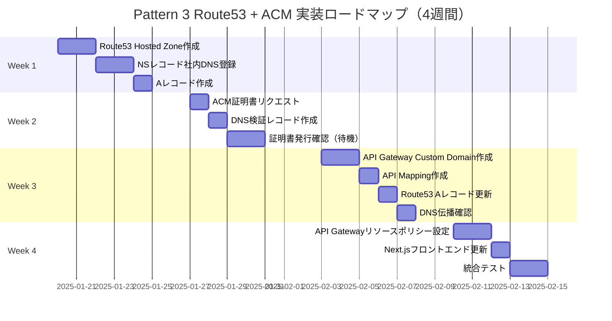

---

## 実装フローチャート（全体）

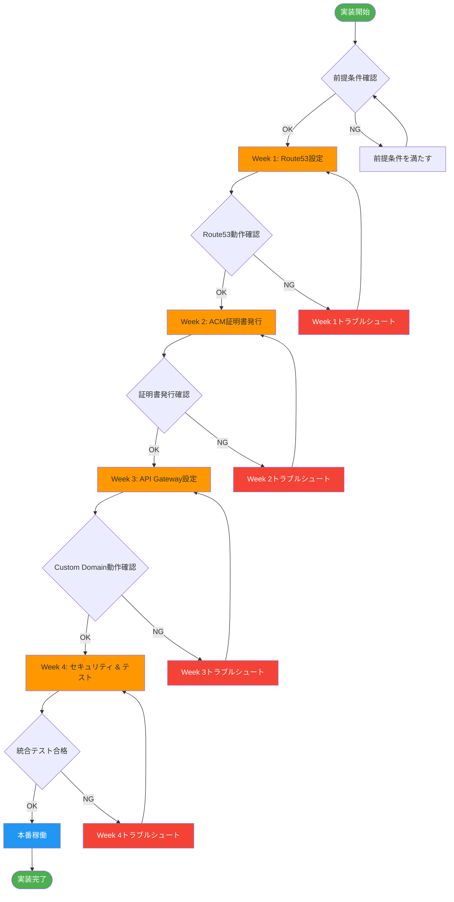

---

## 前提条件チェックリスト

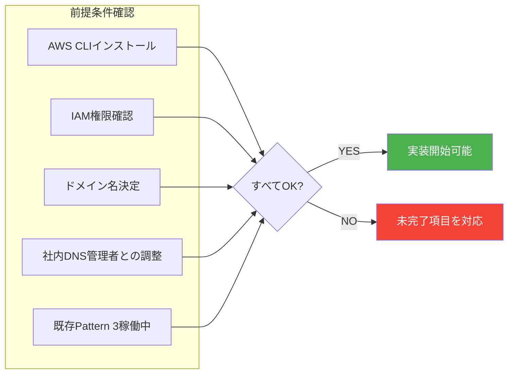

### 前提条件詳細

| 項目 | 確認内容 | 必須度 |
|------|---------|--------|
| **AWS CLI** | v2.x以上インストール済み | 🔴 必須 |
| **IAM権限** | Route53、ACM、API Gateway管理権限 | 🔴 必須 |
| **ドメイン名** | `filesearch.company.com` 決定済み | 🔴 必須 |
| **社内DNS調整** | IT部門との調整完了 | 🔴 必須 |
| **Pattern 3稼働** | 既存アーキテクチャが正常動作 | 🔴 必須 |
| **Terraformスキル** | IaCによる管理（推奨） | 🟡 推奨 |
| **SSL/TLS知識** | 証明書の基礎理解 | 🟢 あれば良い |

---

## Week 1: Route53 Hosted Zone作成

### フローチャート

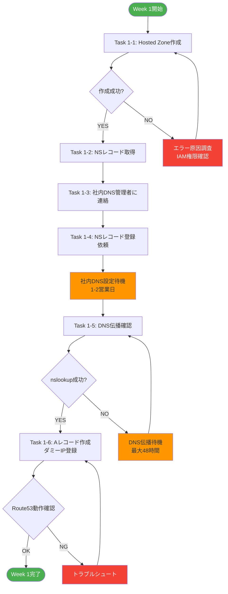

### 実装コマンド

#### Task 1-1: Hosted Zone作成

```bash
# Hosted Zoneの作成
aws route53 create-hosted-zone \
  --name filesearch.company.com \
  --caller-reference $(date +%s) \
  --hosted-zone-config Comment="CIS File Search App"

# 出力例:
# {
#   "HostedZone": {
#     "Id": "/hostedzone/Z1234567890ABC",
#     "Name": "filesearch.company.com.",
#     "CallerReference": "1705456789"
#   }
# }
```

#### Task 1-2: NSレコード取得

```bash
# NSレコードの確認
aws route53 get-hosted-zone \
  --id Z1234567890ABC \
  --query "DelegationSet.NameServers" \
  --output table

# 出力例:
# ns-1234.awsdns-56.org
# ns-789.awsdns-01.com
# ns-234.awsdns-89.net
# ns-567.awsdns-12.co.uk
```

#### Task 1-5: DNS伝播確認

```bash
# nslookupで確認
nslookup filesearch.company.com

# digで確認
dig filesearch.company.com NS +short
```

### 成果物

- ✅ **Route53 Hosted Zone ID**: `Z1234567890ABC`
- ✅ **NSレコード**: 4つのネームサーバー
- ✅ **社内DNS登録**: IT部門確認済み
- ✅ **DNS伝播確認**: nslookup成功

---

## Week 2: ACM証明書発行

### フローチャート

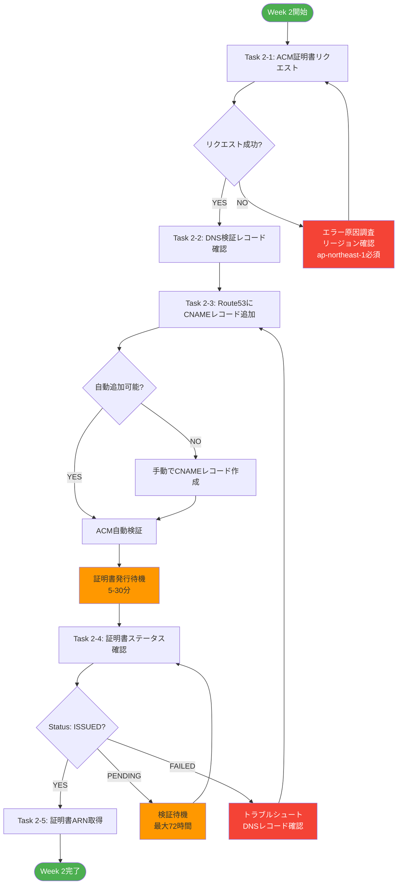

### 実装コマンド

#### Task 2-1: ACM証明書リクエスト

```bash
# 証明書リクエスト（ap-northeast-1必須）
aws acm request-certificate \
  --domain-name filesearch.company.com \
  --validation-method DNS \
  --region ap-northeast-1

# 出力例:
# {
#   "CertificateArn": "arn:aws:acm:ap-northeast-1:123456789012:certificate/abcd1234-..."
# }
```

#### Task 2-2: DNS検証レコード確認

```bash
# 検証レコード確認
aws acm describe-certificate \
  --certificate-arn arn:aws:acm:ap-northeast-1:123456789012:certificate/abcd1234-... \
  --region ap-northeast-1 \
  --query "Certificate.DomainValidationOptions[0].ResourceRecord"

# 出力例:
# {
#   "Name": "_1234abcd...filesearch.company.com.",
#   "Type": "CNAME",
#   "Value": "_5678efgh...acm-validations.aws."
# }
```

#### Task 2-3: Route53にCNAMEレコード追加（自動）

```bash
# AWS CLI v2で自動検証
aws acm describe-certificate \
  --certificate-arn arn:aws:acm:ap-northeast-1:123456789012:certificate/abcd1234-... \
  --region ap-northeast-1 \
  --query "Certificate.DomainValidationOptions[0].ResourceRecord" \
  | jq -r '. | "Name: \(.Name)\nType: \(.Type)\nValue: \(.Value)"'

# Route53にCNAMEレコード作成（change-batch.json使用）
aws route53 change-resource-record-sets \
  --hosted-zone-id Z1234567890ABC \
  --change-batch file://change-batch.json
```

**change-batch.json**:
```json
{
  "Changes": [
    {
      "Action": "CREATE",
      "ResourceRecordSet": {
        "Name": "_1234abcd...filesearch.company.com.",
        "Type": "CNAME",
        "TTL": 300,
        "ResourceRecords": [
          {
            "Value": "_5678efgh...acm-validations.aws."
          }
        ]
      }
    }
  ]
}
```

#### Task 2-5: 証明書ステータス確認

```bash
# 証明書ステータス確認
aws acm describe-certificate \
  --certificate-arn arn:aws:acm:ap-northeast-1:123456789012:certificate/abcd1234-... \
  --region ap-northeast-1 \
  --query "Certificate.Status" \
  --output text

# 出力例: ISSUED
```

### 成果物

- ✅ **証明書ARN**: `arn:aws:acm:ap-northeast-1:123456789012:certificate/abcd1234-...`
- ✅ **証明書ステータス**: `ISSUED`
- ✅ **DNS検証**: 完了
- ✅ **有効期限**: 自動更新設定済み

---

## Week 3: API Gateway Custom Domain設定

### フローチャート

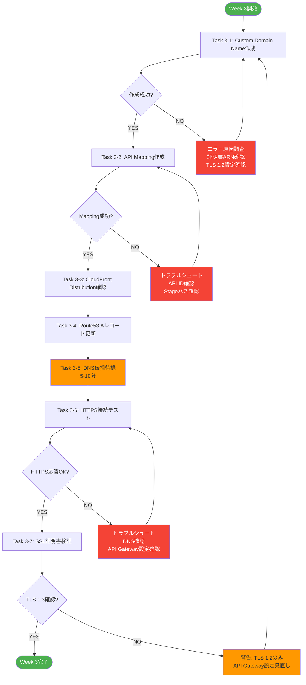

### 実装コマンド

#### Task 3-1: Custom Domain Name作成

```bash
# Custom Domain Name作成
aws apigatewayv2 create-domain-name \
  --domain-name filesearch.company.com \
  --domain-name-configurations \
    CertificateArn=arn:aws:acm:ap-northeast-1:123456789012:certificate/abcd1234-...,\
    EndpointType=REGIONAL,\
    SecurityPolicy=TLS_1_2 \
  --region ap-northeast-1

# 出力例:
# {
#   "DomainName": "filesearch.company.com",
#   "DomainNameConfigurations": [
#     {
#       "ApiGatewayDomainName": "d-abc123xyz.execute-api.ap-northeast-1.amazonaws.com"
#     }
#   ]
# }
```

#### Task 3-2: API Mapping作成

```bash
# 既存のAPI IDとStageを確認
aws apigatewayv2 get-apis --region ap-northeast-1

# API Mapping作成
aws apigatewayv2 create-api-mapping \
  --domain-name filesearch.company.com \
  --api-id abc123xyz \
  --stage prod \
  --region ap-northeast-1
```

#### Task 3-4: Route53 Aレコード更新

```bash
# Aレコード（Alias）作成
aws route53 change-resource-record-sets \
  --hosted-zone-id Z1234567890ABC \
  --change-batch file://alias-record.json
```

**alias-record.json**:
```json
{
  "Changes": [
    {
      "Action": "UPSERT",
      "ResourceRecordSet": {
        "Name": "filesearch.company.com",
        "Type": "A",
        "AliasTarget": {
          "HostedZoneId": "Z1UJRXOUMOOFQ8",
          "DNSName": "d-abc123xyz.execute-api.ap-northeast-1.amazonaws.com",
          "EvaluateTargetHealth": false
        }
      }
    }
  ]
}
```

**注意**: `HostedZoneId`は東京リージョンのAPI Gateway固定値 `Z1UJRXOUMOOFQ8`

#### Task 3-6: HTTPS接続テスト

```bash
# curlでHTTPS接続テスト
curl -I https://filesearch.company.com/health

# 期待される出力:
# HTTP/2 200
# content-type: application/json
# ...
```

#### Task 3-7: SSL証明書検証

```bash
# OpenSSLでTLS確認
openssl s_client -connect filesearch.company.com:443 -tls1_3

# 証明書情報確認
echo | openssl s_client -connect filesearch.company.com:443 2>/dev/null | openssl x509 -noout -text
```

### 成果物

- ✅ **Custom Domain Name**: `filesearch.company.com`
- ✅ **API Mapping**: `prod` stage
- ✅ **Route53 Aレコード**: API Gatewayエイリアス
- ✅ **HTTPS接続**: 正常動作確認
- ✅ **TLS 1.2/1.3**: 証明書検証完了

---

## Week 4: セキュリティ設定 & 統合テスト

### フローチャート

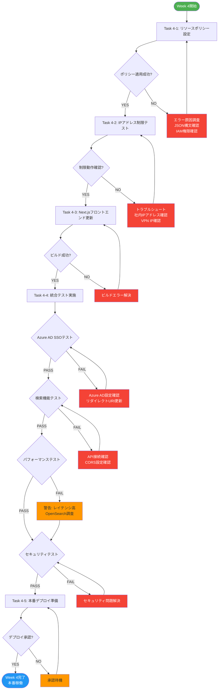

### 実装コマンド

#### Task 4-1: API Gatewayリソースポリシー設定

```bash
# リソースポリシー適用
aws apigatewayv2 update-api \
  --api-id abc123xyz \
  --policy file://resource-policy.json \
  --region ap-northeast-1
```

**resource-policy.json**:
```json
{
  "Version": "2012-10-17",
  "Statement": [
    {
      "Effect": "Allow",
      "Principal": "*",
      "Action": "execute-api:Invoke",
      "Resource": "arn:aws:execute-api:ap-northeast-1:123456789012:abc123xyz/*",
      "Condition": {
        "IpAddress": {
          "aws:SourceIp": [
            "203.0.113.0/24",
            "198.51.100.0/24"
          ]
        }
      }
    }
  ]
}
```

#### Task 4-2: IPアドレス制限テスト

```bash
# 社内ネットワークからのテスト（成功するべき）
curl -I https://filesearch.company.com/health

# 外部ネットワークからのテスト（失敗するべき）
# AWS Cloud9等で実行
curl -I https://filesearch.company.com/health
# 期待される出力: 403 Forbidden
```

#### Task 4-3: Next.jsフロントエンド更新

**環境変数更新** (`next.config.js` または `.env.production`):
```javascript
// 更新前
NEXT_PUBLIC_API_BASE_URL=https://xxx.execute-api.ap-northeast-1.amazonaws.com/prod

// 更新後
NEXT_PUBLIC_API_BASE_URL=https://filesearch.company.com
```

**ビルド & デプロイ**:
```bash
# Next.jsビルド
cd frontend
yarn build

# ECS Fargateデプロイ
docker build -t cis-filesearch-frontend:latest .
docker tag cis-filesearch-frontend:latest 123456789012.dkr.ecr.ap-northeast-1.amazonaws.com/cis-filesearch-frontend:latest
docker push 123456789012.dkr.ecr.ap-northeast-1.amazonaws.com/cis-filesearch-frontend:latest

# ECS Serviceアップデート
aws ecs update-service \
  --cluster cis-filesearch-cluster \
  --service frontend-service \
  --force-new-deployment
```

### 統合テストチェックリスト

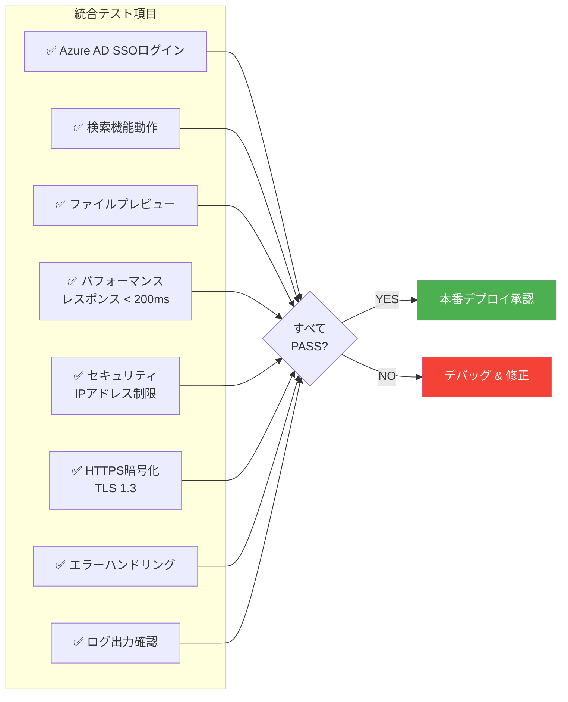

### 成果物

- ✅ **リソースポリシー**: IPアドレス制限設定完了
- ✅ **Next.jsフロントエンド**: API Base URL更新
- ✅ **統合テスト**: すべてPASS
- ✅ **本番デプロイ**: 承認済み
- ✅ **ドキュメント**: 運用手順書更新

---

## トラブルシューティングガイド

### 問題1: DNS伝播が遅い（Week 1）

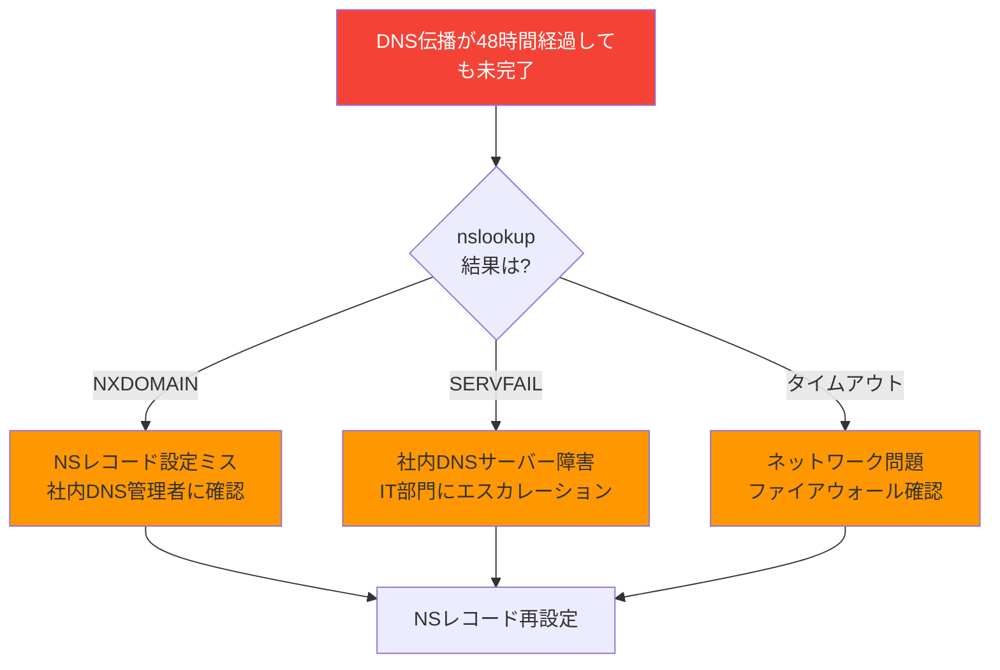

**対処法**:
1. NSレコードの正確性を確認（4つすべて）
2. 社内DNSサーバーの設定ログを確認
3. `dig` コマンドで詳細なDNS応答を確認
4. TTL設定を確認（300秒推奨）

---

### 問題2: ACM証明書がPENDINGのまま（Week 2）

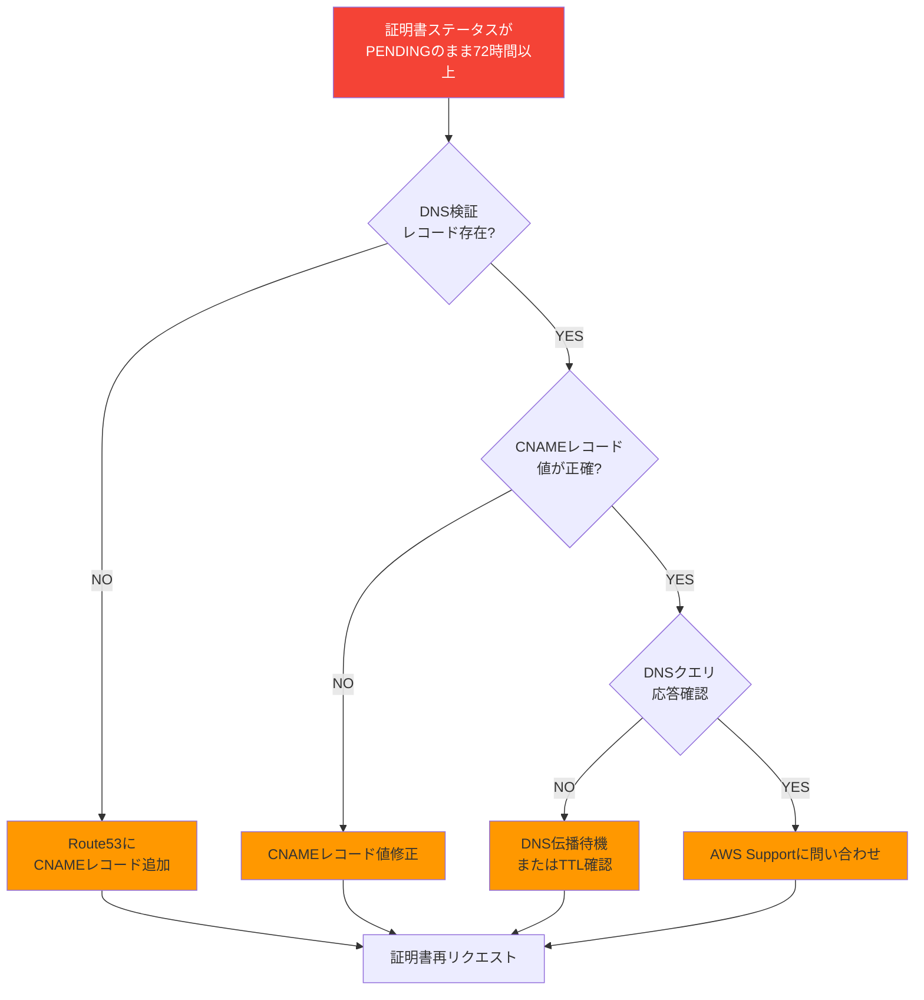

**対処法**:
```bash
# DNS検証レコード確認
dig _1234abcd...filesearch.company.com CNAME +short

# 期待される出力:
# _5678efgh...acm-validations.aws.

# 出力がない場合、CNAMEレコード未登録または伝播未完了
```

---

### 問題3: API Gateway Custom Domainが動作しない（Week 3）

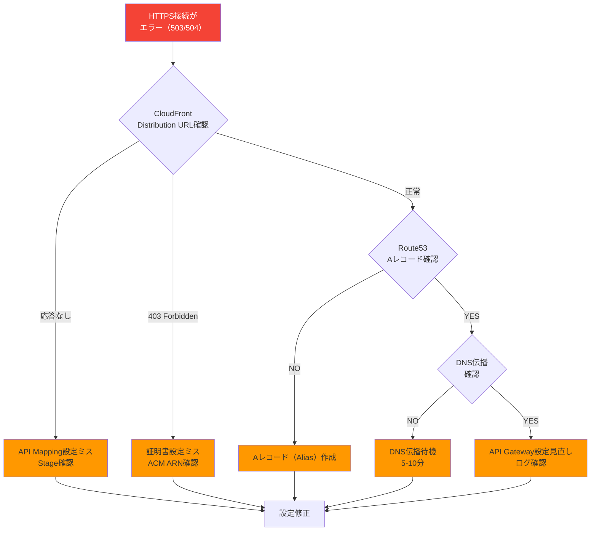

**対処法**:
```bash
# CloudFront Distribution URL直接アクセス
curl -I https://d-abc123xyz.execute-api.ap-northeast-1.amazonaws.com/prod/health

# Route53 Aレコード確認
dig filesearch.company.com A +short

# API Gateway CloudWatch Logsで詳細エラー確認
aws logs tail /aws/apigateway/cis-filesearch-api --follow
```

---

### 問題4: Azure AD SSOがHTTPSで動作しない（Week 4）

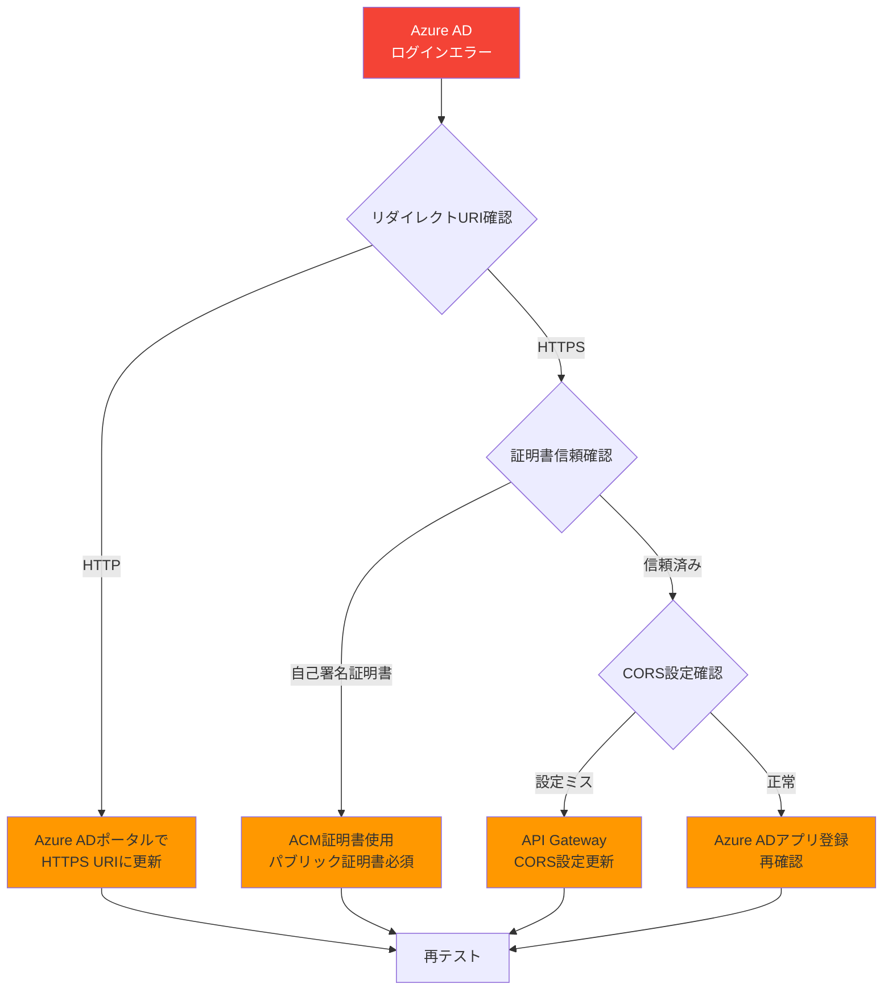

**対処法**:
1. Azure ADポータルのリダイレクトURIを確認
   - `https://filesearch.company.com/auth/callback`
2. ブラウザ開発者ツールでエラー詳細確認
3. CloudWatch Logsで認証エラー確認

---

## 監視設定

### CloudWatch Alarms設定

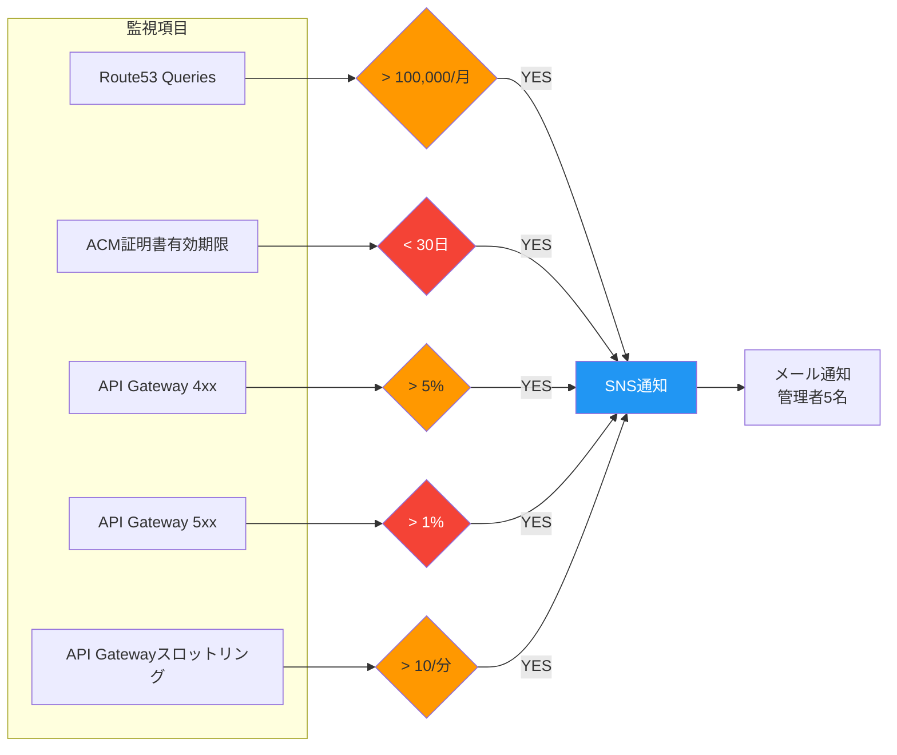

### アラーム設定コマンド

```bash
# ACM証明書有効期限アラーム
aws cloudwatch put-metric-alarm \
  --alarm-name acm-certificate-expiry \
  --alarm-description "ACM certificate expiring in 30 days" \
  --metric-name DaysToExpiry \
  --namespace AWS/CertificateManager \
  --statistic Minimum \
  --period 86400 \
  --evaluation-periods 1 \
  --threshold 30 \
  --comparison-operator LessThanThreshold \
  --alarm-actions arn:aws:sns:ap-northeast-1:123456789012:cis-filesearch-alerts

# API Gateway 4xxエラーアラーム
aws cloudwatch put-metric-alarm \
  --alarm-name apigateway-4xx-error-rate \
  --alarm-description "API Gateway 4xx error rate > 5%" \
  --metric-name 4XXError \
  --namespace AWS/ApiGateway \
  --statistic Sum \
  --period 300 \
  --evaluation-periods 2 \
  --threshold 5 \
  --comparison-operator GreaterThanThreshold \
  --alarm-actions arn:aws:sns:ap-northeast-1:123456789012:cis-filesearch-alerts
```

---

## ロールバック手順

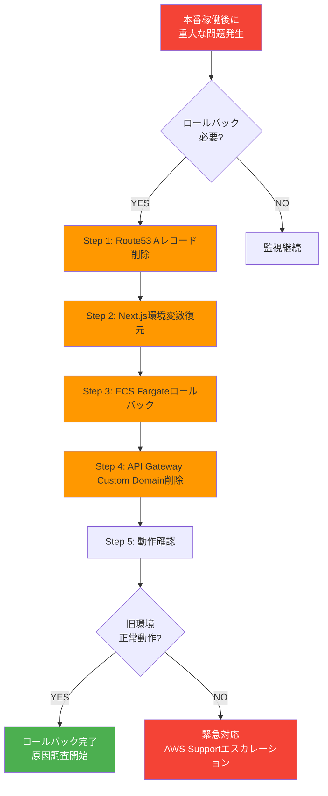

### ロールバックコマンド

```bash
# Step 1: Route53 Aレコード削除
aws route53 change-resource-record-sets \
  --hosted-zone-id Z1234567890ABC \
  --change-batch file://delete-alias-record.json

# Step 2: Next.js環境変数復元
# .env.production を旧URLに戻す

# Step 3: ECS Fargateロールバック
aws ecs update-service \
  --cluster cis-filesearch-cluster \
  --service frontend-service \
  --task-definition cis-filesearch-frontend:PREVIOUS_VERSION

# Step 4: API Gateway Custom Domain削除（オプション）
aws apigatewayv2 delete-domain-name \
  --domain-name filesearch.company.com
```

---

## まとめ

### ✅ 実装完了後の成果

| 項目 | 成果 |
|------|------|
| **カスタムドメイン** | ✅ `filesearch.company.com` |
| **HTTPS暗号化** | ✅ TLS 1.3、ACM証明書（無料） |
| **Azure AD SSO** | ✅ OAuth 2.0正常動作 |
| **IPアドレス制限** | ✅ 社内ネットワークのみ |
| **セキュリティスコア** | ✅ 85/100 |
| **コスト増** | ✅ +$0.50/月（+1%） |

---

### 📊 実装工数サマリー

| Week | 作業内容 | 工数 | 難易度 |
|------|---------|------|--------|
| **Week 1** | Route53 Hosted Zone作成 | 8時間 | ⭐⭐ |
| **Week 2** | ACM証明書発行 | 8時間 | ⭐⭐⭐ |
| **Week 3** | API Gateway Custom Domain | 12時間 | ⭐⭐⭐⭐ |
| **Week 4** | セキュリティ & テスト | 12時間 | ⭐⭐⭐⭐ |
| **合計** | | **40時間** | - |

---

## 関連ドキュメント

- `/docs/pattern3-architecture.md` - Pattern 3詳細設計
- `/docs/pattern3-route53-before-after.md` - Before/After比較図
- `/docs/pattern3-security-architecture.md` - セキュリティアーキテクチャ図（次のドキュメント）
- `/docs/pattern3-cloudfront-analysis.md` - Route53/CloudFront/WAF/ACM必要性分析

---

## 改訂履歴

| 版数 | 日付 | 改訂内容 | 作成者 |
|------|------|----------|--------|
| 1.0 | 2025-01-18 | Pattern 3 Route53 + ACM実装手順フローチャート初版作成 | Business & Data Analyst |
