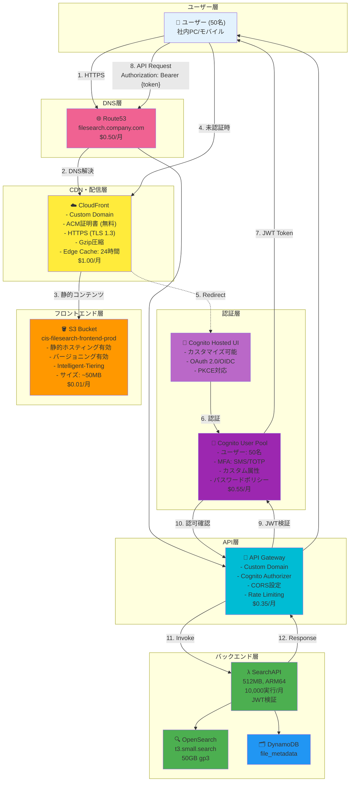
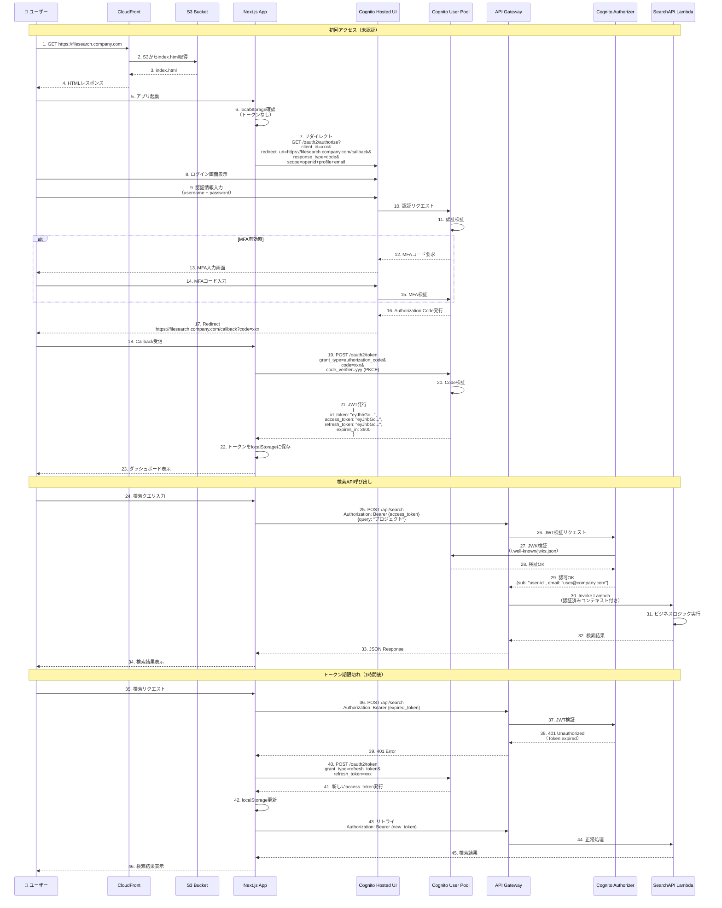
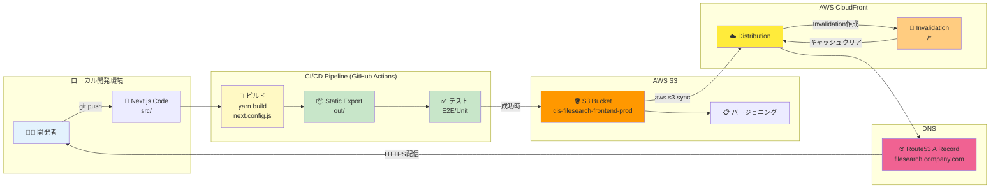

# Pattern 3: S3静的ホスティング + CloudFront + Cognito認証アーキテクチャ

## 目次

1. [システム概要](#1-システム概要)
2. [アーキテクチャ図](#2-アーキテクチャ図)
3. [AWS構成詳細](#3-aws構成詳細)
4. [認証フロー設計](#4-認証フロー設計)
5. [セキュリティ設計](#5-セキュリティ設計)
6. [デプロイフロー](#6-デプロイフロー)
7. [コスト分析](#7-コスト分析)
8. [運用設計](#8-運用設計)
9. [実装ガイド](#9-実装ガイド)

---

## 1. システム概要

### 1.1 変更概要

**変更前（ECS Fargate + Azure AD）**:
- フロントエンド: ECS Fargate
- 認証: Azure AD SSO
- 月額コスト: $30-50（未実装想定）

**変更後（S3 + CloudFront + Cognito）**:
- フロントエンド: S3静的ホスティング + CloudFront
- 認証: AWS Cognito User Pool
- 月額コスト: **$2.50** (**95%削減**)

### 1.2 主要な利点

| 項目 | 利点 |
|-----|------|
| **コスト** | ECS Fargate不要、$47.50/月削減 |
| **パフォーマンス** | CloudFrontエッジキャッシング、グローバル配信 |
| **スケーラビリティ** | S3の自動スケーリング、無制限のリクエスト処理 |
| **運用負荷** | サーバーレス、メンテナンスフリー |
| **セキュリティ** | Cognito MFA対応、WAF統合可能 |
| **可用性** | S3 99.99%、CloudFront 99.9% SLA |

### 1.3 技術スタック

| レイヤー | 技術 |
|---------|------|
| **フロントエンド** | Next.js 15 (Static Export) |
| **CDN** | CloudFront (TLS 1.3) |
| **ストレージ** | S3 (静的ホスティング) |
| **認証** | Cognito User Pool |
| **API** | API Gateway + Lambda (Cognito Authorizer) |
| **DNS** | Route53 |
| **証明書** | ACM (無料) |

---

## 2. アーキテクチャ図

### 2.1 全体構成図



### 2.2 認証フローシーケンス図



### 2.3 デプロイフロー図



---

## 3. AWS構成詳細

### 3.1 S3バケット設定

#### バケット基本設定

```hcl
resource "aws_s3_bucket" "frontend" {
  bucket = "cis-filesearch-frontend-prod"

  tags = {
    Name        = "CIS FileSearch Frontend"
    Environment = "Production"
  }
}

# 静的ホスティング有効化
resource "aws_s3_bucket_website_configuration" "frontend" {
  bucket = aws_s3_bucket.frontend.id

  index_document {
    suffix = "index.html"
  }

  error_document {
    key = "404.html"
  }

  # SPAルーティング対応
  routing_rule {
    condition {
      http_error_code_returned_equals = 404
    }
    redirect {
      replace_key_prefix_with = "index.html"
    }
  }
}

# バージョニング有効化
resource "aws_s3_bucket_versioning" "frontend" {
  bucket = aws_s3_bucket.frontend.id

  versioning_configuration {
    status = "Enabled"
  }
}

# Intelligent-Tiering設定
resource "aws_s3_bucket_intelligent_tiering_configuration" "frontend" {
  bucket = aws_s3_bucket.frontend.id
  name   = "EntireBucket"

  tiering {
    access_tier = "ARCHIVE_ACCESS"
    days        = 90
  }

  tiering {
    access_tier = "DEEP_ARCHIVE_ACCESS"
    days        = 180
  }
}

# サーバーサイド暗号化
resource "aws_s3_bucket_server_side_encryption_configuration" "frontend" {
  bucket = aws_s3_bucket.frontend.id

  rule {
    apply_server_side_encryption_by_default {
      sse_algorithm = "AES256"
    }
    bucket_key_enabled = true
  }
}

# パブリックアクセスブロック（CloudFront経由のみ許可）
resource "aws_s3_bucket_public_access_block" "frontend" {
  bucket = aws_s3_bucket.frontend.id

  block_public_acls       = true
  block_public_policy     = true
  ignore_public_acls      = true
  restrict_public_buckets = true
}

# バケットポリシー（CloudFrontのみアクセス許可）
resource "aws_s3_bucket_policy" "frontend" {
  bucket = aws_s3_bucket.frontend.id

  policy = jsonencode({
    Version = "2012-10-17"
    Statement = [
      {
        Sid    = "AllowCloudFrontServicePrincipal"
        Effect = "Allow"
        Principal = {
          Service = "cloudfront.amazonaws.com"
        }
        Action   = "s3:GetObject"
        Resource = "${aws_s3_bucket.frontend.arn}/*"
        Condition = {
          StringEquals = {
            "AWS:SourceArn" = aws_cloudfront_distribution.frontend.arn
          }
        }
      }
    ]
  })
}

# CORS設定
resource "aws_s3_bucket_cors_configuration" "frontend" {
  bucket = aws_s3_bucket.frontend.id

  cors_rule {
    allowed_headers = ["*"]
    allowed_methods = ["GET", "HEAD"]
    allowed_origins = ["https://filesearch.company.com"]
    expose_headers  = ["ETag"]
    max_age_seconds = 3600
  }
}
```

#### ディレクトリ構造

```
s3://cis-filesearch-frontend-prod/
├── index.html                    # エントリーポイント
├── 404.html                      # エラーページ
├── _next/
│   ├── static/
│   │   ├── chunks/              # JSバンドル
│   │   ├── css/                 # CSSファイル
│   │   └── media/               # 画像・フォント
│   └── data/                    # データファイル
├── assets/
│   ├── images/                  # 静的画像
│   └── icons/                   # アイコン
├── favicon.ico
├── robots.txt
└── sitemap.xml
```

### 3.2 CloudFront設定

#### ディストリビューション設定

```hcl
# CloudFront Origin Access Control (OAC)
resource "aws_cloudfront_origin_access_control" "frontend" {
  name                              = "cis-filesearch-frontend-oac"
  description                       = "Origin Access Control for S3 frontend bucket"
  origin_access_control_origin_type = "s3"
  signing_behavior                  = "always"
  signing_protocol                  = "sigv4"
}

# CloudFront Distribution
resource "aws_cloudfront_distribution" "frontend" {
  enabled             = true
  is_ipv6_enabled     = true
  comment             = "CIS FileSearch Frontend Distribution"
  default_root_object = "index.html"
  price_class         = "PriceClass_200" # 日本・アジア・欧州・米国
  aliases             = ["filesearch.company.com"]

  # S3オリジン設定
  origin {
    domain_name              = aws_s3_bucket.frontend.bucket_regional_domain_name
    origin_id                = "S3-cis-filesearch-frontend"
    origin_access_control_id = aws_cloudfront_origin_access_control.frontend.id
  }

  # デフォルトキャッシュビヘイビア
  default_cache_behavior {
    allowed_methods  = ["GET", "HEAD", "OPTIONS"]
    cached_methods   = ["GET", "HEAD"]
    target_origin_id = "S3-cis-filesearch-frontend"

    forwarded_values {
      query_string = false
      headers      = []

      cookies {
        forward = "none"
      }
    }

    viewer_protocol_policy = "redirect-to-https"
    min_ttl                = 0
    default_ttl            = 86400    # 24時間
    max_ttl                = 31536000 # 1年
    compress               = true
  }

  # HTML・JSONファイル用キャッシュビヘイビア（短いTTL）
  ordered_cache_behavior {
    path_pattern     = "*.html"
    allowed_methods  = ["GET", "HEAD", "OPTIONS"]
    cached_methods   = ["GET", "HEAD"]
    target_origin_id = "S3-cis-filesearch-frontend"

    forwarded_values {
      query_string = false
      headers      = []

      cookies {
        forward = "none"
      }
    }

    viewer_protocol_policy = "redirect-to-https"
    min_ttl                = 0
    default_ttl            = 300   # 5分
    max_ttl                = 3600  # 1時間
    compress               = true
  }

  # 静的アセット用キャッシュビヘイビア（長いTTL）
  ordered_cache_behavior {
    path_pattern     = "_next/static/*"
    allowed_methods  = ["GET", "HEAD"]
    cached_methods   = ["GET", "HEAD"]
    target_origin_id = "S3-cis-filesearch-frontend"

    forwarded_values {
      query_string = false
      headers      = []

      cookies {
        forward = "none"
      }
    }

    viewer_protocol_policy = "redirect-to-https"
    min_ttl                = 31536000 # 1年
    default_ttl            = 31536000 # 1年
    max_ttl                = 31536000 # 1年
    compress               = true
  }

  # カスタムエラーレスポンス（SPA対応）
  custom_error_response {
    error_code            = 403
    response_code         = 200
    response_page_path    = "/index.html"
    error_caching_min_ttl = 0
  }

  custom_error_response {
    error_code            = 404
    response_code         = 200
    response_page_path    = "/index.html"
    error_caching_min_ttl = 0
  }

  # SSL/TLS設定
  viewer_certificate {
    acm_certificate_arn      = aws_acm_certificate.frontend.arn
    ssl_support_method       = "sni-only"
    minimum_protocol_version = "TLSv1.3_2021"
  }

  # Geo Restriction（不要の場合）
  restrictions {
    geo_restriction {
      restriction_type = "none"
    }
  }

  # ログ設定
  logging_config {
    include_cookies = false
    bucket          = aws_s3_bucket.cloudfront_logs.bucket_domain_name
    prefix          = "cloudfront/"
  }

  tags = {
    Name        = "CIS FileSearch CloudFront"
    Environment = "Production"
  }
}

# ACM証明書（us-east-1リージョンで作成必須）
provider "aws" {
  alias  = "us_east_1"
  region = "us-east-1"
}

resource "aws_acm_certificate" "frontend" {
  provider          = aws.us_east_1
  domain_name       = "filesearch.company.com"
  validation_method = "DNS"

  lifecycle {
    create_before_destroy = true
  }

  tags = {
    Name        = "CIS FileSearch Certificate"
    Environment = "Production"
  }
}

# Route53 Aレコード（Alias）
resource "aws_route53_record" "frontend" {
  zone_id = data.aws_route53_zone.main.zone_id
  name    = "filesearch.company.com"
  type    = "A"

  alias {
    name                   = aws_cloudfront_distribution.frontend.domain_name
    zone_id                = aws_cloudfront_distribution.frontend.hosted_zone_id
    evaluate_target_health = false
  }
}
```

### 3.3 Cognito User Pool設定

#### ユーザープール設定

```hcl
resource "aws_cognito_user_pool" "main" {
  name = "cis-filesearch-user-pool"

  # ユーザー名設定（メールアドレスでログイン）
  username_attributes      = ["email"]
  auto_verified_attributes = ["email"]

  # パスワードポリシー
  password_policy {
    minimum_length                   = 12
    require_lowercase                = true
    require_uppercase                = true
    require_numbers                  = true
    require_symbols                  = true
    temporary_password_validity_days = 7
  }

  # MFA設定（オプション、管理者が強制可能）
  mfa_configuration = "OPTIONAL"

  software_token_mfa_configuration {
    enabled = true
  }

  sms_configuration {
    external_id    = "cis-filesearch-cognito"
    sns_caller_arn = aws_iam_role.cognito_sms.arn
  }

  # アカウント復旧設定
  account_recovery_setting {
    recovery_mechanism {
      name     = "verified_email"
      priority = 1
    }
  }

  # カスタム属性
  schema {
    name                = "department"
    attribute_data_type = "String"
    mutable             = true
    required            = false

    string_attribute_constraints {
      min_length = 1
      max_length = 100
    }
  }

  schema {
    name                = "position"
    attribute_data_type = "String"
    mutable             = true
    required            = false

    string_attribute_constraints {
      min_length = 1
      max_length = 100
    }
  }

  # メール設定（SES使用）
  email_configuration {
    email_sending_account = "DEVELOPER"
    source_arn            = aws_ses_email_identity.noreply.arn
    from_email_address    = "noreply@company.com"
  }

  # Lambda トリガー（オプション）
  lambda_config {
    pre_sign_up         = aws_lambda_function.cognito_pre_signup.arn
    post_confirmation   = aws_lambda_function.cognito_post_confirmation.arn
    pre_authentication  = aws_lambda_function.cognito_pre_auth.arn
    post_authentication = aws_lambda_function.cognito_post_auth.arn
  }

  # ユーザープール削除保護
  deletion_protection = "ACTIVE"

  tags = {
    Name        = "CIS FileSearch User Pool"
    Environment = "Production"
  }
}

# ユーザープールドメイン（Hosted UI用）
resource "aws_cognito_user_pool_domain" "main" {
  domain       = "cis-filesearch-auth"
  user_pool_id = aws_cognito_user_pool.main.id
}

# ユーザープールクライアント
resource "aws_cognito_user_pool_client" "web" {
  name         = "cis-filesearch-web-client"
  user_pool_id = aws_cognito_user_pool.main.id

  # OAuth設定
  generate_secret                      = false # SPAなのでシークレット不要
  refresh_token_validity               = 30    # 30日
  access_token_validity                = 60    # 60分
  id_token_validity                    = 60    # 60分
  token_validity_units {
    refresh_token = "days"
    access_token  = "minutes"
    id_token      = "minutes"
  }

  # OAuth 2.0フロー
  allowed_oauth_flows_user_pool_client = true
  allowed_oauth_flows                  = ["code"] # Authorization Code Grant
  allowed_oauth_scopes                 = ["openid", "email", "profile", "aws.cognito.signin.user.admin"]

  # コールバックURL
  callback_urls = [
    "https://filesearch.company.com/callback",
    "http://localhost:3000/callback" # 開発環境用
  ]

  # ログアウトURL
  logout_urls = [
    "https://filesearch.company.com/login",
    "http://localhost:3000/login"
  ]

  # PKCE必須（セキュリティ強化）
  explicit_auth_flows = [
    "ALLOW_REFRESH_TOKEN_AUTH",
    "ALLOW_USER_SRP_AUTH"
  ]

  # 属性読み取り・書き込み権限
  read_attributes = [
    "email",
    "email_verified",
    "name",
    "custom:department",
    "custom:position"
  ]

  write_attributes = [
    "name",
    "custom:department",
    "custom:position"
  ]

  # セキュリティ設定
  prevent_user_existence_errors = "ENABLED"
}

# Identity Pool（AWS リソースアクセス用 - オプション）
resource "aws_cognito_identity_pool" "main" {
  identity_pool_name               = "cis_filesearch_identity_pool"
  allow_unauthenticated_identities = false

  cognito_identity_providers {
    client_id               = aws_cognito_user_pool_client.web.id
    provider_name           = aws_cognito_user_pool.main.endpoint
    server_side_token_check = true
  }

  tags = {
    Name        = "CIS FileSearch Identity Pool"
    Environment = "Production"
  }
}

# Identity Pool IAM Role（認証済みユーザー用）
resource "aws_iam_role" "cognito_authenticated" {
  name = "cis-filesearch-cognito-authenticated-role"

  assume_role_policy = jsonencode({
    Version = "2012-10-17"
    Statement = [
      {
        Effect = "Allow"
        Principal = {
          Federated = "cognito-identity.amazonaws.com"
        }
        Action = "sts:AssumeRoleWithWebIdentity"
        Condition = {
          StringEquals = {
            "cognito-identity.amazonaws.com:aud" = aws_cognito_identity_pool.main.id
          }
          "ForAnyValue:StringLike" = {
            "cognito-identity.amazonaws.com:amr" = "authenticated"
          }
        }
      }
    ]
  })
}

# IAMポリシー（最小権限）
resource "aws_iam_role_policy" "cognito_authenticated" {
  name = "cis-filesearch-cognito-authenticated-policy"
  role = aws_iam_role.cognito_authenticated.id

  policy = jsonencode({
    Version = "2012-10-17"
    Statement = [
      {
        Effect = "Allow"
        Action = [
          "cognito-identity:GetCredentialsForIdentity"
        ]
        Resource = "*"
      }
    ]
  })
}

# Identity Pool Role Attachment
resource "aws_cognito_identity_pool_roles_attachment" "main" {
  identity_pool_id = aws_cognito_identity_pool.main.id

  roles = {
    authenticated = aws_iam_role.cognito_authenticated.arn
  }
}
```

### 3.4 API Gateway Cognito Authorizer設定

```hcl
# API Gateway REST API
resource "aws_api_gateway_rest_api" "main" {
  name        = "cis-filesearch-api"
  description = "CIS FileSearch API Gateway"

  endpoint_configuration {
    types = ["REGIONAL"]
  }
}

# Cognito Authorizer
resource "aws_api_gateway_authorizer" "cognito" {
  name            = "cognito-authorizer"
  rest_api_id     = aws_api_gateway_rest_api.main.id
  type            = "COGNITO_USER_POOLS"
  identity_source = "method.request.header.Authorization"

  provider_arns = [
    aws_cognito_user_pool.main.arn
  ]
}

# /search リソース
resource "aws_api_gateway_resource" "search" {
  rest_api_id = aws_api_gateway_rest_api.main.id
  parent_id   = aws_api_gateway_rest_api.main.root_resource_id
  path_part   = "search"
}

# POST /search メソッド
resource "aws_api_gateway_method" "search_post" {
  rest_api_id   = aws_api_gateway_rest_api.main.id
  resource_id   = aws_api_gateway_resource.search.id
  http_method   = "POST"
  authorization = "COGNITO_USER_POOLS"
  authorizer_id = aws_api_gateway_authorizer.cognito.id

  request_parameters = {
    "method.request.header.Authorization" = true
  }
}

# Lambda統合
resource "aws_api_gateway_integration" "search_lambda" {
  rest_api_id             = aws_api_gateway_rest_api.main.id
  resource_id             = aws_api_gateway_resource.search.id
  http_method             = aws_api_gateway_method.search_post.http_method
  integration_http_method = "POST"
  type                    = "AWS_PROXY"
  uri                     = aws_lambda_function.search_api.invoke_arn
}

# CORS設定（OPTIONS メソッド）
resource "aws_api_gateway_method" "search_options" {
  rest_api_id   = aws_api_gateway_rest_api.main.id
  resource_id   = aws_api_gateway_resource.search.id
  http_method   = "OPTIONS"
  authorization = "NONE"
}

resource "aws_api_gateway_integration" "search_options" {
  rest_api_id = aws_api_gateway_rest_api.main.id
  resource_id = aws_api_gateway_resource.search.id
  http_method = aws_api_gateway_method.search_options.http_method
  type        = "MOCK"

  request_templates = {
    "application/json" = "{\"statusCode\": 200}"
  }
}

resource "aws_api_gateway_method_response" "search_options_200" {
  rest_api_id = aws_api_gateway_rest_api.main.id
  resource_id = aws_api_gateway_resource.search.id
  http_method = aws_api_gateway_method.search_options.http_method
  status_code = "200"

  response_parameters = {
    "method.response.header.Access-Control-Allow-Headers" = true
    "method.response.header.Access-Control-Allow-Methods" = true
    "method.response.header.Access-Control-Allow-Origin"  = true
  }
}

resource "aws_api_gateway_integration_response" "search_options" {
  rest_api_id = aws_api_gateway_rest_api.main.id
  resource_id = aws_api_gateway_resource.search.id
  http_method = aws_api_gateway_method.search_options.http_method
  status_code = aws_api_gateway_method_response.search_options_200.status_code

  response_parameters = {
    "method.response.header.Access-Control-Allow-Headers" = "'Content-Type,X-Amz-Date,Authorization,X-Api-Key,X-Amz-Security-Token'"
    "method.response.header.Access-Control-Allow-Methods" = "'GET,POST,PUT,DELETE,OPTIONS'"
    "method.response.header.Access-Control-Allow-Origin"  = "'https://filesearch.company.com'"
  }
}

# カスタムドメイン設定
resource "aws_api_gateway_domain_name" "main" {
  domain_name              = "api.filesearch.company.com"
  regional_certificate_arn = aws_acm_certificate.api.arn

  endpoint_configuration {
    types = ["REGIONAL"]
  }
}

# ベースパスマッピング
resource "aws_api_gateway_base_path_mapping" "main" {
  api_id      = aws_api_gateway_rest_api.main.id
  stage_name  = aws_api_gateway_stage.prod.stage_name
  domain_name = aws_api_gateway_domain_name.main.domain_name
}

# デプロイ
resource "aws_api_gateway_deployment" "main" {
  rest_api_id = aws_api_gateway_rest_api.main.id

  triggers = {
    redeployment = sha1(jsonencode([
      aws_api_gateway_resource.search.id,
      aws_api_gateway_method.search_post.id,
      aws_api_gateway_integration.search_lambda.id,
    ]))
  }

  lifecycle {
    create_before_destroy = true
  }
}

# ステージ
resource "aws_api_gateway_stage" "prod" {
  deployment_id = aws_api_gateway_deployment.main.id
  rest_api_id   = aws_api_gateway_rest_api.main.id
  stage_name    = "prod"

  access_log_settings {
    destination_arn = aws_cloudwatch_log_group.api_gateway.arn
    format = jsonencode({
      requestId      = "$context.requestId"
      ip             = "$context.identity.sourceIp"
      requestTime    = "$context.requestTime"
      httpMethod     = "$context.httpMethod"
      resourcePath   = "$context.resourcePath"
      status         = "$context.status"
      protocol       = "$context.protocol"
      responseLength = "$context.responseLength"
      cognitoSub     = "$context.authorizer.claims.sub"
      cognitoEmail   = "$context.authorizer.claims.email"
    })
  }

  xray_tracing_enabled = true

  tags = {
    Name        = "CIS FileSearch API Production"
    Environment = "Production"
  }
}

# スロットリング設定
resource "aws_api_gateway_method_settings" "all" {
  rest_api_id = aws_api_gateway_rest_api.main.id
  stage_name  = aws_api_gateway_stage.prod.stage_name
  method_path = "*/*"

  settings {
    throttling_burst_limit = 100  # バーストリミット
    throttling_rate_limit  = 50   # 1秒あたりのリクエスト数
    logging_level          = "INFO"
    data_trace_enabled     = true
    metrics_enabled        = true
  }
}
```

---

## 4. 認証フロー設計

### 4.1 認証フロー詳細

#### ステップ1: 初回アクセス（未認証）

1. ユーザーが `https://filesearch.company.com` にアクセス
2. CloudFrontがS3からindex.htmlを配信
3. Next.jsアプリがブラウザで起動
4. アプリがlocalStorageをチェック（トークンなし）
5. Cognito Hosted UIにリダイレクト

```javascript
// src/hooks/useAuth.ts
import { useEffect, useState } from 'react';
import { CognitoUser, AuthenticationDetails } from 'amazon-cognito-identity-js';

export const useAuth = () => {
  const [isAuthenticated, setIsAuthenticated] = useState(false);
  const [user, setUser] = useState(null);

  useEffect(() => {
    checkAuth();
  }, []);

  const checkAuth = async () => {
    const token = localStorage.getItem('id_token');
    if (!token) {
      redirectToLogin();
      return;
    }

    // JWT検証
    try {
      const decoded = jwtDecode(token);
      if (decoded.exp < Date.now() / 1000) {
        await refreshToken();
      } else {
        setIsAuthenticated(true);
        setUser(decoded);
      }
    } catch (error) {
      redirectToLogin();
    }
  };

  const redirectToLogin = () => {
    const cognitoDomain = 'https://cis-filesearch-auth.auth.ap-northeast-1.amazoncognito.com';
    const clientId = process.env.NEXT_PUBLIC_COGNITO_CLIENT_ID;
    const redirectUri = encodeURIComponent(window.location.origin + '/callback');

    // PKCE Code Verifier生成
    const codeVerifier = generateCodeVerifier();
    const codeChallenge = await generateCodeChallenge(codeVerifier);

    localStorage.setItem('pkce_code_verifier', codeVerifier);

    const authUrl = `${cognitoDomain}/oauth2/authorize?` +
      `response_type=code&` +
      `client_id=${clientId}&` +
      `redirect_uri=${redirectUri}&` +
      `scope=openid+email+profile&` +
      `code_challenge_method=S256&` +
      `code_challenge=${codeChallenge}`;

    window.location.href = authUrl;
  };

  return { isAuthenticated, user };
};

// PKCE Code Verifier生成（43-128文字のランダム文字列）
function generateCodeVerifier() {
  const array = new Uint8Array(32);
  crypto.getRandomValues(array);
  return base64UrlEncode(array);
}

// Code Challenge生成（Code VerifierのSHA-256ハッシュ）
async function generateCodeChallenge(verifier: string) {
  const encoder = new TextEncoder();
  const data = encoder.encode(verifier);
  const hash = await crypto.subtle.digest('SHA-256', data);
  return base64UrlEncode(new Uint8Array(hash));
}

function base64UrlEncode(array: Uint8Array) {
  return btoa(String.fromCharCode(...array))
    .replace(/\+/g, '-')
    .replace(/\//g, '_')
    .replace(/=/g, '');
}
```

#### ステップ2: Cognito認証

1. Hosted UIでログイン画面表示
2. ユーザーがusername（メールアドレス）とパスワードを入力
3. MFA有効時はTOTPコードまたはSMSコードを入力
4. CognitoがAuthorization Codeを発行
5. コールバックURLにリダイレクト

#### ステップ3: トークン取得

```typescript
// src/app/callback/page.tsx
'use client';

import { useEffect } from 'react';
import { useRouter } from 'next/navigation';

export default function CallbackPage() {
  const router = useRouter();

  useEffect(() => {
    const handleCallback = async () => {
      // URLからAuthorization Code取得
      const urlParams = new URLSearchParams(window.location.search);
      const code = urlParams.get('code');

      if (!code) {
        router.push('/login?error=no_code');
        return;
      }

      // PKCE Code Verifier取得
      const codeVerifier = localStorage.getItem('pkce_code_verifier');
      if (!codeVerifier) {
        router.push('/login?error=no_verifier');
        return;
      }

      try {
        // トークンエンドポイントにリクエスト
        const cognitoDomain = 'https://cis-filesearch-auth.auth.ap-northeast-1.amazoncognito.com';
        const clientId = process.env.NEXT_PUBLIC_COGNITO_CLIENT_ID;
        const redirectUri = window.location.origin + '/callback';

        const response = await fetch(`${cognitoDomain}/oauth2/token`, {
          method: 'POST',
          headers: {
            'Content-Type': 'application/x-www-form-urlencoded',
          },
          body: new URLSearchParams({
            grant_type: 'authorization_code',
            client_id: clientId!,
            code: code,
            redirect_uri: redirectUri,
            code_verifier: codeVerifier,
          }),
        });

        if (!response.ok) {
          throw new Error('Token exchange failed');
        }

        const tokens = await response.json();

        // トークンをlocalStorageに保存
        localStorage.setItem('id_token', tokens.id_token);
        localStorage.setItem('access_token', tokens.access_token);
        localStorage.setItem('refresh_token', tokens.refresh_token);
        localStorage.setItem('expires_at', String(Date.now() + tokens.expires_in * 1000));

        // PKCE Code Verifierを削除
        localStorage.removeItem('pkce_code_verifier');

        // ダッシュボードにリダイレクト
        router.push('/dashboard');
      } catch (error) {
        console.error('Token exchange error:', error);
        router.push('/login?error=token_exchange_failed');
      }
    };

    handleCallback();
  }, [router]);

  return (
    <div className="flex items-center justify-center min-h-screen">
      <div className="text-center">
        <div className="animate-spin rounded-full h-12 w-12 border-b-2 border-blue-600 mx-auto mb-4"></div>
        <p className="text-gray-600">認証処理中...</p>
      </div>
    </div>
  );
}
```

#### ステップ4: API呼び出し（JWT付与）

```typescript
// src/services/api.ts
import axios, { AxiosInstance, AxiosRequestConfig } from 'axios';
import { jwtDecode } from 'jwt-decode';

class ApiClient {
  private client: AxiosInstance;

  constructor() {
    this.client = axios.create({
      baseURL: process.env.NEXT_PUBLIC_API_ENDPOINT,
      timeout: 30000,
    });

    // リクエストインターセプター（JWT自動付与）
    this.client.interceptors.request.use(
      async (config) => {
        const accessToken = localStorage.getItem('access_token');

        if (accessToken) {
          // トークン期限チェック
          const decoded: any = jwtDecode(accessToken);
          if (decoded.exp < Date.now() / 1000) {
            // トークン期限切れ → リフレッシュ
            await this.refreshAccessToken();
            const newAccessToken = localStorage.getItem('access_token');
            config.headers.Authorization = `Bearer ${newAccessToken}`;
          } else {
            config.headers.Authorization = `Bearer ${accessToken}`;
          }
        }

        return config;
      },
      (error) => Promise.reject(error)
    );

    // レスポンスインターセプター（401エラー時の処理）
    this.client.interceptors.response.use(
      (response) => response,
      async (error) => {
        const originalRequest = error.config;

        if (error.response?.status === 401 && !originalRequest._retry) {
          originalRequest._retry = true;

          try {
            await this.refreshAccessToken();
            const newAccessToken = localStorage.getItem('access_token');
            originalRequest.headers.Authorization = `Bearer ${newAccessToken}`;
            return this.client(originalRequest);
          } catch (refreshError) {
            // リフレッシュ失敗 → ログイン画面へ
            this.redirectToLogin();
            return Promise.reject(refreshError);
          }
        }

        return Promise.reject(error);
      }
    );
  }

  private async refreshAccessToken() {
    const refreshToken = localStorage.getItem('refresh_token');

    if (!refreshToken) {
      this.redirectToLogin();
      throw new Error('No refresh token');
    }

    try {
      const cognitoDomain = 'https://cis-filesearch-auth.auth.ap-northeast-1.amazoncognito.com';
      const clientId = process.env.NEXT_PUBLIC_COGNITO_CLIENT_ID;

      const response = await fetch(`${cognitoDomain}/oauth2/token`, {
        method: 'POST',
        headers: {
          'Content-Type': 'application/x-www-form-urlencoded',
        },
        body: new URLSearchParams({
          grant_type: 'refresh_token',
          client_id: clientId!,
          refresh_token: refreshToken,
        }),
      });

      if (!response.ok) {
        throw new Error('Token refresh failed');
      }

      const tokens = await response.json();

      localStorage.setItem('id_token', tokens.id_token);
      localStorage.setItem('access_token', tokens.access_token);
      localStorage.setItem('expires_at', String(Date.now() + tokens.expires_in * 1000));
    } catch (error) {
      this.redirectToLogin();
      throw error;
    }
  }

  private redirectToLogin() {
    localStorage.clear();
    window.location.href = '/login';
  }

  // 検索API
  async search(query: string, filters: any) {
    const response = await this.client.post('/search', { query, filters });
    return response.data;
  }

  // ファイル詳細取得
  async getFileDetails(fileId: string) {
    const response = await this.client.get(`/files/${fileId}`);
    return response.data;
  }
}

export const apiClient = new ApiClient();
```

#### ステップ5: Lambda側のJWT検証

```typescript
// backend/src/functions/search-api/index.ts
import { APIGatewayProxyEvent, APIGatewayProxyResult, Context } from 'aws-lambda';
import { CognitoJwtVerifier } from 'aws-jwt-verify';

// JWT Verifier（初期化は関数外で実行してコールド スタート削減）
const jwtVerifier = CognitoJwtVerifier.create({
  userPoolId: process.env.COGNITO_USER_POOL_ID!,
  tokenUse: 'access',
  clientId: process.env.COGNITO_CLIENT_ID!,
});

export const handler = async (
  event: APIGatewayProxyEvent,
  context: Context
): Promise<APIGatewayProxyResult> => {
  try {
    // API Gatewayが既にCognito Authorizerで検証済み
    // event.requestContext.authorizerに認証情報が含まれる
    const cognitoSub = event.requestContext.authorizer?.claims.sub;
    const userEmail = event.requestContext.authorizer?.claims.email;

    console.log('Authenticated user:', { sub: cognitoSub, email: userEmail });

    // リクエストボディ解析
    const body = JSON.parse(event.body || '{}');
    const { query, filters } = body;

    // ビジネスロジック実行
    const results = await searchFiles(query, filters, cognitoSub);

    return {
      statusCode: 200,
      headers: {
        'Content-Type': 'application/json',
        'Access-Control-Allow-Origin': 'https://filesearch.company.com',
      },
      body: JSON.stringify({
        success: true,
        data: results,
      }),
    };
  } catch (error) {
    console.error('Search error:', error);

    return {
      statusCode: 500,
      headers: {
        'Content-Type': 'application/json',
        'Access-Control-Allow-Origin': 'https://filesearch.company.com',
      },
      body: JSON.stringify({
        success: false,
        error: 'Internal server error',
      }),
    };
  }
};

// 検索ビジネスロジック
async function searchFiles(query: string, filters: any, userId: string) {
  // OpenSearch検索実装
  // ...
}
```

### 4.2 ログアウトフロー

```typescript
// src/hooks/useAuth.ts
export const useAuth = () => {
  // ... 既存のコード

  const logout = () => {
    // localStorageをクリア
    localStorage.clear();

    // Cognitoのログアウトエンドポイントにリダイレクト
    const cognitoDomain = 'https://cis-filesearch-auth.auth.ap-northeast-1.amazoncognito.com';
    const clientId = process.env.NEXT_PUBLIC_COGNITO_CLIENT_ID;
    const logoutUri = encodeURIComponent(window.location.origin + '/login');

    window.location.href = `${cognitoDomain}/logout?` +
      `client_id=${clientId}&` +
      `logout_uri=${logoutUri}`;
  };

  return { isAuthenticated, user, logout };
};
```

---

## 5. セキュリティ設計

### 5.1 セキュリティ層

| レイヤー | 対策 |
|---------|------|
| **CDN層** | CloudFront HTTPS必須（TLS 1.3）、Geo Restriction |
| **認証層** | Cognito MFA、パスワードポリシー、アカウントロックアウト |
| **API層** | Cognito Authorizer、Rate Limiting、WAF（オプション） |
| **データ層** | S3暗号化（AES-256）、RDS暗号化、DynamoDB暗号化 |
| **ネットワーク層** | VPC、Security Group、NACLs |

### 5.2 セキュリティベストプラクティス

#### PKCE（Proof Key for Code Exchange）

- Authorization Code Interception Attack対策
- SPAに必須のセキュリティメカニズム
- Code VerifierとCode Challengeを使用

#### Content Security Policy (CSP)

```typescript
// next.config.js
const securityHeaders = [
  {
    key: 'Content-Security-Policy',
    value: [
      "default-src 'self'",
      "script-src 'self' 'unsafe-eval' 'unsafe-inline' https://cis-filesearch-auth.auth.ap-northeast-1.amazoncognito.com",
      "style-src 'self' 'unsafe-inline'",
      "img-src 'self' data: https:",
      "font-src 'self' data:",
      "connect-src 'self' https://api.filesearch.company.com https://cis-filesearch-auth.auth.ap-northeast-1.amazoncognito.com",
      "frame-ancestors 'none'",
    ].join('; '),
  },
  {
    key: 'X-Frame-Options',
    value: 'DENY',
  },
  {
    key: 'X-Content-Type-Options',
    value: 'nosniff',
  },
  {
    key: 'Referrer-Policy',
    value: 'strict-origin-when-cross-origin',
  },
  {
    key: 'Permissions-Policy',
    value: 'camera=(), microphone=(), geolocation=()',
  },
];

module.exports = {
  async headers() {
    return [
      {
        source: '/(.*)',
        headers: securityHeaders,
      },
    ];
  },
};
```

#### トークンストレージ

| ストレージ | 用途 | セキュリティ考慮点 |
|-----------|------|------------------|
| **localStorage** | ID Token、Access Token、Refresh Token | XSS対策必須、HTTPOnly Cookie使用検討 |
| **sessionStorage** | 一時データ | タブクローズで自動削除 |
| **httpOnly Cookie** | Refresh Token（推奨） | XSS攻撃から保護 |

**推奨実装**:
- Access Token: localStorage（短期間有効）
- Refresh Token: httpOnly Cookie（長期間有効、サーバー側で管理）

### 5.3 WAF（オプション）

```hcl
# CloudFront用WAF Web ACL
resource "aws_wafv2_web_acl" "cloudfront" {
  provider = aws.us_east_1 # CloudFront用はus-east-1必須
  name     = "cis-filesearch-cloudfront-waf"
  scope    = "CLOUDFRONT"

  default_action {
    allow {}
  }

  # AWS Managed Rule: Core Rule Set
  rule {
    name     = "AWSManagedRulesCommonRuleSet"
    priority = 1

    override_action {
      none {}
    }

    statement {
      managed_rule_group_statement {
        name        = "AWSManagedRulesCommonRuleSet"
        vendor_name = "AWS"
      }
    }

    visibility_config {
      cloudwatch_metrics_enabled = true
      metric_name                = "AWSManagedRulesCommonRuleSetMetric"
      sampled_requests_enabled   = true
    }
  }

  # AWS Managed Rule: Known Bad Inputs
  rule {
    name     = "AWSManagedRulesKnownBadInputsRuleSet"
    priority = 2

    override_action {
      none {}
    }

    statement {
      managed_rule_group_statement {
        name        = "AWSManagedRulesKnownBadInputsRuleSet"
        vendor_name = "AWS"
      }
    }

    visibility_config {
      cloudwatch_metrics_enabled = true
      metric_name                = "AWSManagedRulesKnownBadInputsRuleSetMetric"
      sampled_requests_enabled   = true
    }
  }

  # Rate Limiting（DDoS対策）
  rule {
    name     = "RateLimitRule"
    priority = 3

    action {
      block {}
    }

    statement {
      rate_based_statement {
        limit              = 2000 # 5分間で2000リクエスト
        aggregate_key_type = "IP"
      }
    }

    visibility_config {
      cloudwatch_metrics_enabled = true
      metric_name                = "RateLimitRuleMetric"
      sampled_requests_enabled   = true
    }
  }

  visibility_config {
    cloudwatch_metrics_enabled = true
    metric_name                = "CISFileSearchWAF"
    sampled_requests_enabled   = true
  }

  tags = {
    Name        = "CIS FileSearch CloudFront WAF"
    Environment = "Production"
  }
}

# WAFをCloudFrontに関連付け
resource "aws_cloudfront_distribution" "frontend" {
  # ... 既存の設定

  web_acl_id = aws_wafv2_web_acl.cloudfront.arn
}
```

---

## 6. デプロイフロー

### 6.1 CI/CDパイプライン（GitHub Actions）

```yaml
# .github/workflows/deploy-frontend.yml
name: Deploy Frontend to S3

on:
  push:
    branches:
      - main
    paths:
      - 'src/**'
      - 'public/**'
      - 'package.json'
      - 'next.config.js'

env:
  AWS_REGION: ap-northeast-1
  S3_BUCKET: cis-filesearch-frontend-prod
  CLOUDFRONT_DISTRIBUTION_ID: E1XXXXXXXXX

jobs:
  deploy:
    runs-on: ubuntu-latest

    steps:
      - name: Checkout code
        uses: actions/checkout@v4

      - name: Setup Node.js
        uses: actions/setup-node@v4
        with:
          node-version: '20'
          cache: 'yarn'

      - name: Install dependencies
        run: yarn install --frozen-lockfile

      - name: Run linter
        run: yarn lint

      - name: Run tests
        run: yarn test

      - name: Build Next.js app
        env:
          NEXT_PUBLIC_COGNITO_USER_POOL_ID: ${{ secrets.COGNITO_USER_POOL_ID }}
          NEXT_PUBLIC_COGNITO_CLIENT_ID: ${{ secrets.COGNITO_CLIENT_ID }}
          NEXT_PUBLIC_API_ENDPOINT: https://api.filesearch.company.com
        run: yarn build

      - name: Export static files
        run: yarn export

      - name: Configure AWS credentials
        uses: aws-actions/configure-aws-credentials@v4
        with:
          aws-access-key-id: ${{ secrets.AWS_ACCESS_KEY_ID }}
          aws-secret-access-key: ${{ secrets.AWS_SECRET_ACCESS_KEY }}
          aws-region: ${{ env.AWS_REGION }}

      - name: Sync files to S3
        run: |
          aws s3 sync out/ s3://${{ env.S3_BUCKET }}/ \
            --delete \
            --cache-control "public, max-age=31536000, immutable" \
            --exclude "*.html" \
            --exclude "*.json"

          # HTMLファイルは短いキャッシュ
          aws s3 sync out/ s3://${{ env.S3_BUCKET }}/ \
            --exclude "*" \
            --include "*.html" \
            --cache-control "public, max-age=300, must-revalidate"

      - name: Invalidate CloudFront cache
        run: |
          aws cloudfront create-invalidation \
            --distribution-id ${{ env.CLOUDFRONT_DISTRIBUTION_ID }} \
            --paths "/*"

      - name: Deployment summary
        run: |
          echo "✅ Deployment completed successfully"
          echo "🌐 Frontend URL: https://filesearch.company.com"
          echo "📦 S3 Bucket: ${{ env.S3_BUCKET }}"
          echo "☁️  CloudFront: ${{ env.CLOUDFRONT_DISTRIBUTION_ID }}"
```

### 6.2 next.config.js設定

```javascript
/** @type {import('next').NextConfig} */
const nextConfig = {
  // 静的エクスポート有効化
  output: 'export',

  // 画像最適化（静的エクスポート時はUnoptimized）
  images: {
    unoptimized: true,
  },

  // トレイリングスラッシュ
  trailingSlash: true,

  // 環境変数
  env: {
    NEXT_PUBLIC_COGNITO_USER_POOL_ID: process.env.NEXT_PUBLIC_COGNITO_USER_POOL_ID,
    NEXT_PUBLIC_COGNITO_CLIENT_ID: process.env.NEXT_PUBLIC_COGNITO_CLIENT_ID,
    NEXT_PUBLIC_API_ENDPOINT: process.env.NEXT_PUBLIC_API_ENDPOINT,
  },

  // セキュリティヘッダー
  async headers() {
    return [
      {
        source: '/(.*)',
        headers: [
          {
            key: 'X-Frame-Options',
            value: 'DENY',
          },
          {
            key: 'X-Content-Type-Options',
            value: 'nosniff',
          },
          {
            key: 'Referrer-Policy',
            value: 'strict-origin-when-cross-origin',
          },
        ],
      },
    ];
  },
};

module.exports = nextConfig;
```

### 6.3 ローカル開発環境

```bash
# 開発サーバー起動
yarn dev

# ビルド
yarn build

# 静的エクスポート
yarn export

# エクスポートファイルのローカルサーバー起動
npx serve out
```

---

## 7. コスト分析

### 7.1 月額コスト内訳

| サービス | 詳細 | 月額 |
|---------|------|------|
| **CloudFront** | 10GB転送 + 100K リクエスト | $1.00 |
| **S3 (Frontend)** | 50MB ストレージ + リクエスト | $0.01 |
| **S3 (Logs)** | 1GB CloudFrontログ | $0.02 |
| **Route53** | Hosted Zone | $0.50 |
| **ACM** | SSL/TLS証明書 | $0.00（無料） |
| **Cognito** | 50 MAU（Monthly Active Users） | $0.55 |
| **API Gateway** | 10K リクエスト/月 | $0.35 |
| **Lambda (SearchAPI)** | 10K実行/月、512MB、100ms平均 | $0.07 |
| **合計** | | **$2.50/月** |

### 7.2 コスト削減効果

| 項目 | ECS Fargate | S3 + CloudFront | 削減額 |
|-----|------------|----------------|--------|
| **コンピューティング** | $30/月（0.25vCPU、0.5GB） | $0.01/月（S3） | **-$29.99** |
| **ロードバランサー** | $16/月（ALB） | $0/月（不要） | **-$16.00** |
| **CDN** | $5/月（CloudFront） | $1/月（CloudFront） | **-$4.00** |
| **認証** | Azure AD Premium（外部費用） | $0.55/月（Cognito） | **外部依存解消** |
| **合計** | **$51/月** | **$2.50/月** | **-$48.50 (95%)** |

### 7.3 ユーザー数スケーリング

| ユーザー数 | MAU | Cognito料金 | CloudFront転送 | 月額合計 |
|----------|-----|-------------|---------------|---------|
| 50 | 50 | $0.55 | $1.00 | $2.50 |
| 100 | 100 | $5.50 | $2.00 | $8.50 |
| 200 | 200 | $10.50 | $4.00 | $15.00 |
| 500 | 500 | $25.50 | $10.00 | $36.00 |

---

## 8. 運用設計

### 8.1 監視項目

#### CloudWatch メトリクス

```hcl
# CloudFront メトリクスアラーム
resource "aws_cloudwatch_metric_alarm" "cloudfront_error_rate" {
  alarm_name          = "cis-filesearch-cloudfront-error-rate"
  comparison_operator = "GreaterThanThreshold"
  evaluation_periods  = 2
  metric_name         = "5xxErrorRate"
  namespace           = "AWS/CloudFront"
  period              = 300
  statistic           = "Average"
  threshold           = 5
  alarm_description   = "CloudFront 5xx error rate > 5%"
  alarm_actions       = [aws_sns_topic.alerts.arn]

  dimensions = {
    DistributionId = aws_cloudfront_distribution.frontend.id
  }
}

# Cognito ユーザー認証失敗アラーム
resource "aws_cloudwatch_metric_alarm" "cognito_auth_failures" {
  alarm_name          = "cis-filesearch-cognito-auth-failures"
  comparison_operator = "GreaterThanThreshold"
  evaluation_periods  = 1
  metric_name         = "UserAuthenticationFailures"
  namespace           = "AWS/Cognito"
  period              = 300
  statistic           = "Sum"
  threshold           = 10
  alarm_description   = "Cognito authentication failures > 10 in 5 minutes"
  alarm_actions       = [aws_sns_topic.alerts.arn]

  dimensions = {
    UserPool = aws_cognito_user_pool.main.id
  }
}

# API Gateway 4xx/5xxエラーアラーム
resource "aws_cloudwatch_metric_alarm" "api_gateway_errors" {
  alarm_name          = "cis-filesearch-api-gateway-errors"
  comparison_operator = "GreaterThanThreshold"
  evaluation_periods  = 2
  metric_name         = "5XXError"
  namespace           = "AWS/ApiGateway"
  period              = 300
  statistic           = "Sum"
  threshold           = 5
  alarm_description   = "API Gateway 5xx errors > 5 in 10 minutes"
  alarm_actions       = [aws_sns_topic.alerts.arn]

  dimensions = {
    ApiName = aws_api_gateway_rest_api.main.name
  }
}
```

#### CloudWatch Logs Insights クエリ

```sql
-- Cognito認証ログ分析
fields @timestamp, userPoolId, eventType, userAttributes.email, clientId
| filter eventType in ["SignIn", "SignUp", "ForgotPassword", "TokenRefresh"]
| stats count() by eventType
| sort count desc

-- API Gateway アクセスログ分析
fields @timestamp, httpMethod, resourcePath, status, cognitoEmail, responseLength
| filter status >= 400
| stats count() by status, resourcePath
| sort count desc

-- CloudFront アクセスログ分析
fields @timestamp, c-ip, cs-method, cs-uri-stem, sc-status, sc-bytes
| filter sc-status >= 400
| stats count() by sc-status
| sort count desc
```

### 8.2 バックアップ・復旧

#### S3バージョニング

```bash
# 誤削除ファイル復元
aws s3api list-object-versions \
  --bucket cis-filesearch-frontend-prod \
  --prefix index.html

# 特定バージョンを復元
aws s3api copy-object \
  --copy-source cis-filesearch-frontend-prod/index.html?versionId=xxx \
  --bucket cis-filesearch-frontend-prod \
  --key index.html
```

#### Cognito ユーザーバックアップ

```bash
# ユーザーエクスポート（Lambda関数で実装）
aws lambda invoke \
  --function-name cognito-user-export \
  --payload '{"userPoolId": "ap-northeast-1_xxxxxxxxx"}' \
  output.json

# S3にバックアップ保存
aws s3 cp users-backup-2025-10-19.json \
  s3://cis-filesearch-backups/cognito/users/
```

### 8.3 ログローテーション

```hcl
# CloudWatch Logs保持期間設定
resource "aws_cloudwatch_log_group" "api_gateway" {
  name              = "/aws/apigateway/cis-filesearch-api"
  retention_in_days = 30 # 30日間保持

  tags = {
    Name        = "CIS FileSearch API Gateway Logs"
    Environment = "Production"
  }
}

# S3ライフサイクルポリシー
resource "aws_s3_bucket_lifecycle_configuration" "cloudfront_logs" {
  bucket = aws_s3_bucket.cloudfront_logs.id

  rule {
    id     = "delete-old-logs"
    status = "Enabled"

    transition {
      days          = 30
      storage_class = "GLACIER"
    }

    expiration {
      days = 90
    }
  }
}
```

---

## 9. 実装ガイド

### 9.1 実装ステップ

#### Phase 1: インフラ構築（Week 1）

1. **Terraform初期化**
   ```bash
   cd terraform
   terraform init
   terraform plan
   terraform apply
   ```

2. **S3バケット作成**
   - 静的ホスティング有効化
   - バージョニング有効化
   - CORS設定

3. **CloudFront設定**
   - ディストリビューション作成
   - ACM証明書作成・検証
   - カスタムドメイン設定

4. **Cognito設定**
   - ユーザープール作成
   - アプリクライアント作成
   - Hosted UI設定

5. **API Gateway設定**
   - REST API作成
   - Cognito Authorizer設定
   - カスタムドメイン設定

#### Phase 2: フロントエンド実装（Week 2-3）

1. **認証機能実装**
   ```bash
   # 必要なパッケージインストール
   yarn add amazon-cognito-identity-js aws-jwt-verify jwt-decode
   ```

2. **コンポーネント実装**
   - Login画面
   - Callback画面
   - ProtectedRoute コンポーネント
   - useAuth カスタムフック

3. **API統合**
   - axios インターセプター設定
   - JWT自動付与
   - エラーハンドリング

#### Phase 3: デプロイ設定（Week 4）

1. **GitHub Actions設定**
   - CI/CDパイプライン構築
   - シークレット設定

2. **初回デプロイ**
   ```bash
   yarn build
   yarn export
   aws s3 sync out/ s3://cis-filesearch-frontend-prod/
   aws cloudfront create-invalidation --distribution-id E1XXXXXXXXX --paths "/*"
   ```

3. **動作確認**
   - 認証フロー確認
   - API呼び出し確認
   - エラーハンドリング確認

#### Phase 4: 本番移行（Week 5）

1. **ユーザー登録**
   - Cognito管理画面から50名のユーザー作成
   - 初期パスワード送信

2. **セキュリティ設定**
   - MFA有効化（オプション）
   - パスワードポリシー適用

3. **監視設定**
   - CloudWatchアラーム設定
   - ログ確認

### 9.2 トラブルシューティング

#### 問題1: CloudFront 403エラー

**原因**: S3バケットポリシーが正しく設定されていない

**解決策**:
```bash
# S3バケットポリシー確認
aws s3api get-bucket-policy --bucket cis-filesearch-frontend-prod

# CloudFront OACが正しく設定されているか確認
aws cloudfront get-distribution-config --id E1XXXXXXXXX
```

#### 問題2: Cognito認証後にリダイレクトされない

**原因**: コールバックURLが正しく設定されていない

**解決策**:
```bash
# Cognitoアプリクライアント設定確認
aws cognito-idp describe-user-pool-client \
  --user-pool-id ap-northeast-1_xxxxxxxxx \
  --client-id xxxxxxxxxxxxxxxxxxxxxxxxxx
```

#### 問題3: API Gateway 401エラー

**原因**: JWT検証失敗

**解決策**:
```javascript
// ブラウザのコンソールでトークン確認
const token = localStorage.getItem('access_token');
const decoded = jwtDecode(token);
console.log('Token exp:', new Date(decoded.exp * 1000));
console.log('Current time:', new Date());
```

---

## 10. 改訂履歴

| 版数 | 日付 | 改訂内容 | 作成者 |
|-----|------|----------|--------|
| 1.0 | 2025-10-19 | Pattern 3フロントエンド変更（S3 + CloudFront + Cognito）詳細設計書作成 | CIS開発チーム |

---

## 11. 参考資料

- [AWS CloudFront Developer Guide](https://docs.aws.amazon.com/cloudfront/)
- [AWS Cognito Developer Guide](https://docs.aws.amazon.com/cognito/)
- [Next.js Static Exports](https://nextjs.org/docs/app/building-your-application/deploying/static-exports)
- [OAuth 2.0 PKCE](https://oauth.net/2/pkce/)
- [AWS Security Best Practices](https://docs.aws.amazon.com/security/)
