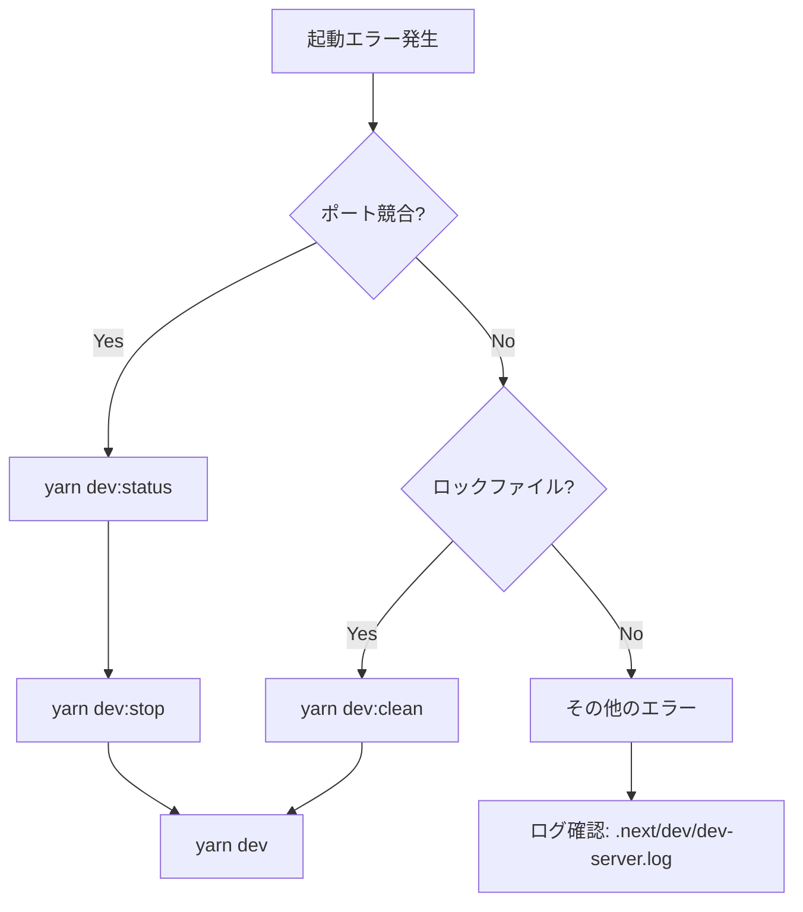

# 開発プロセス管理ガイド

## 📋 概要

Next.js開発環境における重複プロセス、ポート競合、ロックファイル問題を防ぐためのベストプラクティスガイド。

## 🚨 よくある問題と解決策

### 1. **ポート3000が既に使用中**

**症状:**
```
- ready started server on 0.0.0.0:3000
Error: listen EADDRINUSE: address already in use :::3000
```

**原因:**
- 複数の`yarn dev`/`npm run dev`プロセスが同時実行
- 以前のプロセスが正常終了していない
- 他のアプリケーションがポート3000を使用

**解決策:**
```bash
# 現在の状態を確認
yarn dev:status

# すべてのプロセスを停止
yarn dev:stop

# クリーンな状態で再起動
yarn dev:clean
```

### 2. **Next.jsロックファイル競合**

**症状:**
```
Error: Failed to acquire lock
Lock file: /path/to/frontend/.next/dev/lock
```

**原因:**
- 前回のプロセスが異常終了し、ロックファイルが残存
- 複数のプロセスが同時にビルドを試行

**解決策:**
```bash
# 自動クリーンアップ（推奨）
yarn dev:clean

# 手動削除（必要な場合のみ）
rm -f .next/dev/lock
```

### 3. **非推奨のNext.js設定警告**

**症状:**
```
Warning: The `eslint` option is no longer supported in Next.js 16
Warning: `images.domains` is deprecated, use `images.remotePatterns`
```

**原因:**
- Next.js 16での設定変更に未対応

**解決済み:**
✅ `next.config.js`を最新仕様に更新済み
- `images.domains` → `images.remotePatterns`
- `eslint` → `typescript.ignoreBuildErrors`

## 🛠️ 開発プロセス管理ツール

### プロセス管理スクリプト

```bash
# 使用可能なコマンド
yarn dev              # 通常の起動
yarn dev:clean        # クリーンな状態で再起動
yarn dev:stop         # すべてのプロセスを停止
yarn dev:status       # 現在のプロセス状態を確認

# 低レベルスクリプト（直接実行）
./scripts/dev-manager.sh start     # 開発サーバー起動
./scripts/dev-manager.sh stop      # すべてのプロセス停止
./scripts/dev-manager.sh restart   # 再起動
./scripts/dev-manager.sh status    # 状態確認
./scripts/dev-manager.sh clean     # .nextフォルダを削除
```

### スクリプトの機能

1. **自動プロセス検出と停止**
   - 重複プロセスを自動検出
   - 安全な停止（SIGTERM → SIGKILL）

2. **ロックファイル管理**
   - 自動削除と検証
   - 状態レポート

3. **ポート管理**
   - ポート3000-3002の使用状況確認
   - 競合検出とレポート

4. **ログ管理**
   - ログファイル: `.next/dev/dev-server.log`
   - PIDファイル: `.next/dev/dev-server.pid`

## 📝 ベストプラクティス

### 日常的な開発フロー

#### ✅ 推奨される起動手順

```bash
# 1. 現在の状態を確認
yarn dev:status

# 2. クリーンな環境で起動
yarn dev:clean

# 3. 開発作業
# ... コーディング ...

# 4. 作業終了時は必ず停止
yarn dev:stop
```

#### ❌ 避けるべきパターン

```bash
# 複数のターミナルで同時起動（NG）
# ターミナル1: yarn dev
# ターミナル2: yarn dev  # ← 競合発生

# Ctrl+Cで停止せずターミナルを閉じる（NG）
# → プロセスがバックグラウンドで残る

# ロックファイルを手動削除しすぎる（NG）
# → 根本原因を解決していない
```

### トラブルシューティングフロー



### プロセス管理のチェックリスト

開発開始時:
- [ ] 既存プロセスが残っていないか確認（`yarn dev:status`）
- [ ] ポート3000が空いているか確認
- [ ] ロックファイルが存在しないか確認

開発中:
- [ ] 1つのターミナルでのみ`yarn dev`を実行
- [ ] エラー発生時は即座に`yarn dev:status`で確認
- [ ] 再起動が必要な場合は`yarn dev:clean`を使用

開発終了時:
- [ ] Ctrl+Cで正常に停止
- [ ] `yarn dev:stop`で残存プロセスを確認
- [ ] 必要に応じて`yarn dev:status`で最終確認

## 🔍 高度なトラブルシューティング

### プロセスを手動で調査

```bash
# Next.jsプロセスをすべて確認
ps aux | grep "next dev"

# ポート使用状況を詳細確認
lsof -ti:3000
lsof -i:3000 -P -n

# プロセスを手動で停止
kill -15 <PID>  # 通常の停止
kill -9 <PID>   # 強制停止（最後の手段）
```

### ロックファイルの詳細確認

```bash
# ロックファイルの存在確認
ls -la .next/dev/lock

# ロックファイルの詳細
stat .next/dev/lock

# 手動削除（緊急時のみ）
rm -f .next/dev/lock
```

### システムリソース確認

```bash
# メモリ使用量
ps aux | grep node | awk '{print $2, $4, $11}'

# CPU使用量
top -l 1 | grep "next dev"

# ディスク使用量
du -sh .next
```

## 🚀 パフォーマンス最適化

### 開発サーバーの起動速度改善

1. **不要なファイルを除外**
   ```json
   // next.config.js
   {
     "turbopack": {
       // Turbopackで高速化
     }
   }
   ```

2. **キャッシュのクリア**
   ```bash
   # 完全なクリーンビルド
   ./scripts/dev-manager.sh clean
   yarn dev
   ```

3. **環境変数の最適化**
   ```bash
   # .env.local
   NODE_OPTIONS=--max-old-space-size=4096
   ```

## 📚 関連ドキュメント

- [Next.js 16 Migration Guide](https://nextjs.org/docs/app/building-your-application/upgrading/version-16)
- [Next.js Configuration Options](https://nextjs.org/docs/app/api-reference/next-config-js)
- [Turbopack Documentation](https://turbo.build/pack)

## 🤝 チーム開発での注意事項

### Git管理

```gitignore
# .gitignore に追加（既に設定済み）
.next/
.next/dev/lock
.next/dev/*.pid
.next/dev/*.log
```

### CI/CD環境

```yaml
# GitHub Actions例
- name: Clean Next.js cache
  run: |
    rm -rf .next
    yarn dev:clean

- name: Start dev server for testing
  run: |
    yarn dev &
    sleep 10  # サーバー起動待機
```

### チーム共有ルール

1. **問題発生時は即座に報告**
   - プロセス競合を検知したら`yarn dev:status`の結果を共有

2. **定期的なクリーンアップ**
   - 週次または重大な変更後に`yarn dev:clean`を実行

3. **ドキュメントの更新**
   - 新しい問題や解決策を発見したらこのドキュメントを更新

## 🔐 セキュリティ考慮事項

### ログファイルの取り扱い

```bash
# 機密情報が含まれる可能性のあるログを確認
cat .next/dev/dev-server.log | grep -i "password\|token\|secret"

# 定期的にログをローテーション
mv .next/dev/dev-server.log .next/dev/dev-server.log.old
```

### 環境変数の保護

```bash
# .env.localは絶対にコミットしない
# 誤ってコミットした場合は即座にシークレットをローテーション
```

## 📊 モニタリング

### 開発サーバーの健全性チェック

```bash
# 定期的な健全性確認スクリプト
watch -n 5 "yarn dev:status"

# プロセス数の監視
watch -n 5 "ps aux | grep -c '[n]ext dev'"
```

---

**最終更新**: 2025-12-18
**Next.js バージョン**: 16.0.10
**Node.js バージョン**: 22.20.0
